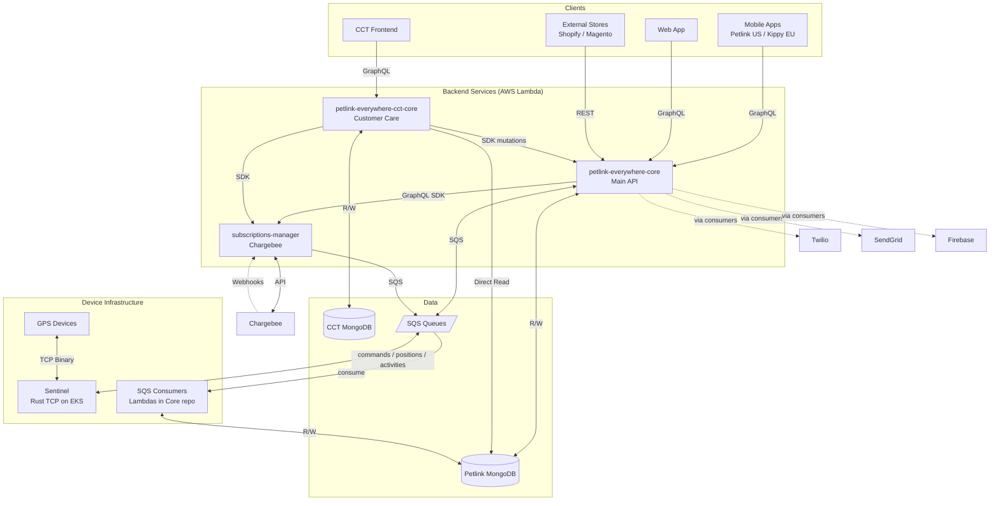
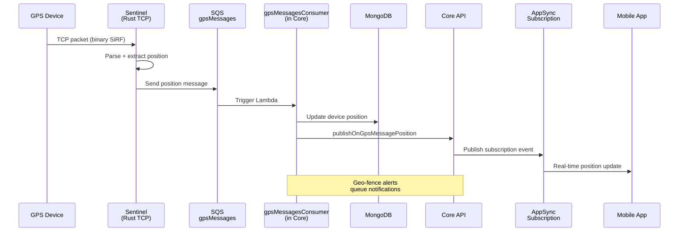
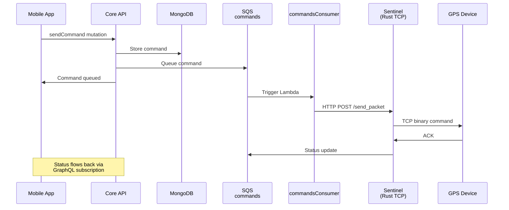
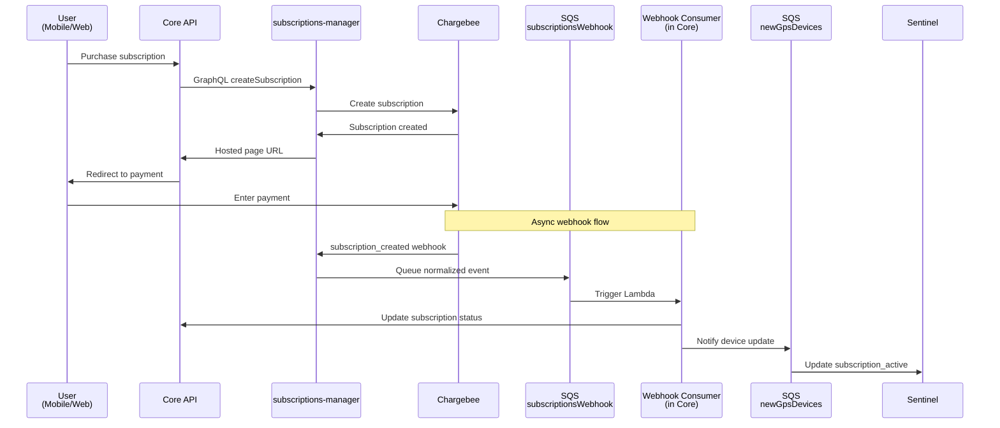
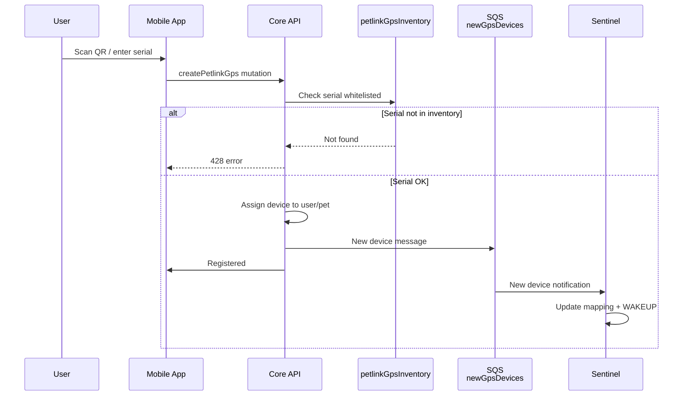
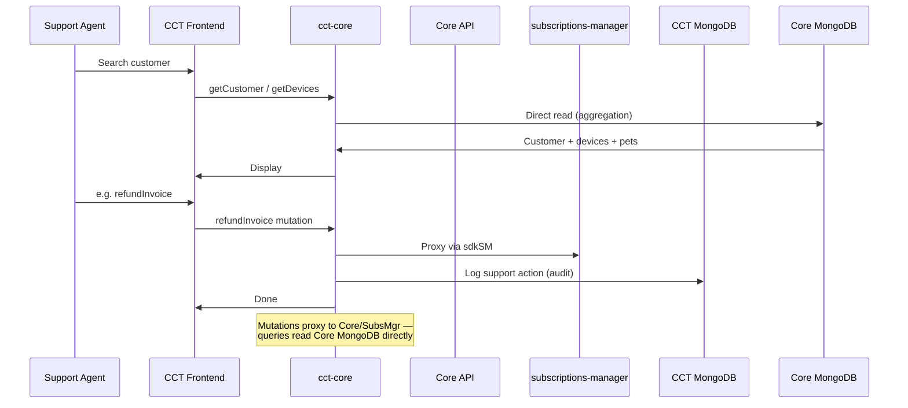
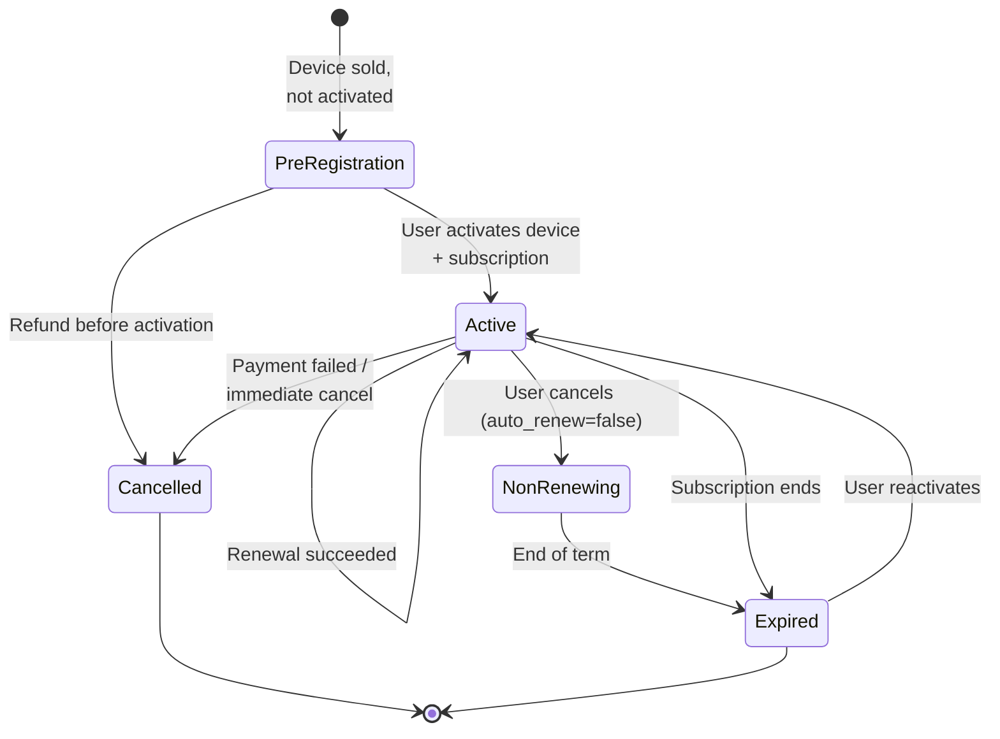

# Petlink Everywhere - Architecture & Overview

## 1. System Architecture
Petlink/Kippy is a GPS pet tracking platform where users register their pets, activate GPS collars, purchase subscriptions, and monitor their pets in real-time through mobile apps.
Two brands: **Petlink** (US) and **Kippy** (EU), same backend. The `APP_BRAND` env var determines which brand the test suite runs against.

## 2. Repositories (`all-repo/`)
Backend / device:
- **`petlink-everywhere-core`** — Main backend API (AppSync + Lambdas). Users, pets, devices, SQS consumers.
- **`petlink-everywhere-cct-core`** — Backend for Customer Care Tool. Reads Petlink DB, owns CCT DB.
- **`subscriptions-manager`** — Chargebee webhooks, payments, subscription states.
- **`petlink-everywhere-sentinel`** — Rust TCP server on EKS for GPS device connections.

Clients:
- **`petlink-everywhere-mobile`** — Flutter app (Petlink US / Kippy EU).
- **`petlink-everywhere-web`** — React frontend for end users.
- **`petlink-everywhere-cct`** — React frontend for support agents.

Shared/support: `petlink-everywhere-types`, `petlink-everywhere-dictionary`, `petlink-everywhere-bluetooth`, `petlink-everywhere-device-simulator`, `petlink-everywhere-databases`.

---

## 3. Repo Minimaps
> Goal: get the AI to the **right folder on first try**. Function names and exact lists are intentionally omitted — discover them on demand.

### 3.1 `petlink-everywhere-core` (Node/TS, AppSync + Lambdas)
- **GraphQL endpoints** (1 Lambda per op): `src/lambda_functions/graphql/{mutation|query}/{name}/handler.ts`
- **Business logic** (most bugs live here): `src/lib/petlink/*.ts` (user, pet, petlinkGps, subscriptions, …)
- **DB layer**: `src/lib/mongoDb/`
- **SQS consumers**: `src/lambda_functions/sentinel/*` (positions, notifications, activities) and `src/lambda_functions/subscriptions/*` (Chargebee webhook events, expired checker)
- **Handler pattern**: `handler.ts → createAppSyncHandler → getUserFromCognito → lib/petlink → mongoDb`
- **MongoDB**: single collection `petlinkEverywhere` with `entityType` discriminator (`USER`, `PET`, `PETLINK_GPS`, `SUBSCRIPTION`, …); separate collection `petlinkGpsInventory` is the **device whitelist** (serial → imei/iccid/firmware). Missing serial → `createPetlinkGps` 428.
- **Gotcha**: SQS consumers that process Sentinel data live **here**, not in Sentinel.
- **Test-only**: `utilityIntegrationTest` mutation (IAM auth) for signup/cleanup/buy-subscription bypassing OTP/Chargebee.
- **`publishOn*` mutations** don't write to DB — they only trigger AppSync WebSocket subscriptions.

### 3.2 `petlink-everywhere-cct-core` (Node/TS, AppSync + Lambdas)
- **Layout**: same as Core — `src/lambda_functions/graphql/{mutation|query}/{name}/handler.ts`
- **Dual MongoDB** via `MongoDbSingleton`:
  - `'PETLINK'` → reads Core's MongoDB directly (customers, devices, subscriptions, inventory)
  - `'CCT'` → its own DB (CCT users, audit logs, tickets)
- **Read pattern**: `getCustomer`, `getDevices`, etc. read Petlink MongoDB **directly** — no proxy to Core. `getDevices` is an aggregation pipeline JOINing `petlinkEverywhere` (`entityType=PETLINK_GPS`) with `petlinkGpsInventory`.
- **Write pattern**: mutations **proxy** to Core via `sdkCore` (e.g. delete customer, reset device, hide pet) and to subscriptions-manager via `sdkSM` (refunds, coupons), then log the action in CCT DB for audit.

### 3.3 `subscriptions-manager` (Node/TS, Chargebee)
- **GraphQL mutations**: `src/lambdaFunctions/graphql/mutations/{name}/handler.ts`
- **Chargebee webhook (REST)**: `src/lambdaFunctions/webhook/operations/post/webhook.ts` + per-event handlers in `webhookHandlers/`
- **Flow**: Chargebee POST → `webhook.ts` routes by `event_type` → handler builds normalized payload → SQS `subscriptionsWebhook` → consumed by Core (`subscriptionsWebhookConsumer`).
- **Cross-repo**: Core ↔ subscriptions-manager via GraphQL SDK (IAM); async side-effects via SQS.

### 3.4 `petlink-everywhere-sentinel` (Rust, TCP server)
- TCP server on AWS EKS + Global Accelerator; parses **SiRF binary** from GPS devices.
- **Gotcha**: Lambda consumers of the outbound queues live in **Core**, not here.
- **SQS queue map** (all async flows pass through these):

| Queue | Producer | Consumer | Purpose |
|---|---|---|---|
| `gpsMessages` | Sentinel Rust | Core `gpsMessagesConsumer` | GPS positions + device status |
| `activities` | Sentinel Rust | Core `activitiesConsumer` | Pet activity data |
| `notifications` | Sentinel + Core | Core `notificationsConsumer` | Push, SMS, email dispatch |
| `commands` | Core `sendCommand` | Sentinel Rust | Commands to device (torch, sound, liveTracking) |
| `newGpsDevices` | Core `createPetlinkGps` | Sentinel Rust | New device registration |
| `settings` | Core `sendSetting` | Sentinel Rust | Device configuration updates |
| `subscriptionsWebhook` | subscriptions-manager | Core `subscriptionsWebhookConsumer` | Chargebee payment events |

### 3.5 `petlink-everywhere-mobile` (Flutter, end-user app)
- **Stack**: Flutter + **GetX** (state/DI/routing) + `graphql_flutter` + AWS Cognito.
- **Entrypoint**: `lib/main.dart`.
- **Feature-driven clean arch** under `lib/features/{feature}/{binding,data,domain,presentation}/`. Key features: `auth`, `home`, `pet_profile`, `gps_settings`, `new_registration`, `products`, `lost_pet`, `activity_pets`, `history`, `settings`, `user_profile`, `menu`.
- **Shared code**: `lib/core/` (widgets, utils, generated GraphQL schema in `lib/core/schema.graphql.dart`) and `lib/base/` (network, router, extensions, namespaces).
- **Network**: `lib/base/network/client_service.dart` + `cognito_manager.dart`.
- **Routing**: `lib/base/router/app_router.dart` + `app_routes.dart`.
- Talks to **Core** GraphQL only (not to cct-core / subs-manager directly).

### 3.6 `petlink-everywhere-web` (React, end-user web app)
- **Stack**: React + TypeScript + **Redux Toolkit + RTK Query** + TailwindCSS.
- **Entrypoint**: `src/index.tsx` → `src/App.tsx`.
- **UI**: pages in `src/components/pages/`, layout in `src/components/layout/`, reusable in `src/components/{common,shared}/`.
- **State + API**: `src/store/store.ts`; slices in `src/store/slices/`; **GraphQL endpoints wrapped as RTK Query** in `src/store/api/`.
- **GraphQL operations** (generated): `src/graphql/operations/{queries,mutations,subscriptions}.ts`.
- **Routing**: `src/routing/`. Custom hooks: `src/hooks/`. i18n: `src/locales/` + `src/i18n/`.
- Talks to **Core** GraphQL only.

### 3.7 `petlink-everywhere-cct` (React, Customer Care frontend)
- Same stack as web (React + TS + RTK Query + Tailwind), built with **Vite**.
- **Entrypoint**: `src/index.tsx` → `src/components/App.tsx`.
- **UI**: `src/components/{pages,layout,common,shared}/` (same convention as web).
- **State + API**: `src/store/store.ts`; `src/store/api/` is split **per domain** (`customers/`, `devices/`, `pets/`, `subscriptions/`, `coupons/`, `logs/`, `orders/`, `shelters/`, `users/`, `petProtections/`, `planProfiles/`, `migrations/`, `preregFreePeriod/`, `profile/`).
- **Routing**: `src/routing/appRouter.tsx` + `appPaths.ts` + `appRoutesId.ts` + `useAppMenuList.ts`.
- Talks to **`cct-core`** GraphQL — never directly to Core.

---

## 4. Data Flows
The diagrams below are the canonical reference for how data moves through the system. They are stable architectural views (not implementation details).

### 4.1 Device → User (Position Updates)

### 4.2 User → Device (Send Command)

### 4.3 Subscription Purchase

### 4.4 Device Registration

### 4.5 Customer Support (CCT)

---

## 5. Subscriptions Domain

### Brand differences
- **Petlink (US)**: standard subscriptions only (Monthly / Yearly / Multi-year). No protection addons.
- **Kippy (EU)**: standard subscriptions + optional **Device Protection** addon (same duration, covers device replacement).
- **Pet Protection** (a.k.a. *Care Protection* in code): **Italy only**, 1-year independent subscription, requires an active main subscription, covers veterinary expenses.

### State machine

### Key flows
- **Pre-registration**: external store (Shopify/Magento) calls Core REST API with serial + plan → Core creates pre-registered subscription in Chargebee → activates when user registers the device.
- **Renewal**: Chargebee triggers renewal → `subscription_renewed` webhook → SubsMgr → SQS → Core updates term end → Sentinel keeps device active.
- **Cancellation**: user/CCT cancels → `auto_renew=false` in Chargebee → device active until term end → at term end `subscription_cancelled` webhook → Sentinel deactivates device.

---

## 6. External Integrations
- **AWS Cognito** — auth for mobile/web (end users) and CCT (separate user pool for support staff). Integrated via AWS Amplify.
- **Chargebee** — payments + subscription lifecycle + addons + hosted pages + webhooks. SDK in `subscriptions-manager`.
- **Firebase Cloud Messaging** — push notifications. Separate FCM projects per brand (Petlink / Kippy).
- **Twilio** — SMS (OTP signup, critical alerts). Env-based whitelists for testing.
- **SendGrid** — transactional email (welcome, receipts, alerts). Templates stored in MongoDB.
- **LocationIQ** — reverse geocoding (GPS → address). Called by **Sentinel** when processing positions.

---

## 7. Domain Knowledge (deep-dives in `docs/`)
Read on demand when fine-grained business logic matters:
- **Registration (user / pet / device)**: `docs/registration/`
- **Subscriptions deep-dive**: `docs/subscriptions/`
- **Device modes & commands**: `docs/modes/`, `docs/commands/`
- **End of life**: `docs/end-of-life/`
- **API references**: `docs/api_core.md`, `docs/api_cct.md`

---

## 8. AI Agent Debugging & Troubleshooting Rules
When an API call fails or a test breaks, **DO NOT make assumptions, guess the cause, or suggest blind fixes**. You must autonomously investigate by following these steps:

1. **Inspect Backend Logic**: Locate and read the actual AWS Lambda resolver or backend service code (in `petlink-everywhere-core`, `petlink-everywhere-cct-core`, or `subscriptions-manager`) that handles the failing API. Analyze exactly how the payload is processed, validated, and where the error is thrown.
2. **Verify Frontend/App Usage**: Search the frontend or mobile repositories (`petlink-everywhere-web`, `petlink-everywhere-mobile`, or `petlink-everywhere-cct`) to see how the user or CCT operator actually calls this endpoint in the real application flow.
3. **Compare Flows**: Compare the exact GraphQL/REST request (payload, headers, sequence of operations) made by the real client with the one being made in the failing test suite. Identify any missing or malformed parameters.
4. **Trace the Architecture**: If necessary, follow the data flow through AppSync, SQS queues, MongoDB or all of necessary microservices to understand the exact state of the system during the request.
