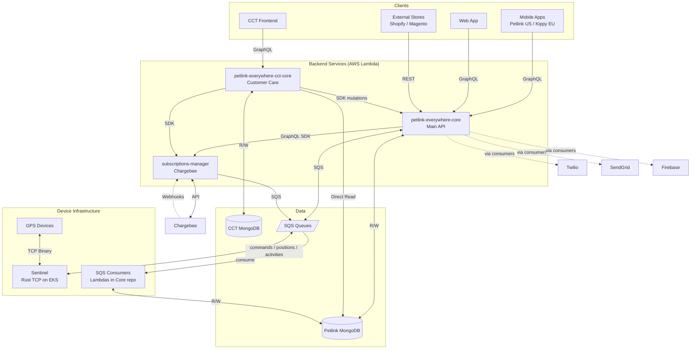
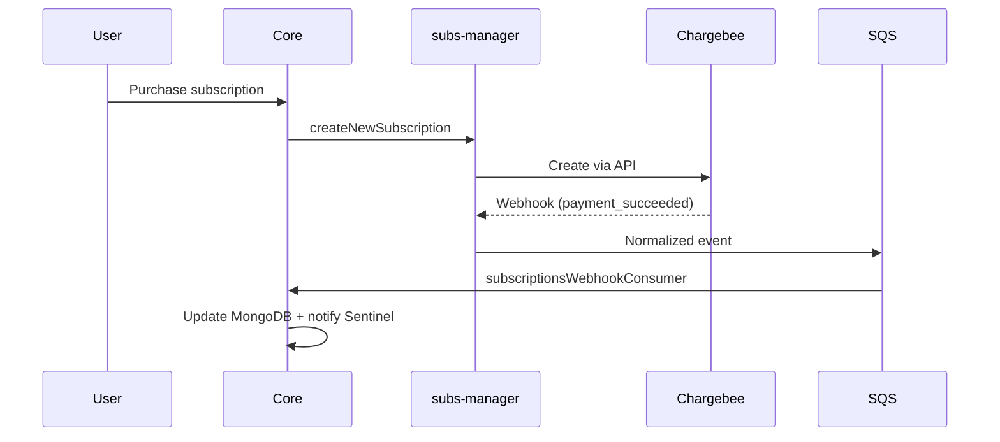
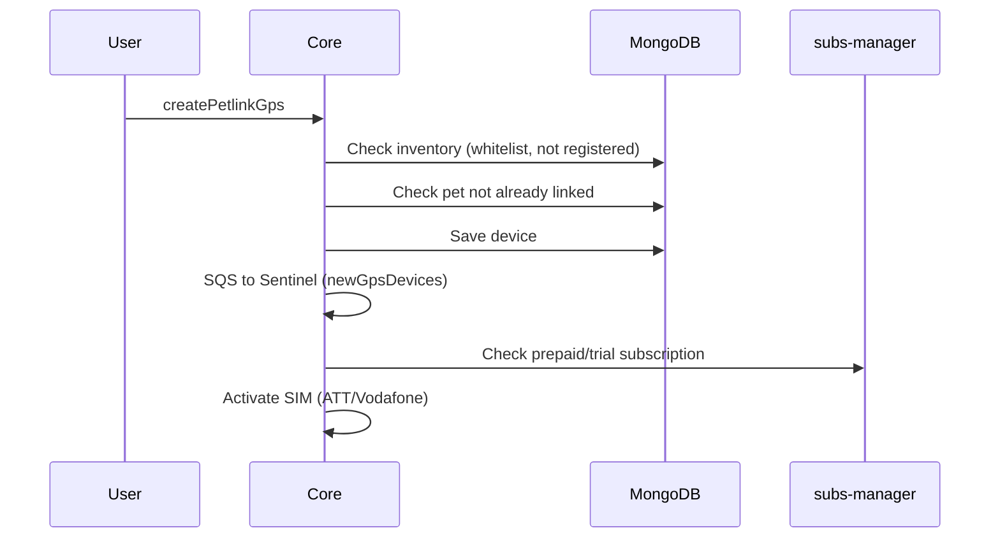
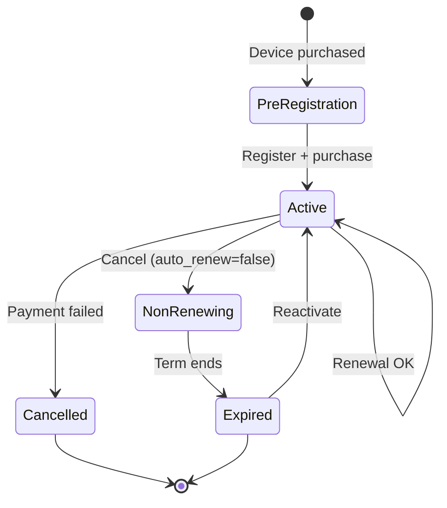

# Petlink Everywhere Test - AI Rules

## 1. System Architecture

Petlink/Kippy is a pet monitoring system with GPS-enabled collars. Two brands: **Petlink** (US) and **Kippy** (EU), same backend. The `APP_BRAND` env var determines which brand the test suite runs against — fixtures and some flows differ per brand.

All backend repos are cloned under `all-repo/`.

### Architecture Diagram

> **Note**: All clients (mobile, web, CCT) call a GraphQL endpoint powered by **AWS AppSync**. AppSync is just a managed proxy — it authenticates via Cognito, routes each query/mutation to the correct Lambda, and manages WebSocket connections for real-time subscriptions. It has no business logic.



---

## 2. Backend Navigation Guide (for debugging)

When a test fails, use this to know **where to look** in each repo.

### petlink-everywhere-core (Main Backend)

**Folder pattern**: Every GraphQL endpoint = one Lambda function.
```
src/lambda_functions/graphql/
  mutation/{operationName}/handler.ts   ← e.g. createPetlinkGps, sendCommand, signUpUser
  query/{operationName}/handler.ts      ← e.g. getUser, getGeofences, getSubscriptionPlans
```

**Business logic layer** (where most bugs live):
```
src/lib/petlink/
  user.ts            ← createPetlinkUser, getUserFromCognito
  pet.ts             ← createPetlinkPet (validates breeds, colors, weight g→kg conversion)
  petlinkGps.ts      ← createPetlinkGps, checkPetlinkGps (inventory whitelist), checkPetAlreadyLinked
  subscriptions.ts   ← checkDeviceSubscription, findProduct, calculateAndSetNewTermEnd
  energySavingZone.ts, positionsHistory.ts, settings.ts, ssoToken.ts
```

**Handler pattern**: `handler.ts → createAppSyncHandler() → getUserFromCognito() → business logic in lib/petlink/*.ts → MongoDB via lib/mongoDb/crud.ts`

**SQS consumers** (all in `src/lambda_functions/` of Core — **not** in the Sentinel repo):
- `sentinel/gpsMessagesConsumer/handler.ts` — GPS positions → MongoDB + publishes via `publishOnGpsMessagePosition`/`publishOnGpsMessageStatus`
- `sentinel/notificationsConsumer/handler.ts` — Push/SMS/email via Firebase/Twilio/SendGrid
- `sentinel/activitiesConsumer/handler.ts` — Pet activity data
- `subscriptions/subscriptionsWebhookConsumer/handler.ts` — Chargebee events from subscriptions-manager
- `subscriptions/subscriptionExpiredChecker/handler.ts` — Scheduled: checks expired subs

> **`publishOnGpsMessagePosition` / `publishOnGpsMessageStatus` / `publishOnSubscriptionStatus`** are special mutations that **don't write to DB** — they only trigger AppSync WebSocket subscriptions so connected clients receive real-time updates. Don't look for business logic in their handlers.

**MongoDB**: Single main collection `petlinkEverywhere` with `entityType` discriminator (`USER`, `PET`, `PETLINK_GPS`, `SUBSCRIPTION`, etc.). Separate collection `petlinkGpsInventory` — this is the **device whitelist/inventory**: maps serial → imei, iccid, model, brand, firmware, simStatus. If a serial is not in this collection, `createPetlinkGps` fails with **428**. The firmware field is populated asynchronously by Sentinel after the device first connects.

**Authentication**: User signup (`signUpUser`) creates the user in **AWS Cognito** + MongoDB. Normal flow requires OTP (phone via Twilio) + email verification. The test backdoor bypasses this.

**`utilityIntegrationTest`** — Test-only endpoint (IAM auth, develop/test envs only) in `mutation/utilityIntegrationTest/`:
- `SIGN_UP` — Creates user in Cognito + MongoDB, **auto-confirms** email and phone (no OTP needed)
- `CLEAN_UP_USER` — Deletes user from Cognito + all MongoDB entities
- `BUY_NEW_SUBSCRIPTION` — Purchases subscription bypassing Chargebee hosted page (uses test card directly)

### subscriptions-manager (Chargebee)

**Folder**: `src/lambdaFunctions/graphql/mutations/` (GraphQL) + `src/lambdaFunctions/webhook/` (REST webhooks from Chargebee).

**Webhook flow**: Chargebee → `webhook.ts` routes by event_type → handler normalizes → SQS → Core's `subscriptionsWebhookConsumer`.

Core calls this service via GraphQL SDK (`sdkSSM`).

### petlink-everywhere-cct-core (Customer Care)

**Folder**: Same as Core — `mutation/{name}/handler.ts`, `query/{name}/handler.ts`.

**Dual DB**: Reads Petlink MongoDB directly for queries (getCustomer, getDevices). Writes to its own CCT MongoDB (users, logs, issues). Calls Core via `sdkCore` for mutations only (deleteCustomer, resetPetlinkGps). Calls subscriptions-manager via `sdkSM` (refundInvoice, stopRenewing).

**`getDevices` detail**: Uses a MongoDB **aggregation pipeline** that JOINs the main `petlinkEverywhere` collection (entityType=PETLINK_GPS) with `petlinkGpsInventory` to return imei, iccid, firmware. This is why the test `enrich()` polls `getDevices` — it waits for firmware to be populated in inventory by Sentinel.

### petlink-everywhere-sentinel (Devices)

Rust TCP server on EKS. Accepts GPS device connections, parses SiRF binary protocol. The SQS consumer Lambdas that process device data live in **Core**, not here.

### SQS Queue Map

| Queue | Producer | Consumer | Purpose |
|-------|----------|----------|---------|
| `gpsMessages` | Sentinel | Core consumer | GPS positions + status |
| `notifications` | Sentinel + Core | Core consumer | Push, SMS, email |
| `activities` | Sentinel | Core consumer | Pet activity data |
| `commands` | Core `sendCommand` | Sentinel | Commands to device |
| `newGpsDevices` | Core `createPetlinkGps` | Sentinel | New device registration |
| `settings` | Core `sendSetting` | Sentinel | Device config updates |
| `subscriptionsWebhook` | subscriptions-manager | Core consumer | Chargebee events |

---

## 3. Data Flows

### 3.1 Device → User (Position Updates)

GPS Device → Sentinel (TCP) → SQS `gpsMessages` → Core `gpsMessagesConsumer` → update MongoDB + publish real-time event via `publishOnGpsMessagePosition` → client receives via WebSocket subscription.

### 3.2 User → Device (Send Command)

Mobile → Core `sendCommand` mutation → SQS `commands` → Sentinel → TCP binary to device → device ACK → Sentinel sends status via SQS `gpsMessages` → Core publishes `publishOnGpsMessageStatus` → client receives via WebSocket.

### 3.3 Subscription Purchase



### 3.4 Device Registration



### 3.5 Subscription States



---

## 4. Test Philosophy: User-Centric Flows

Our tests validate the system through **end-to-end user journeys**, not isolated technical layers.

**Core Entity Flow**: The system follows a clear entity sequence. Tests must respect this dependency:
1.  **User**: A user is created first.
2.  **Pet**: A pet is created and associated with a user.
3.  **Device**: A device is registered and associated with a pet.
4.  **Subscription**: A subscription is purchased to activate a device.
5.  **Activities**: Now activities of pet (through device) can be tracked.

Tests are organized by actor (`user/`, `cct/`) and journey (`registration/`, `subscriptions/`, `commands/`, `mode/`, `eol/`).

---

## 5. How to Write a Test: A Practical Guide

Follow this structure for consistency and clarity.

### Step 1: Setup with `TestSetupBuilder` in `beforeAll`

Use the `testHelper` builder to create a clean state before tests run. This is the **only** recommended way to set up test entities.

```typescript
// in src/tests/user/subscriptions/default-purchase.test.ts

import { describe, expect, it, beforeAll } from "vitest";

describe.sequential("User Subscription Purchase Flow", () => {
  let setup: TestSetup;

  beforeAll(async () => {
    // Build the necessary entities for this test flow
    setup = await testHelper.setupBuilder()
      .withUser()
      .withDog()
      .withDogDevice()
      .build();
  });

  // Access created entities via setup.user, setup.pets.dog, setup.devices.dogStandard
});
```

**Key Principles**:
- **Clean First**: `cleanupAll()` runs *before* tests (as a config of setupFiles - beforeAll), ensuring a fresh start and allowing manual inspection of the database after a run.
- **Use the Builder**: `.withUser()`, `.withDog()`, `.withCatDevice()`, etc. abstract away the complexity of entity creation. Access results via the `setup` object.

### Step 2: Define Explicit Payloads (No Spread Operator)

At the top of your `describe` block, define all API payloads by explicitly listing each required field. **Never use the spread operator (`...`) with fixtures.**

```typescript
// At the top of your describe block
import { fixtures } from "../../../fixtures/fixtures.js";
import type { PetIn } from "../../../generated/core_schema.js";

const catPayload: PetIn = {
  name: fixtures.pet.cat.name,
  species: fixtures.pet.cat.species,
  breedType: fixtures.pet.cat.breedType,
  breeds: fixtures.pet.cat.breeds,
  gender: fixtures.pet.cat.gender,
  weight: fixtures.pet.cat.weight,
  birthDate: fixtures.pet.cat.birthDate,
  // ... and other required fields
};
```

**Why?** This prevents tests from breaking if the global `fixtures` object is updated with new properties not relevant to the payload. It ensures payloads are stable and explicit.

### Step 3: Write Assertions

#### General Assertions

Use built-in Vitest matchers to verify responses. Be explicit and clear.

```typescript
// Check for object structure and partial content
expect(response.getUser.user).toMatchObject({
  email: signUpPayload.email,
  name: signUpPayload.name,
});

// Check for existence and type
expect(response.getUser.user?.id).toBeDefined();
expect(response.getUser.user?.id).toEqual(expect.any(String));
```

#### Status Code Assertions (MANDATORY FORMAT)

**All API response code checks MUST follow this format.** It provides essential debugging information directly in the test failure output.

```typescript
// ✅ CORRECT: For a success case
expect(
  response.createPet.code,
  `createPet should succeed - Error: ${response.createPet.message}${response.createPet.translationCode ? ` (${response.createPet.translationCode})` : ''}`
).toBe("200");

// ✅ CORRECT: For an expected failure case
expect(
  response.deletePet.code,
  `deletePet should fail - Error: ${response.deletePet.message}${response.createPet.translationCode ? ` (${response.createPet.translationCode})` : ''}`
).not.toBe("200");
```

**Why this format?**
1.  **Endpoint Name**: Instantly identifies which API call failed.
2.  **API Error Message**: Shows the backend error for immediate context.

---

## 6. Core Principles & TypeScript Usage

- **Clients are the Interface**: Interact with the backend **only** through the provided clients (`petlink`, `testHelper`, `sentinelTcpSocketClient`). They abstract away authentication, performance tracking, and protocol details.
  - **GraphQL HTTP**: `petlink.core.graphqlHttp.authJwt.getUser()`, `petlink.core.graphqlHttp.authIam.utilityIntegrationTest()`
  - **GraphQL WebSocket**: `petlink.core.graphqlWS.authJwt.subscribeUntil(...)` — for real-time subscriptions (position, status, commands)
  - **Sentinel TCP**: `sentinelTcpSocketClient.connectAndHandshake(device)` — simulates device firmware communication

- **TypeScript Best Practices**:
  - **Always Type Payloads**: Use `as TypeName` to ensure all payloads match the API schema (e.g., `as UserIn`, `as PetIn`).
  - **Use Enums**: For values like species or device types, always import and use the TypeScript `enum` (e.g., `SpeciesEnum.DOG`). Avoid raw strings.
  - **Prefer `type` or `interface`**: Do not use `const` objects for defining complex type structures.

- **Logging Strategy**:
  - **`logger.info()`** in tests: Log payloads before API calls, responses after.
  - **`logger.debug()`** in clients only: Low-level flow (auth, caching).
  - **`logger.error()`** in clients only: Actual failures (catch blocks, timeouts).

---

## 7. Anti-Patterns to Avoid

1.  **❌ Don't use spread operators (`...fixtures`) for payloads.** Always define fields explicitly.
2.  **❌ Don't create opaque assertion helpers.** All `expect` statements must be visible and explicit within the test. Clarity over DRYness. (Exception: approved helpers in `src/helpers/vitest.ts` like `expectSubBoughtMatchSubToBuy`.)
3.  **❌ Don't bypass the clients.** Never make direct `fetch` or `axios` calls.
4.  **❌ Don't write silent `catch` blocks.** If an operation is expected to fail, assert the failure. Don't just swallow errors.

---

## 8. GraphQL & Microservices Workflow

### Schema Source of Truth
- **Schemas**: Located in `src/clients/petlink-infrastructure/endpoints/graphql/schema/`.
- **Files**: Look here first to validate types/fields (e.g., `core_schema.graphql` for Core service, `cct_schema.graphql` for CCT).
- **Rule**: Never infer fields; verify them against these `.graphql` files.

### Adding New Operations
- **Location**: Add queries/mutations in `src/clients/petlink-infrastructure/endpoints/graphql/operations/{microservice}/`.
- **File Conventions**:
  - Core: `querys.graphql`, `mutations.graphql`
  - CCT: `queries.graphql`, `mutations.graphql`
  - Core WebSocket subscriptions: `subscriptions.ts` (TypeScript, not `.graphql`)
- **Field Selection**: When adding an operation, ALWAYS select ALL available fields defined in the schema to ensure the SDK has full data availability.
- **Format**: Use standard GraphQL syntax inside `.graphql` files.

### SDK Generation
- **Trigger**: After ANY change to operation files (`.graphql`), you MUST run the generation command.
- **Command**: `yarn generate-sdk` (runs `npx tsx src/scripts/fetch-schema-and-generate-sdk.ts generate`).
- **Output**: Validates that `src/clients/petlink-infrastructure/endpoints/graphql/generated/{microservice}_schema.ts` is updated.

### Usage in Code/Tests
- **Strict Access Rule**: NEVER use `getSdk` directly in tests or business logic.
- **Facade**: ALWAYS access methods via the `petlink` singleton from `@petlink-everywhere-test/src/clients/petlink-infrastructure/client-petlink-infrastructure.ts`.
  - Example: `await petlink.core.graphqlHttp.authJwt.myNewMethod(...)`
- **Imports**:
  - Import **Types/Enums** from `generated/{microservice}_schema.ts` (e.g., `User`, `BreedTypeEnum`).
  - Import **Client** from `client-petlink-infrastructure.ts`.