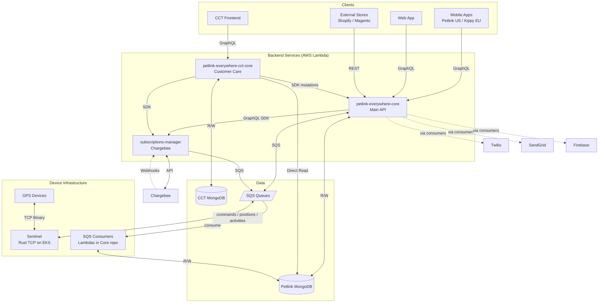
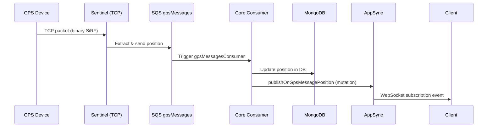
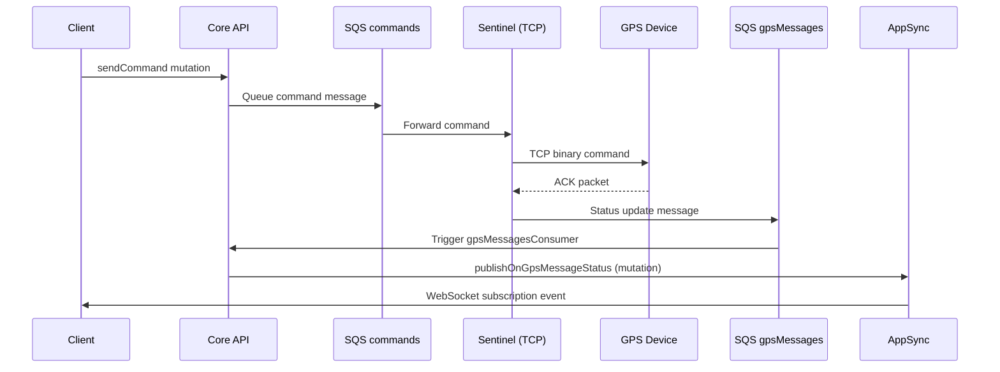
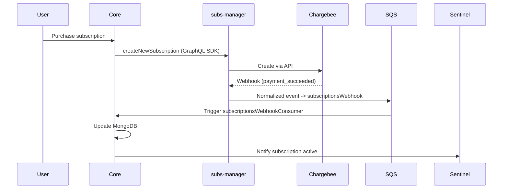
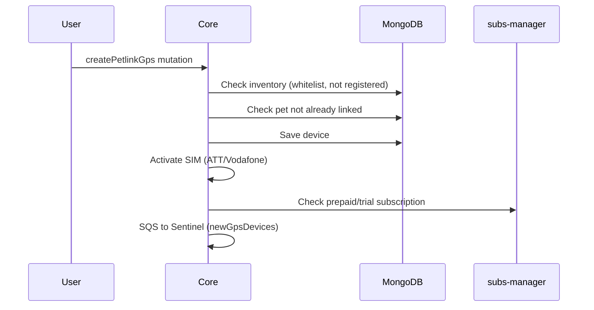
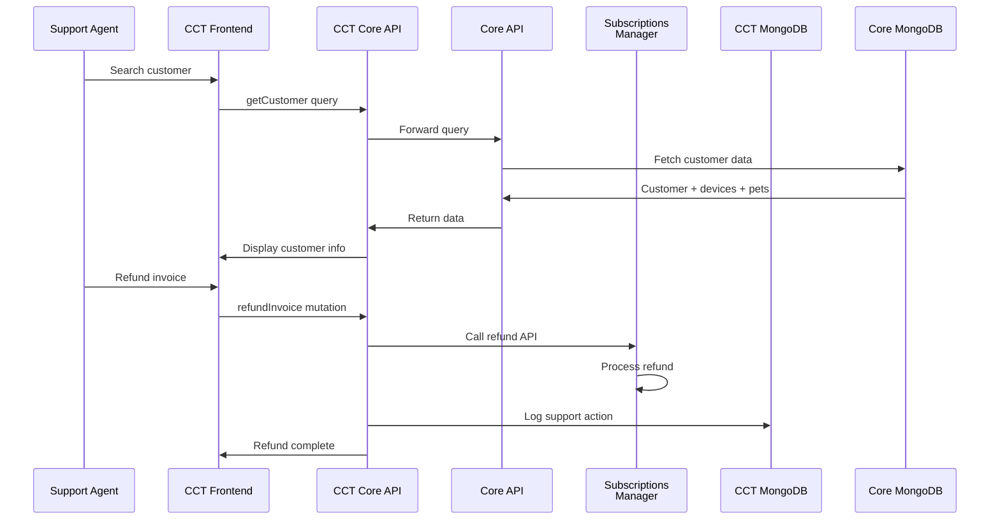
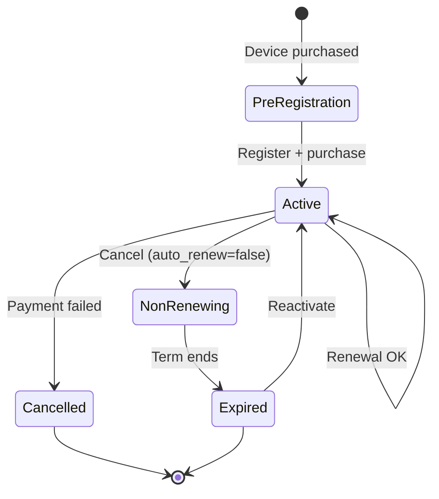

# Petlink Everywhere - Architecture & Overview

## 1. System Architecture & Actors Communication

Petlink/Kippy is a GPS pet tracking platform where users register their pets, activate GPS collars, purchase subscriptions, and monitor their pets in real-time through mobile apps.
Two brands: **Petlink** (US) and **Kippy** (EU), same backend. The `APP_BRAND` env var determines which brand the test suite runs against.

### IT Infrastructure Actors

- **AWS AppSync**: The core GraphQL API Gateway. It exposes all queries/mutations to clients, handles WebSocket persistent connections for real-time subscriptions, and routes requests to the correct Lambda resolvers. It contains **no business logic**.
- **AWS Cognito**: Handles all user authentication. Mobile apps, web portal, and CCT frontend authenticate here to get JWTs, which are then passed to AppSync.
- **AWS Lambda**: Hosts all the microservices backend logic (Core, CCT Core, Subscriptions Manager) acting as AppSync resolvers or SQS consumers.
- **MongoDB (Petlink DB)**: The main database. `petlink-everywhere-core` has full Read/Write access. `petlink-everywhere-cct-core` has **Direct Read** access to query users/devices without proxying.
- **MongoDB (CCT DB)**: A separate database used exclusively by `petlink-everywhere-cct-core` to read/write internal support logs, issues, and CCT user data.
- **SQS (Simple Queue Service)**: The backbone for async communication. Connects Sentinel with Core, and Subscriptions Manager with Core.
- **Sentinel (Rust TCP Server)**: Sits on AWS EKS behind a Global Accelerator. Accepts raw TCP connections from GPS collars worldwide, parses SiRF binary protocol, and bridges the device world to the AWS SQS world.

### Architecture Diagram

---

## 2. Repositories (Under `all-repo/`)

### Backend (BE)
- **`petlink-everywhere-core`** - Main backend API. Handles users, pets, device logic, and contains the SQS consumers for device data.
- **`petlink-everywhere-cct-core`** - Backend for Customer Care Tool. Reads Petlink DB, manages CCT DB, proxies mutations to Core/SubsMgr.
- **`subscriptions-manager`** - Handles Chargebee webhooks, subscription lifecycles, and payments.
- **`petlink-everywhere-sentinel`** - High-performance TCP server on EKS managing raw binary connections with GPS devices.

### Mobile
- **`petlink-everywhere-mobile`** - The mobile application used by end-users (compiled for iOS/Android, Petlink & Kippy brands).

### Frontend (FE)
- **`petlink-everywhere-web`** - Public-facing web portal for end-users.
- **`petlink-everywhere-cct`** - Internal web frontend for customer support agents.

### Support Libraries & Testing
- **`petlink-everywhere-types`** - Shared schemas, enums, and types across all backend microservices.
- **`petlink-everywhere-test`** - This repository. The end-to-end integration test suite.

---

## 3. SQS Queue Map

All async data flows through these queues.

| Queue | Producer | Consumer | Purpose |
|-------|----------|----------|---------|
| `gpsMessages` | Sentinel Rust | Core `gpsMessagesConsumer` | GPS positions + device status |
| `notifications` | Sentinel + Core | Core `notificationsConsumer` | Push, SMS, email dispatch |
| `activities` | Sentinel Rust | Core `activitiesConsumer` | Pet activity data |
| `commands` | Core `sendCommand` | Sentinel Rust | Commands to device (torch, sound, liveTracking) |
| `newGpsDevices` | Core `createPetlinkGps` | Sentinel Rust | New device registration |
| `settings` | Core `sendSetting` | Sentinel Rust | Device configuration updates |
| `subscriptionsWebhook` | subscriptions-manager | Core `subscriptionsWebhookConsumer`| Chargebee payment events |

---

## 4. Macro Data Flows

### 4.1 Device → User (Position Updates)

### 4.2 User → Device (Send Command)

### 4.3 Subscription Purchase

### 4.4 Device Registration

### 4.5 Customer Support Flow (CCT)

### 4.6 Subscription States

--

## External Integrations

### AWS Cognito
- **Purpose**: User authentication and authorization
- **Usage**:
    - Mobile apps: User sign-up, sign-in, password reset
    - Web app: User authentication
    - CCT: Support staff authentication (separate user pool)
- **Integration**: AWS Amplify libraries

### Chargebee
- **Purpose**: Payment processing and subscription billing
- **Features Used**:
    - Customer management
    - Subscription lifecycle management
    - Addons (device/pet protection)
    - Invoicing and payments
    - Webhooks for event notifications
    - Hosted payment pages
- **Integration**: Chargebee Node.js SDK
- **Webhook Events**: payment_succeeded, payment_failed, subscription_created, subscription_renewed, subscription_cancelled, etc.

### Firebase Cloud Messaging (FCM)
- **Purpose**: Push notifications to mobile apps
- **Configuration**: Separate FCM projects for Petlink and Kippy
- **Notification Types**:
    - Device alerts (low battery, geo-fence)
    - Subscription reminders
    - Activity summaries
    - System messages

### Twilio
- **Purpose**: SMS notifications
- **Use Cases**:
    - OTP for phone verification during sign-up
    - Critical device alerts
    - Subscription expiration warnings
- **Configuration**: Environment-based whitelists for testing

### SendGrid
- **Purpose**: Transactional email
- **Use Cases**:
    - Welcome emails
    - Password reset
    - Subscription receipts
    - Device alerts
    - Marketing campaigns (via templates)
- **Configuration**: Template-based emails stored in MongoDB

### LocationIQ
- **Purpose**: Reverse geocoding
- **Usage**: Convert GPS coordinates to human-readable addresses
- **Called By**: Sentinel when processing position updates

---

## Deployment Architecture

### AWS Infrastructure
- **AppSync**: Managed GraphQL API service that exposes GraphQL endpoints and manages WebSocket connections for real-time subscriptions
- **Lambda Functions**: All backend services (Core, CCT Core, Subscriptions Manager) - invoked as resolvers by AppSync
- **EKS**: Kubernetes cluster for Sentinel
- **MongoDB Atlas**: Database hosting
- **SQS**: Message queues for async communication
- **S3**: Asset storage (pet photos, device firmware)
- **CloudFront**: CDN for web applications
- **Global Accelerator**: Low-latency device connections to Sentinel

### CI/CD
- **CDK**: Infrastructure as code for all AWS resources
- **GitHub Actions**: Build and deployment pipelines
- **Environment Stages**: Development, Staging, Production
- **Branch-based Deployments**: Feature branches deploy to isolated environments

---