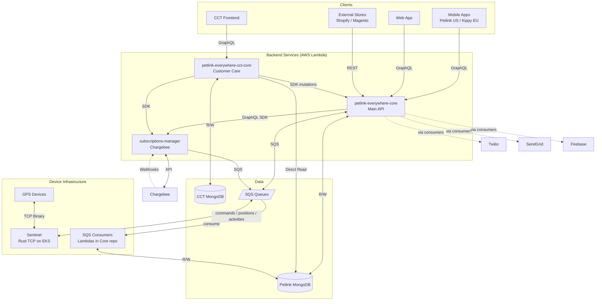

# Petlink Everywhere - Architecture & Overview

## 1. System Architecture
Petlink/Kippy is a GPS pet tracking platform where users register their pets, activate GPS collars, purchase subscriptions, and monitor their pets in real-time through mobile apps.
Two brands: **Petlink** (US) and **Kippy** (EU), same backend. The `APP_BRAND` env var determines which brand the test suite runs against.

## 2. Repositories (`all-repo/`)
- **`petlink-everywhere-core`** - Main backend API (AppSync + Lambdas). Handles users, pets, devices, and SQS consumers.
- **`petlink-everywhere-cct-core`** - Backend for Customer Care Tool. Reads Petlink DB, manages its own CCT DB.
- **`subscriptions-manager`** - Handles Chargebee webhooks, payments, and subscription states.
- **`petlink-everywhere-sentinel`** - High-performance Rust TCP server managing raw connections with GPS devices.
- **`petlink-everywhere-mobile`** - Flutter mobile app (Petlink/Kippy).
- **`petlink-everywhere-web` / `cct`** - React frontends for users and support agents.

---

## 3. AI Navigation & Deep Dives
**CRITICAL:** Before starting any task, use your tools to read the relevant documentation:

### Domain Knowledge (Business Logic Flows)
- **General Infrastructure & Data Flows**: Read `docs/petlnk-infrastructure.md`
- **Registration (User, Pet, Device)**: Read files in `docs/registration/`
- **Subscriptions & Billing**: Read `docs/subscriptions/subscriptions.md`
- **Device Modes & Commands**: Read files in `docs/modes/` and `docs/commands/`

### Technical Rules & Repo Guidelines
- **Core API (`petlink-everywhere-core`)**: Read `ai-rules/petlink-everywhere-core.md`
- **Customer Care (`petlink-everywhere-cct-core`)**: Read `ai-rules/petlink-everywhere-cct-core.md`
- **Payments (`subscriptions-manager`)**: Read `ai-rules/subscriptions-manager.md`
- **Raw GPS / Rust (`petlink-everywhere-sentinel`)**: Read `ai-rules/petlink-everywhere-sentinel.md`
- **Integration Tests (Vitest)**: Follow the testing rules in section 4 of this document.

---

## 4. AI Agent Debugging & Troubleshooting Rules
When an API call fails or a test breaks, **DO NOT make assumptions, guess the cause, or suggest blind fixes**. You must autonomously investigate by following these steps:

1. **Inspect Backend Logic**: Locate and read the actual AWS Lambda resolver or backend service code (in `petlink-everywhere-core`, `petlink-everywhere-cct-core`, or `subscriptions-manager`) that handles the failing API. Analyze exactly how the payload is processed, validated, and where the error is thrown.
2. **Verify Frontend/App Usage**: Search the frontend or mobile repositories (`petlink-everywhere-web`, `petlink-everywhere-mobile`, or `petlink-everywhere-cct`) to see how the user or CCT operator actually calls this endpoint in the real application flow.
3. **Compare Flows**: Compare the exact GraphQL/REST request (payload, headers, sequence of operations) made by the real client with the one being made in the failing test suite. Identify any missing or malformed parameters.
4. **Trace the Architecture**: If necessary, follow the data flow through AppSync, SQS queues, MongoDB or all of necessary microservices to understand the exact state of the system during the request.
