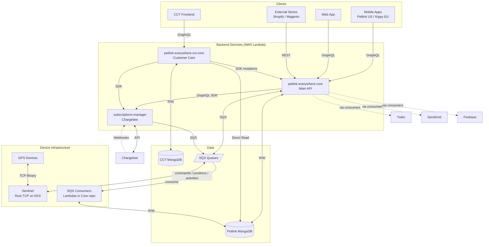

# Petlink Everywhere - Architecture & Overview

## 1. System Architecture
Petlink/Kippy is a GPS pet tracking platform where users register their pets, activate GPS collars, purchase subscriptions, and monitor their pets in real-time through mobile apps.
Two brands: **Petlink** (US) and **Kippy** (EU), same backend. The `APP_BRAND` env var determines which brand the test suite runs against.



## 2. Repositories (`all-repo/`)
- **`petlink-everywhere-core`** - Main backend API (AppSync + Lambdas). Handles users, pets, devices, and SQS consumers.
- **`petlink-everywhere-cct-core`** - Backend for Customer Care Tool. Reads Petlink DB, manages its own CCT DB.
- **`subscriptions-manager`** - Handles Chargebee webhooks, payments, and subscription states.
- **`petlink-everywhere-sentinel`** - High-performance Rust TCP server managing raw connections with GPS devices.
- **`petlink-everywhere-mobile`** - Flutter mobile app (Petlink/Kippy).
- **`petlink-everywhere-web` / `cct`** - React frontends for users and support agents.

---

## 3. AI Navigation & Deep Dives
**CRITICAL:** Before starting any task, use your tools to read the relevant documentation:

### Domain Knowledge (Business Logic Flows)
- **General Infrastructure & Data Flows**: Read `docs/petlnk-infrastructure.md`
- **Registration (User, Pet, Device)**: Read files in `docs/registration/`
- **Subscriptions & Billing**: Read `docs/subscriptions/subscriptions.md`
- **Device Modes & Commands**: Read files in `docs/modes/` and `docs/commands/`

### Technical Rules & Repo Guidelines
- **Core API (`petlink-everywhere-core`)**: Read `ai-rules/petlink-everywhere-core.md`
- **Customer Care (`petlink-everywhere-cct-core`)**: Read `ai-rules/petlink-everywhere-cct-core.md`
- **Payments (`subscriptions-manager`)**: Read `ai-rules/subscriptions-manager.md`
- **Raw GPS / Rust (`petlink-everywhere-sentinel`)**: Read `ai-rules/petlink-everywhere-sentinel.md`
- **Integration Tests (Vitest)**: Follow the testing rules in section 4 of this document.

---

## 4. Integration Testing Rules (Vitest)

### 4.1 Test Philosophy: Entity-Centric Flows
Tests must validate end-to-end entity flows, not isolated technical layers.

Core entity dependency order:
1. **User**: create user.
2. **Pet**: create pet associated to user.
3. **Device**: register device associated to pet.
4. **Subscription**: purchase subscription to activate the device.
5. **Activities**: validate device-driven activities and tracking flows.

Tests are organized by entity and flow domain (`entities/`, `mode/`, `commands/`, `subscriptions/`, `eol/`).

### 4.2 Setup Rules
Use `testHelper.setupBuilder()` in `beforeAll` as the standard setup pattern.

- Always run `cleanupAll()` explicitly in `beforeAll` for a clean state.
- Build entities through the builder (`.withUser()`, `.withDog()`, `.withDogDevice()`, `.withCatDevice()`, etc.).
- Avoid custom setup shortcuts that bypass shared helpers.

### 4.3 Payload Rules
- Define payloads explicitly field by field.
- Never use spread operators with fixtures (`...fixtures`) for API payloads.
- Type payloads with generated/domain types.
- Prefer enums (for example `SpeciesEnum.DOG`) over raw string literals.

### 4.4 Assertion Rules (Mandatory)
All status-code assertions must include a contextual failure message with API error details.

Required pattern:

```typescript
expect(
  response.createPet.code,
  `createPet should succeed - Error: ${response.createPet.message}${response.createPet.translationCode ? ` (${response.createPet.translationCode})` : ''}`
).toBe("200");

expect(
  response.deletePet.code,
  `deletePet should fail - Error: ${response.deletePet.message}${response.deletePet.translationCode ? ` (${response.deletePet.translationCode})` : ''}`
).not.toBe("200");
```

Keep expectations explicit and visible in test files.

### 4.5 Client Access Rules
Backend interactions in tests must go only through approved clients:

- `petlink`
- `testHelper`
- `sentinelTcpSocketClient`

Allowed examples:
- GraphQL HTTP: `petlink.core.graphqlHttp.authJwt.getUser()`, `petlink.core.graphqlHttp.authIam.utilityIntegrationTest()`
- GraphQL WS: `petlink.core.graphqlWS.authJwt.subscribeUntil(...)`
- Sentinel TCP: `petlink.sentinel.connectAndHandshake(device)`

Strictly forbidden:
- Direct `fetch`/`axios` calls to backend services.
- Direct use of `getSdk` inside tests.

Always access infrastructure methods via the `petlink` facade singleton from `client-petlink-infrastructure.ts`.

### 4.6 Logging Rules
- In tests, use `logger.info()` for payload and response visibility.
- In clients, use `logger.debug()` for low-level flow details.
- In clients, use `logger.error()` for real failures (exceptions, timeouts, transport errors).

### 4.7 GraphQL Operations Workflow
- Schemas source of truth: `src/clients/petlink-infrastructure/endpoints/graphql/schema/`.
- Verify operation fields against `.graphql` schema files.
- Add operations in: `src/clients/petlink-infrastructure/endpoints/graphql/operations/{service}_ops.graphql`.
- Keep one unified operations file per microservice (queries, mutations, subscriptions).
- Select all schema fields needed for complete SDK data availability.
- Run `yarn generate-sdk` after operation/schema updates.

### 4.8 Anti-Patterns to Avoid
1. Do not use spread operators for payloads.
2. Do not hide assertions in opaque helper abstractions.
3. Do not bypass official clients.
4. Do not use silent `catch` blocks for expected failures; assert failure outcomes explicitly.

---

## 5. AI Agent Debugging & Troubleshooting Rules
When an API call fails or a test breaks, **DO NOT make assumptions, guess the cause, or suggest blind fixes**. You must autonomously investigate by following these steps:

1. **Inspect Backend Logic**: Locate and read the actual AWS Lambda resolver or backend service code (in `petlink-everywhere-core`, `petlink-everywhere-cct-core`, or `subscriptions-manager`) that handles the failing API. Analyze exactly how the payload is processed, validated, and where the error is thrown.
2. **Verify Frontend/App Usage**: Search the frontend or mobile repositories (`petlink-everywhere-web`, `petlink-everywhere-mobile`, or `petlink-everywhere-cct`) to see how the user or CCT operator actually calls this endpoint in the real application flow.
3. **Compare Flows**: Compare the exact GraphQL/REST request (payload, headers, sequence of operations) made by the real client with the one being made in the failing test suite. Identify any missing or malformed parameters.
4. **Trace the Architecture**: If necessary, follow the data flow through AppSync, SQS queues, MongoDB or all of necessary microservices to understand the exact state of the system during the request.
