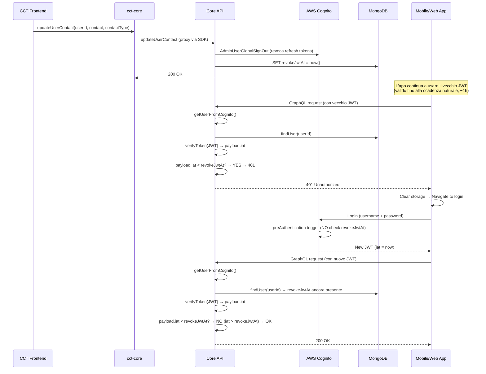

# JWT Revocation & Force Logout Flow

## Scopo

Forzare il logout di un utente (invalidazione JWT) quando un agente CCT modifica il contatto (email/telefono) dell'utente, in modo che l'app smetta di usare dati cachati e rifaccia le richieste al backend con dati freschi.

## Flow End-to-End



## Componenti Coinvolte

### Backend (petlink-everywhere-core)

1. **Trigger**: `src/lambda_functions/graphql/cct/updateUserContact/handler.ts:208-216`
   - Chiama `forceLogout(USER_POOL_ID, userId)` → `AdminUserGlobalSignOut` (revoca tutti i refresh token Cognito)
   - Setta `revokeJwtAt: new Date().toISOString()` sul documento utente in MongoDB

2. **Enforcement**: `src/lib/petlink/user.ts:324-340` (`getUserFromCognito`)
   - Chiamato da `createAppSyncHandler` su **ogni** richiesta GraphQL
   - Se `revokeJwtAt` è settato:
     - Verifica il JWT via `verifyToken()` (Cognito JWT Verifier)
     - Confronta `payload.iat * 1000 < revokeJwtAt`
     - Se il token è stato emesso **prima** di `revokeJwtAt` → ritorna 401
   - Se il token è stato emesso **dopo** → passa (token valido)

3. **`forceLogout`**: `src/lib/aws/cognito.ts:165-182`
   - Chiama `AdminUserGlobalSignOutCommand` → revoca tutti i refresh token
   - **Non** invalida i JWT già emessi (scadono naturalmente, ~1h)

4. **`verifyToken`**: `src/lib/aws/cognito.ts:280-323`
   - Usa `CognitoJwtVerifier` per verificare ID token e Access token
   - Ritorna il payload decodificato (incluso `iat`)

5. **preAuthentication**: `src/lambda_functions/cognito/preAuthentication/handler.ts`
   - **NON** controlla `revokeJwtAt` → l'utente può sempre fare login
   - Valida solo coerenza metodo/username, contatti verificati, forceChangePassword

### Schema (petlink-everywhere-types)

- `src/types/user.ts:120`: `revokeJwtAt: z.string().datetime({ offset: true }).nullish()`
- Campo opzionale sul documento `USER` in MongoDB

### Mobile (petlink-everywhere-mobile)

1. **Gestione 401**: `lib/base/network/exception_managment.dart:37-63`
   - Mostra dialog "session expired"
   - Clear storage, delete controllers, navigate to `Routes.auth`

2. **Session check**: `lib/base/network/cognito_manager.dart:131-210`
   - `checkUserSession()` verifica la sessione Cognito
   - Se scaduta → `_handleExpiredSessionLogout()` → clear + navigate to auth

3. **WebSocket 401**: `lib/base/network/subscriptions/app_sync_subscription_manager.dart:319-337`
   - Su errore 401/Unauthorized nella subscription → `_handleDisconnection()` → riconnessione

### Web (petlink-everywhere-web)

1. **Gestione 401**: `src/store/middlewares/unauthorized.middleware.ts`
   - Intercetta azioni RTK Query con code 401 o errori "unauthorized"
   - Clear `sessionStorage` + `localStorage` → `window.location.reload()`

## Bug e Debolezze Identificate

### BUG 1: `revokeJwtAt` non viene MAI ripulito

**Problema**: Dopo che l'utente fa re-login, `revokeJwtAt` rimane nel documento MongoDB. Non esiste un trigger `postAuthentication` che lo cancelli.

**Impatto**:
- Ogni richiesta GraphQL futura esegue comunque `verifyToken()` (chiamata Cognito aggiuntiva, ~50-100ms latenza)
- Il campo accumula stale data nel DB indefinitamente
- Se il valore viene accidentalmente settato a una data futura → **lockout permanente**

### BUG 2: Lockout infinito con data futura

**Problema**: Se `revokeJwtAt` viene settato a una data futura (es. errore manuale nel DB, clock skew, o bug futuro):

```typescript
// user.ts:330
if (!payload || new Date(payload.iat * 1000) < new Date(revokeJwtAt))
```

- Qualsiasi token emesso prima di quella data futura → `iat < revokeJwtAt` → 401
- Anche dopo re-login, il nuovo token ha `iat` = now, che è ancora `< revokeJwtAt` (futuro)
- L'utente **non può mai** usare l'app finché il tempo reale non supera `revokeJwtAt`

**Scenario realistico**: un admin o script setta `revokeJwtAt` a `2026-12-31` per errore → l'utente è bloccato fino a fine anno.

### BUG 3: `verifyToken` su ogni richiesta (performance)

**Problema**: Quando `revokeJwtAt` è settato (sempre, dato che non viene ripulito), ogni richiesta GraphQL:
1. Legge `revokeJwtAt` dal DB (già fatto per il user)
2. Chiama `verifyToken()` → verifica crittografica JWT via Cognito JWKS
3. Confronta `iat` vs `revokeJwtAt`

`verifyToken()` è una operazione costosa (verifica firma + fetch JWKS cache). Su ogni singola richiesta GraphQL è overhead non necessario.

### Debolezza 4: Doppio meccanismo ridondante

`AdminUserGlobalSignOut` + `revokeJwtAt` sono parzialmente ridondanti:
- `AdminUserGlobalSignOut`: revoca refresh token → l'utente non può rinnovare il JWT dopo scadenza
- `revokeJwtAt`: blocca i JWT ancora validi prima della scadenza naturale

Ma `revokeJwtAt` rimane attivo **per sempre** anche dopo che `AdminUserGlobalSignOut` ha già fatto il suo lavoro (refresh token già revocati).

## Fix Proposti

### Fix A: Ripulire `revokeJwtAt` dopo re-login (raccomandato)

Aggiungere un trigger Cognito `PostAuthentication` che setta `revokeJwtAt = null` dopo un login successful:

```typescript
// src/lambda_functions/cognito/postAuthentication/handler.ts
export const handler: PostAuthenticationTriggerHandler = async (event) => {
  if (event.triggerSource === 'PostAuthentication_Authentication') {
    await upsertItemById(
      dbSecret,
      event.userName,
      { revokeJwtAt: null },
      COLLECTION_NAME
    );
  }
  return event;
};
```

**Vantaggi**:
- Risolve BUG 1, 2, 3 simultaneamente
- `revokeJwtAt` serve solo nel window tra force-logout e re-login
- Dopo re-login, il campo viene ripulito → no più overhead

### Fix B: Aggiungere guardia anti-data-futura (defense in depth)

```typescript
// user.ts:330 - aggiungere guardia
if (revokeJwtAt) {
  const revokeDate = new Date(revokeJwtAt);
  const now = new Date();
  
  // Ignora revokeJwtAt nel futuro (bug/data corrotta)
  if (revokeDate > now) {
    logger.warn(`revokeJwtAt is in the future: ${revokeJwtAt}, ignoring`);
  } else {
    const authToken = headers['authorization']!.replace('Bearer ', '');
    const payload = await verifyToken(authToken, userPoolId, clientId);
    if (!payload || new Date(payload.iat * 1000) < revokeDate) {
      // ... return 401
    }
  }
}
```

**Vantaggi**:
- Previene lockout infinito anche se il DB viene corrotto
- Defense in depth: anche se Fix A fallisce, l'utente non resta bloccato

### Fix C: TTL su `revokeJwtAt` (alternativa a Fix A)

Se non si può aggiungere un trigger postAuthentication, si può ignorare `revokeJwtAt` dopo un certo TTL (es. 1h = durata naturale del JWT):

```typescript
const revokeDate = new Date(revokeJwtAt);
const oneHourMs = 60 * 60 * 1000;
if (Date.now() - revokeDate.getTime() > oneHourMs) {
  // revokeJwtAt è più vecchio della durata del JWT → il token è già scaduto naturalmente
  // AdminUserGlobalSignOut ha già revocato i refresh token → skip check
} else {
  // ... check normale
}
```

## Raccomandazione

Implementare **Fix A + Fix B** insieme:
- Fix A risolve la causa root (revokeJwtAt mai ripulito)
- Fix B protegge contro dati corrotti/manueli (defense in depth)
