# End of Life (EOL)

## Overview

The **End of Life (EOL)** process is a critical initiative designed to replace **KIPPY EVO** devices, which rely exclusively on 2G connectivity. With the upcoming decommissioning of 2G networks (scheduled for late 2027 in France), these devices will eventually cease to function. This flow ensures a seamless transition for users to newer, 4G/LTE-compatible devices.

The system determines eligibility based on the user's current device and subscription status, offering two distinct paths:

1.  **Device Replacement Only (Flow 1)**: For users with an active long-term subscription or specific eligibility. The user only pays for the new device (often discounted or free).
    *   **Rule**: If the user has a subscription expiring **after 2027**, the device is **free**.

2.  **Device + Subscription Replacement (Flow 2)**: For users with expired or no subscription. The user purchases a new subscription plan first, and then proceeds to order the new device.
    *   **Rule**: If the user buys a **2 or 5-year subscription**, the device is **free**.
    *   **Rule**: If the user buys a **1-year subscription**, the device is **50% off**.

**Chronological user flow:**
1.  **Eligibility Check**: User visits EOL page; backend checks device status and available offers.
2.  **Selection**: User selects device (and plan if applicable).
3.  **Shipping**: User provides shipping address.
4.  **Checkout (if needed)**: User pays for subscription via Chargebee (Flow 2 only).
5.  **Order Completion**: User is redirected to complete the device order (Internal Thank You page or External Order System).
    *   *Note*: Even for Flow 2, after completing the order on the external system, the user is redirected back to our **Internal Thank You Page**.

---

## Visual Flow Summary

```mermaid
graph TD
    %% Definitions of styles
    classDef page fill:#e3f2fd,stroke:#1565c0,stroke-width:2px,color:black;
    classDef api fill:#f3e5f5,stroke:#7b1fa2,stroke-width:2px,stroke-dasharray: 5 5,color:black;
    classDef ext fill:#fff3e0,stroke:#e65100,stroke-width:2px,color:black;
    classDef decision fill:#fff9c4,stroke:#fbc02d,stroke-width:2px,shape:diamond,color:black;

    %% START
    Start((Start)) --> API_Init
    
    API_Init["API: getPlansEOL<br/>(Check Eligibility)"]:::api
    API_Init --> Check{"Plans Available?"}:::decision

    %% FLOW 1 BRANCH
    Check -- No (Device Only) --> P1_Select
    
    subgraph "Flow 1: Device Replacement Only"
        direction TB
        P1_Select["PAGE: Device Selection<br/>Step: UPDATE_ONLY_DEVICE<br/>Action: Select Device"]:::page
        P1_Select -- "Select & Continue" --> API1_Upd1
        
        API1_Upd1["API: updateEndOfLife<br/>step: SHIPPING_INFO_FROM_ONLY_DEVICE<br/>devicePriceId: ID"]:::api
        API1_Upd1 --> P1_Ship
        
        P1_Ship["PAGE: Shipping Info<br/>Step: SHIPPING_INFO<br/>Action: Fill Address"]:::page
        P1_Ship -- "Submit" --> API1_Upd2
        
        API1_Upd2["API: updateEndOfLife<br/>step: SHIPPING_INFO_DEFINED...<br/>shippingInfo: {...}"]:::api
        API1_Upd2 --> API1_Checkout
        
        API1_Checkout["API: checkoutEOLNewDevice<br/>Generates URL (Internal)"]:::api
        API1_Checkout --> API1_Upd3
        
        API1_Upd3["API: updateEndOfLife<br/>step: EXTERNAL_PAGE<br/>shopUrl: /eol/thank-you"]:::api
        API1_Upd3 --> P1_Redirect
        
        P1_Redirect["Redirect: Internal Thank You Page"]:::page
    end

    %% FLOW 2 BRANCH
    Check -- Yes (Device + Plan) --> P2_Select

    subgraph "Flow 2: Device + Subscription"
        direction TB
        P2_Select["PAGE: Device & Plan Selection<br/>Step: UPDATE_DEVICE_AND_PLAN<br/>Action: Select Both"]:::page
        P2_Select -- "Select & Continue" --> API2_Upd1
        
        API2_Upd1["API: updateEndOfLife<br/>step: SHIPPING_INFO_FROM_PLAN<br/>devicePriceId: ID, priceId: ID"]:::api
        API2_Upd1 --> P2_Ship
        
        P2_Ship["PAGE: Shipping Info<br/>Step: SHIPPING_INFO<br/>Action: Fill Address"]:::page
        P2_Ship -- "Submit" --> API2_Upd2
        
        API2_Upd2["API: updateEndOfLife<br/>step: PLAN_SUMMARY_PAGE<br/>shippingInfo: {...}"]:::api
        API2_Upd2 --> P2_Summary
        
        P2_Summary["PAGE: Summary<br/>Step: PLAN_SUMMARY_PAGE<br/>Action: Click Checkout"]:::page
        P2_Summary -- "Checkout" --> API2_Checkout
        
        API2_Checkout["API: checkoutNewSubscription<br/>Returns Chargebee Hosted Page"]:::api
        API2_Checkout --> EXT_CB
        
        EXT_CB["EXTERNAL: Chargebee Payment<br/>Action: Pay & Confirm"]:::ext
        EXT_CB -- "Callback (Success)" --> P2_Wait
        
        P2_Wait["PAGE: Waiting...<br/>Step: WAITING_PLAN_PURCHASE<br/>Action: Polling"]:::page
        P2_Wait -.-> API2_Ack
        
        API2_Ack["API: setAcknowledgeCheckout<br/>API: updateEndOfLife (WAITING...)"]:::api
        API2_Ack --> API2_Poll
        
        API2_Poll["API: getPlansEOL<br/>(Polling for subscriptionId)"]:::api
        API2_Poll -- "Got SubscriptionId" --> API2_GenUrl
        
        API2_GenUrl["API: checkoutEOLNewDevice<br/>Generates URL (External Daniele)"]:::api
        API2_GenUrl --> API2_UpdFinal
        
        API2_UpdFinal["API: updateEndOfLife<br/>step: EXTERNAL_PAGE<br/>shopUrl: orders.daniele.com..."]:::api
        API2_UpdFinal --> EXT_Daniele
        
        EXT_Daniele["EXTERNAL: Daniele Order System<br/>Action: Complete Hardware Order"]:::ext
        EXT_Daniele -- "Callback (Success)" --> P2_Redirect

        P2_Redirect["Redirect: Internal Thank You Page"]:::page
    end
```



---

## Full User Journey

### STEP 1: INITIALIZATION & ELIGIBILITY

```
User visits /eol page
  ↓
App calls GraphQL query:

  getPlansEOL({
    productId: "device123",
    countryCode: "FR"
  })

  ↓
Backend:
  ├─ Checks if device is EOL eligible
  ├─ Checks if user has active subscription
  └─ Returns:
     - plans: [] -> triggers Flow 1 (Device Only)
     - plans: [...] -> triggers Flow 2 (Device + Plan)
```

### STEP 2: SELECTION & UPDATE

```
User selects device (and plan if Flow 2)
  ↓
App calls GraphQL mutation:

  updateEndOfLife({
    eolId: null, // First call creates the EOL session
    deviceId: "device123",
    input: {
      step: "SHIPPING_INFO_...",
      devicePriceId: "...",
      priceId: "..." // Flow 2 only
    }
  })

  ↓
Backend:
  ├─ Creates EndOfLife record in DB
  └─ Returns new eolId
```

### STEP 3: CHECKOUT & COMPLETION

#### Flow 1 (Device Only)
1.  **Shipping Info**: User enters address → `updateEndOfLife`
2.  **Generate URL**: App calls `checkoutEOLNewDevice` → returns internal URL
3.  **Redirect**: App redirects to Internal Thank You Page (`/eol/thank-you`)

#### Flow 2 (Device + Subscription)
1.  **Shipping Info**: User enters address → `updateEndOfLife`
2.  **Summary**: User reviews plan → `checkoutNewSubscription` → returns Chargebee URL
3.  **Payment**: User pays on Chargebee → redirects back to app
4.  **Acknowledge**: App calls `acknowledgeCheckout` (triggers backend event)
5.  **Polling**: App polls `getPlansEOL` until `subscriptionId` appears
6.  **Generate URL**: App calls `checkoutEOLNewDevice` → returns External Daniele URL
7.  **Redirect**: App redirects to External Order System (`orders.daniele.com`)
8.  **Final Redirect**: External System redirects back to Internal Thank You Page (`/eol/thank-you`)

---
