# End of Life (EOL) - Flow Analysis & Comparison

## 1. 🔄 Flow Divergence & Landing Points

### **Dove divergono?**
I due flussi divergono **fin dall'inizio**, in base alla risposta di `getPlansEOL`:
1.  **Start**: Se `plans` è vuoto -> **Flow 1**; Se `plans` ha elementi -> **Flow 2**.
2.  **Selection Page**:
    *   **Flow 1**: Pagina `UPDATE_ONLY_DEVICE` (Vedo solo device).
    *   **Flow 2**: Pagina `UPDATE_DEVICE_AND_PLAN` (Vedo device + lista piani).
3.  **Convergenza (Apparente)**: Entrambi passano per la pagina `Shipping Info`.
4.  **Divergenza Principale**: Dopo la shipping info:
    *   **Flow 1**: Va dritto alla generazione URL e redirect finale.
    *   **Flow 2**: Va alla `PLAN_SUMMARY_PAGE`, poi Chargebee, poi Polling.

### **Dove atterrano? (Redirect Finali)**
Non atterrano nello stesso posto immediatamente:
*   **Flow 1**: Atterra sulla **Nostra Thank You Page Interna** (`/eol/thank-you`).
    *   *Il Backend genera un URL che punta a noi stessi.*
*   **Flow 2**: Atterra sul **Sistema Ordini Esterno (Daniele)** (`orders.daniele.com...`).
    *   *L'utente esce dal nostro sito per completare l'ordine del device.*
    *   *Nota: Il sistema di Daniele ha una `callBackUrl` che punta alla nostra Thank You Page, quindi l'utente potrebbe tornare da noi alla fine del processo esterno.*

## 2. 💳 Chargebee & Test
*   **Redirect**: Sì, il redirect verso Chargebee nel Flow 2 è lo stesso meccanismo standard usato per le altre subscription (`useChargebeeCheckout`).
*   **Test**: Confermo che puoi usare `testHelper.purchaseSubscription` per simulare/aggirare il pagamento reale nei test, esattamente come fai per i flussi standard. Il backend se ne accorge tramite il polling.

---

## 3. 📊 Visual Flow Diagrams

### Legenda Colori

```mermaid
graph TD
    %% Definitions of styles
    classDef page fill:#e3f2fd,stroke:#1565c0,stroke-width:2px,color:black;
    classDef api fill:#f3e5f5,stroke:#7b1fa2,stroke-width:2px,stroke-dasharray: 5 5,color:black;
    classDef ext fill:#fff3e0,stroke:#e65100,stroke-width:2px,color:black;
    classDef decision fill:#fff9c4,stroke:#fbc02d,stroke-width:2px,shape:diamond,color:black;

    %% START
    Start((Start)) --> API_Init
    
    API_Init["API: getPlansEOL<br/>(Check Eligibility)"]:::api
    API_Init --> Check{"Plans Available?"}:::decision

    %% FLOW 1 BRANCH
    Check -- No (Device Only) --> P1_Select
    
    subgraph "Flow 1: Device Replacement Only"
        direction TB
        P1_Select["PAGE: Device Selection<br/>Step: UPDATE_ONLY_DEVICE<br/>Action: Select Device"]:::page
        P1_Select -- "Select & Continue" --> API1_Upd1
        
        API1_Upd1["API: updateEndOfLife<br/>step: SHIPPING_INFO_FROM_ONLY_DEVICE<br/>devicePriceId: ID"]:::api
        API1_Upd1 --> P1_Ship
        
        P1_Ship["PAGE: Shipping Info<br/>Step: SHIPPING_INFO<br/>Action: Fill Address"]:::page
        P1_Ship -- "Submit" --> API1_Upd2
        
        API1_Upd2["API: updateEndOfLife<br/>step: SHIPPING_INFO_DEFINED...<br/>shippingInfo: {...}"]:::api
        API1_Upd2 --> API1_Checkout
        
        API1_Checkout["API: checkoutEOLNewDevice<br/>Generates URL (Internal)"]:::api
        API1_Checkout --> API1_Upd3
        
        API1_Upd3["API: updateEndOfLife<br/>step: EXTERNAL_PAGE<br/>shopUrl: /eol/thank-you"]:::api
        API1_Upd3 --> P1_Redirect
        
        P1_Redirect["Redirect: Internal Thank You Page"]:::page
    end

    %% FLOW 2 BRANCH
    Check -- Yes (Device + Plan) --> P2_Select

    subgraph "Flow 2: Device + Subscription"
        direction TB
        P2_Select["PAGE: Device & Plan Selection<br/>Step: UPDATE_DEVICE_AND_PLAN<br/>Action: Select Both"]:::page
        P2_Select -- "Select & Continue" --> API2_Upd1
        
        API2_Upd1["API: updateEndOfLife<br/>step: SHIPPING_INFO_FROM_PLAN<br/>devicePriceId: ID, priceId: ID"]:::api
        API2_Upd1 --> P2_Ship
        
        P2_Ship["PAGE: Shipping Info<br/>Step: SHIPPING_INFO<br/>Action: Fill Address"]:::page
        P2_Ship -- "Submit" --> API2_Upd2
        
        API2_Upd2["API: updateEndOfLife<br/>step: PLAN_SUMMARY_PAGE<br/>shippingInfo: {...}"]:::api
        API2_Upd2 --> P2_Summary
        
        P2_Summary["PAGE: Summary<br/>Step: PLAN_SUMMARY_PAGE<br/>Action: Click Checkout"]:::page
        P2_Summary -- "Checkout" --> API2_Checkout
        
        API2_Checkout["API: checkoutNewSubscription<br/>Returns Chargebee Hosted Page"]:::api
        API2_Checkout --> EXT_CB
        
        EXT_CB["EXTERNAL: Chargebee Payment<br/>Action: Pay & Confirm"]:::ext
        EXT_CB -- "Callback (Success)" --> P2_Wait
        
        P2_Wait["PAGE: Waiting...<br/>Step: WAITING_PLAN_PURCHASE<br/>Action: Polling"]:::page
        P2_Wait -.-> API2_Ack
        
        API2_Ack["API: setAcknowledgeCheckout<br/>API: updateEndOfLife (WAITING...)"]:::api
        API2_Ack --> API2_Poll
        
        API2_Poll["API: getPlansEOL<br/>(Polling for subscriptionId)"]:::api
        API2_Poll -- "Got SubscriptionId" --> API2_GenUrl
        
        API2_GenUrl["API: checkoutEOLNewDevice<br/>Generates URL (External Daniele)"]:::api
        API2_GenUrl --> API2_UpdFinal
        
        API2_UpdFinal["API: updateEndOfLife<br/>step: EXTERNAL_PAGE<br/>shopUrl: orders.daniele.com..."]:::api
        API2_UpdFinal --> EXT_Daniele
        
        EXT_Daniele["EXTERNAL: Daniele Order System<br/>Action: Complete Hardware Order"]:::ext
    end
```

*   🟦 Pagine Frontend (User UI)
*   🟪 Chiamate API (Backend)
*   🟧 Redirect Esterni

