# End of Life (EOL) Frontend Flow Comparison

```mermaid
graph TD
subgraph "Flow 1: Device-Only"
F1[Start: User with active subscription]
F1_Eligibility[getPlansEOL<br/>subscription active<br/>plans empty]
F1_Decision{Frontend: plans empty<br/>use device-only flow}
F1_Step1[STEP 1: Device Selection<br/>User selects device type]
F1_API1[updateEndOfLife<br/>eolId: null<br/>step: SHIPPING_INFO_FROM_ONLY_DEVICE<br/>devicePriceId: selected]
F1_Step2[STEP 2: Shipping Info<br/>User fills shipping form]
F1_API2[updateEndOfLife<br/>eolId: created<br/>step: SHIPPING_INFO_DEFINED_BEFORE_EXTERNAL_PAGE<br/>shippingInfo: user data]
F1_API3[checkoutEOLNewDevice<br/>eolId: created]
F1_API4[updateEndOfLife<br/>eolId: created<br/>step: EXTERNAL_PAGE<br/>shopUrl: thank-you URL]
F1_Redirect[Redirect to thank-you page]
F1_End[End: Device replaced]

F1 --> F1_Eligibility --> F1_Decision --> F1_Step1 --> F1_API1 --> F1_Step2 --> F1_API2 --> F1_API3 --> F1_API4 --> F1_Redirect --> F1_End
end

subgraph "Flow 2: Device + Subscription"
F2[Start: User with expired subscription]
F2_Eligibility[getPlansEOL<br/>subscription expired<br/>plans available]
F2_Decision{Frontend: plans available<br/>use device+subscription flow}
F2_Step1[STEP 1: Device+Plan Selection<br/>User selects device and plan]
F2_API1[updateEndOfLife<br/>eolId: null<br/>step: SHIPPING_INFO_FROM_PLAN<br/>devicePriceId: selected<br/>priceId: selected]
F2_Step2[STEP 2: Shipping Info<br/>User fills shipping form]
F2_API2[updateEndOfLife<br/>eolId: created<br/>step: PLAN_SUMMARY_PAGE<br/>shippingInfo: user data]
F2_Step3[STEP 3: Plan Summary<br/>User reviews order]
F2_API3[checkoutNewSubscription<br/>productId: device<br/>priceIds: plan IDs]
F2_Redirect1[Redirect to Chargebee payment]
F2_Callback[Return from payment<br/>with checkout ID]
F2_API4[setAcknowledgeCheckout<br/>checkoutId: received]
F2_API5[updateEndOfLife<br/>eolId: created<br/>step: WAITING_PLAN_PURCHASE]
F2_Step4[STEP 4: Polling<br/>Wait for subscription activation]
F2_API6[getPlansEOL<br/>poll every 5 seconds]
F2_API7[checkoutEOLNewDevice<br/>eolId: created]
F2_API8[updateEndOfLife<br/>eolId: created<br/>step: EXTERNAL_PAGE<br/>shopUrl: Daniele URL]
F2_Redirect2[Redirect to Daniele device page]
F2_End[End: Device replaced + new subscription]

F2 --> F2_Eligibility --> F2_Decision --> F2_Step1 --> F2_API1 --> F2_Step2 --> F2_API2 --> F2_Step3 --> F2_API3 --> F2_Redirect1 --> F2_Callback --> F2_API4 --> F2_API5 --> F2_Step4 --> F2_API6 --> F2_API7 --> F2_API8 --> F2_Redirect2 --> F2_End
end

class F1,F2 fill:#e8f5e8,stroke:#2e7d32,stroke-width:3px
class F1_Eligibility,F2_Eligibility fill:#fff3e0,stroke:#e65100,stroke-width:2px
class F1_Decision,F2_Decision fill:#fce4ec,stroke:#c2185b,stroke-width:2px
class F1_Step1,F1_Step2,F2_Step1,F2_Step2,F2_Step3,F2_Step4 fill:#e3f2fd,stroke:#1565c0,stroke-width:2px
class F1_API1,F1_API2,F1_API3,F1_API4,F2_API1,F2_API2,F2_API3,F2_API4,F2_API5,F2_API6,F2_API7,F2_API8 fill:#f3e5f5,stroke:#7b1fa2,stroke-width:2px
class F1_Redirect,F2_Redirect1,F2_Callback,F2_Redirect2 fill:#ffebee,stroke:#c62828,stroke-width:2px
class F1_End,F2_End fill:#e0f2f1,stroke:#00695c,stroke-width:3px
```



## 🔄 Complete Frontend Cycles

### 📋 **Flow 1: Device-Only (3 Pages + Redirect)**

| Step | Page | User Action | API Call | Request Data | Next Step |
|------|------|-------------|----------|--------------|-----------|
| 1. Eligibility | - | Landing page loads automatically | **getPlansEOL(productId: device-123, countryCode: "FR")** | productId, countryCode | Device Selection |
| 2. Device Selection | `/end-of-life/upgrade-device` | User selects new device type | **updateEndOfLife(eolId: null, deviceId: device-123, input: { step: "SHIPPING_INFO_FROM_ONLY_DEVICE", devicePriceId: "price-456" })** | eolId: null, devicePriceId | Shipping Info |
| 3. Shipping Info | `/end-of-life/shipping-info` | User fills shipping form (name, address, email, phone) | **updateEndOfLife(eolId: "eol-789", deviceId: device-123, input: { step: "SHIPPING_INFO_DEFINED_BEFORE_EXTERNAL_PAGE", shippingInfo: { firstName: "Mario", lastName: "Rossi", email: "user@test.com", phone: "+33612345678", address: "123 Rue de la Paix", city: "Paris", zip: "75001", country: "FR" } })** | eolId, shippingInfo | Generate URL |
| 4. Generate URL | - | Automatic after shipping submit | **checkoutEOLNewDevice(eolId: "eol-789")** | eolId | Update with shopUrl |
| 5. Update & Redirect | - | Automatic after URL generation | **updateEndOfLife(eolId: "eol-789", deviceId: device-123, input: { step: "EXTERNAL_PAGE", shopUrl: "https://app.kippy.io/pets/dog-123/products/device-456/eol/thank-you" })** | eolId, shopUrl | Browser redirect |

### 📋 **Flow 2: Device + Subscription (6 Pages + 2 Redirects)**

| Step | Page | User Action | API Call | Request Data | Next Step |
|------|------|-------------|----------|--------------|-----------|
| 1. Eligibility | - | Landing page loads automatically | **getPlansEOL(productId: device-123, countryCode: "FR")** | productId, countryCode | Device+Plan Selection |
| 2. Device+Plan Selection | `/end-of-life/upgrade-device-and-plan` | User selects new device + subscription plan | **updateEndOfLife(eolId: null, deviceId: device-123, input: { step: "SHIPPING_INFO_FROM_PLAN", devicePriceId: "price-456", priceId: "plan-2", addonIds: ["addon-123"] })** | eolId: null, devicePriceId, priceId, addonIds | Shipping Info |
| 3. Shipping Info | `/end-of-life/shipping-info` | User fills shipping form (name, address, email, phone) | **updateEndOfLife(eolId: "eol-789", deviceId: device-123, input: { step: "PLAN_SUMMARY_PAGE", shippingInfo: { firstName: "Mario", lastName: "Rossi", email: "user@test.com", phone: "+33612345678", address: "123 Rue de la Paix", city: "Paris", zip: "75001", country: "FR" } })** | eolId, shippingInfo | Plan Summary |
| 4. Plan Summary | `/end-of-life/summary-page` | User reviews order and clicks "Continue to Payment" | **checkoutNewSubscription(productId: device-123, priceIds: ["plan-2"], hostedPageOptions: { redirectUrl: "https://app.kippy.io/end-of-life/from-hosted-page" })** | productId, priceIds, redirectUrl | Chargebee redirect |
| 5. Payment Callback | `/end-of-life/from-hosted-page` | User returns from Chargebee payment page | **setAcknowledgeCheckout(id: "chargebee-checkout-xyz789")** | chargebeeCheckoutId | Update state |
| 6. Update State | - | Automatic after acknowledge | **updateEndOfLife(eolId: "eol-789", deviceId: device-123, input: { step: "WAITING_PLAN_PURCHASE" })** | eolId | Polling for active sub |
| 7. Polling | `/end-of-life/waiting-plan-purchase` | Frontend polls every 5 seconds | **getPlansEOL(productId: device-123, countryCode: "FR")** | productId, countryCode | Generate final URL |
| 8. Final URL | - | Automatic when subscription becomes active | **checkoutEOLNewDevice(eolId: "eol-789")** | eolId | Update with shopUrl |
| 9. Final Redirect | - | Automatic after final URL generation | **updateEndOfLife(eolId: "eol-789", deviceId: device-123, input: { step: "EXTERNAL_PAGE", shopUrl: "https://orders.daniele.com/checkout?tk=device-token-456" })** | eolId, shopUrl | Daniele redirect |

## 🎯 Key Differences

| Aspect | Flow 1 | Flow 2 |
|---------|----------|----------|
| **Pages** | 3 pages | 6 pages |
| **User Actions** | 2 actions (select device, fill shipping) | 3 actions (select device+plan, fill shipping, confirm payment) |
| **API Calls** | 5 total | 9 total |
| **Redirects** | 1 (thank-you page) | 2 (Chargebee + Daniele) |
| **Complexity** | Simple device replacement | Complex payment + polling flow |
| **Payment** | No payment required | Chargebee subscription payment |

## 📝 **deviceId vs devicePriceId**

- **deviceId**: ID del device corrente dell'utente (es: "device-123")
- **devicePriceId**: ID del prezzo del nuovo device selezionato (es: "price-456")

Nel frontend:
```typescript
// useUpdateEndOfLifeManager.tsx
return {
  eolId,
  deviceId: productId,        // ← Device corrente
  input: {
    devicePriceId,            // ← Prezzo nuovo device
    // ...
  }
};
```

## 🔍 **API Call Sequence Details**

### Flow 1 Sequence:
```
1. getPlansEOL() → Check eligibility (plans: empty)
2. updateEndOfLife() → Create EOL, select device
3. updateEndOfLife() → Save shipping info
4. checkoutEOLNewDevice() → Generate thank-you URL
5. updateEndOfLife() → Save shopUrl, prepare redirect
```

### Flow 2 Sequence:
```
1. getPlansEOL() → Check eligibility (plans: available)
2. updateEndOfLife() → Create EOL, select device+plan
3. updateEndOfLife() → Save shipping info
4. checkoutNewSubscription() → Start Chargebee payment
5. setAcknowledgeCheckout() → Confirm payment
6. updateEndOfLife() → Set waiting state
7. getPlansEOL() → Poll for active subscription
8. checkoutEOLNewDevice() → Generate Daniele URL
9. updateEndOfLife() → Save shopUrl, prepare redirect
```
