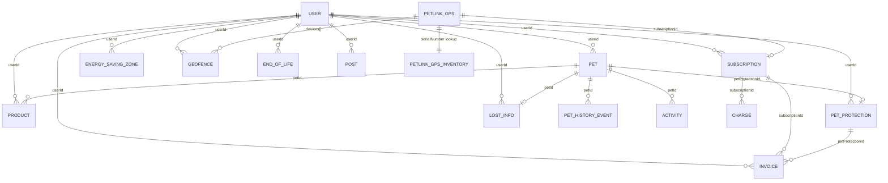

# Entità e Relazioni Backend

> Documento ricavato da GraphQL Core Schema (`core_schema.graphql`), tipi TypeScript di `cct-core` e logica DB in `petlink-everywhere-core`.

---

## 1. Panoramica Architettura DB

- **Collezione unica principale:** `petlinkEverywhere` con discriminatore `entityType` che ospita quasi tutte le entità.
- **Collezione separata:** `petlinkGpsInventory` → whitelist/catalogo fisico dei device (serial → imei/iccid/firmware/model/brand).
- Altre collezioni ausiliarie: `positionsHistory`, `notificationsHistory`, `templates`, `ssoTokens`, `breeds`.

---

## 2. Diagramma ER

---

## 3. Entità Principali

### `Entity` (base)
- `id` (UUID)
- `entityType` → discriminatore (enum)
- `creationDate`, `updateDate`

---

### `USER` (`entityType = USER`)
**Fonte:** `cct-core/src/lib/types/user.ts:53-85`

**Campi principali:**
- `id`, `email`, `phone`, `name`, `surname`
- `appBrand`: `KIPPY` | `PETLINK`
- `languageId`, `countryCode`, `city`, `stateCode`, `zipCode`, `streetAddress`, `timezone`
- `contactVerified: { email, phone }`
- `notificationSettings`, `mobileDevices[]`, `image`, `chargebeeId`
- `haveMicrochip` (calcolato a runtime da `userHasEntity`)
- `deleted` (soft delete), `revokeJwtAt`

**Relazioni:**
- **1 → N** `PET` (`Pet.userId`)
- **1 → N** `Product` di qualsiasi tipo (`Product.userId`)
- **1 → N** `SUBSCRIPTION` (`Subscription.userId`)
- **1 → N** `ENERGY_SAVING_ZONE`, `GEOFENCE`, `PET_PROTECTION`, `INVOICE`, `LOST_INFO`, `POST`, `END_OF_LIFE`

**Vincoli:** non cancellabile se ha almeno un `PET` associato.

---

### `PET` (`entityType = PET`)
**Fonte:** `cct-core/src/lib/types/pet.ts:74-99`

**Campi principali:**
- `id`, `name`, `species` (`DOG` | `CAT` | `OTHER`)
- `breeds[]`, `breedType` (`PUREBREED` | `MIXED_BREED`), `gender`
- `birthDate`, `primaryColor`, `weight`, `livingEnvironment`, `neutered`, `length`
- `userId` → FK a `USER`
- `image`, `dateMarkedAsLost`, `hidden`
- `petProtectionId` → FK opzionale a `PET_PROTECTION`

**Relazioni:**
- Appartiene a **1 USER**.
- Può avere **N Product** (GPS, microchip, QR tag) → `Product.petId`.
- Non può essere eliminato se ha un `Product` associato.

---

### `Product` (base) e tipi concreti
**Fonte:** `cct-core/src/lib/types/product.ts:58-67`

`Product` è la classe base con:
- `id`, `entityType` (`PETLINK_GPS` | `PETLINK_MICROCHIP` | `PETLINK_QR_TAG`)
- `serialNumber`, `petId`, `userId`
- `subscriptionId` (opzionale), `lastKnownPosition`, `lastKnownStatus`

#### `PETLINK_GPS`
**Fonte:** `cct-core/src/lib/types/petlinkGps.ts:61-80`

Estende `Product` e aggiunge:
- `serialNumber`, `countryCode`, `timezone`
- `settings: { activityProfile, updateFrequency, enableGpsOnDefault }`
- `lastKnownPosition`, `lastKnownStatus`, `geofenceCoordinates`
- `subscriptionId` → FK a `Subscription`
- `subscriptionIsActive` (boolean derivato dal lookup con la subscription)
- `newFirmwareVersion`, `logEnabled`, `endOfLifeDeviceStatus`
- `imei`, `iccid` (popolati dal lookup con `petlinkGpsInventory`)

**Lookup con inventory:**
Quando il BE serve i dati al client, esegue un aggregation `$lookup` da `petlinkEverywhere` a `petlinkGpsInventory` per arricchire il documento con:
- `deviceType` (`DOG`/`CAT`/`EVO`/`FINDER`/`VITA`…)
- `appBrand` (`KIPPY`/`PETLINK`)
- `firmwareVersion`, `imei`, `iccid`, `simStatus`

**Fonte aggregato:** `petlink-everywhere-core/src/lib/petlink/subscriptions.ts:58-178`

#### `PETLINK_MICROCHIP` / `PETLINK_QR_TAG`
Struttura minimale: ereditano da `Product` e hanno solo `serialNumber`, `petId`, `userId`.

---

### `PETLINK_GPS_INVENTORY` (collezione separata)
**Fonte:** `cct-core/src/lib/types/petlinkGpsInventory.ts:50-84`

Questa NON è nella `petlinkEverywhere` ma in `petlinkGpsInventory`.
- Chiave logica: `serialNumber`
- Campi: `brand` (`KIPPY`/`PETLINK`), `model` (`DOG`/`CAT`/`EVO`…), `imei`, `iccid`, `firmwareVersion`, `simStatus`, `planProfileId`, `bluetoothAddress`
- Se un serial non è presente qui, `createPetlinkGps` ritorna **428**.

---

### `SUBSCRIPTION` (`entityType = SUBSCRIPTION`)
**Fonte:** `cct-core/src/lib/types/subscription.ts:98-144`

**Campi principali:**
- `id`, `userId` → FK a USER
- `productId` → FK a PRODUCT (in pratica al `PETLINK_GPS`)
- `serialNumber`
- `chargebeeSubscriptionId`, `businessEntityId`
- `status`: `active`, `in_trial`, `non_renewing`, `cancelled`, `to_stop_renew`, `to_stop_renew_addon`…
- `paymentStatus`: `SUCCEEDED` | `FAILED` | `PENDING`
- `subscriptionItems[]` (ogni item ha `itemType`: `plan` o `addon`, `itemPriceId`, `amount`, `quantity`)
- `billingPeriod`, `billingPeriodUnit`, `currentTermStart`, `currentTermEnd`, `nextBillingAt`
- `card`, `currencyCode`
- `addonToStopIds[]`, `retentionCoupon`, `dunningAttempts[]`
- `scheduledChanges` (per cambio piano programmato)

**Relazioni:**
- **N → 1** con `USER` e `PRODUCT`.
- **1 → N** con `INVOICE` (`Invoice.subscriptionId`).
- **1 → N** con `CHARGE`.

---

### `PET_PROTECTION` (`entityType = PET_PROTECTION`)
**Fonte:** `cct-core/src/lib/types/subscription.ts:319-345`

**Campi principali:**
- `id`, `petId` → FK a PET, `userId` → FK a USER
- `chargebeeSubscriptionId` (opzionale)
- `status`: `IN_PROGRESS`, `ACTIVE`, `REFUNDED`, `EXPIRED`, `OPEN`, `CANCELLED`, `TO_UPDATE`, `IN_REVIEW`
- `currentTermStart`, `currentTermEnd`
- `petOwner` (dati anagrafici completi: nome, cognome, email, codice fiscale, indirizzo, telefoni)
- `pet` (dati pet: specie, razza, genere, nome, data nascita, microchip)
- `petFlag: { country, age }`
- `price`, `currencyCode`, `period`, `periodUnit`
- `reservedCoupon`, `reservedCouponPercent`, `customerServiceContact`, `card`

**Relazioni:**
- **1 → 1** con `PET` tramite `Pet.petProtectionId`.
- **1 → N** con `INVOICE` (`Invoice.petProtectionId`).

---

### `INVOICE` / `CHARGE`
**Fonte:** `cct-core/src/lib/types/subscription.ts:210-231`

- `entityType`: `INVOICE` o `CHARGE`
- `userId`, `subscriptionId` (opzionale), `petProtectionId` (opzionale)
- `status` (`paid`, `posted`, `payment_due`, `voided`, `pending`, `paid_externally`, `non_paying`…)
- `chargebeeInvoiceId`, `businessEntityId`
- `total`, `currencyCode`
- `items[]` (`InvoiceItem`), `discountItems[]`, `billingAddress`

---

### `ENERGY_SAVING_ZONE` (`entityType = ENERGY_SAVING_ZONE`)
**Fonte:** `core_schema.graphql:413-425`

- `id`, `userId`, `name`, `icon`, `ssid`, `bssid`
- `position` (`lat`, `lng`), `radius`
- Appartiene a un **USER** (non ha FK a PET o Device).

---

### `GEOFENCE` (`entityType = GEOFENCE`)
**Fonte:** `core_schema.graphql:467-476`

- `id`, `userId`, `name`, `position[]` (array di coordinate)
- `devices[]` → array di seriali / ID di `PETLINK_GPS` a cui è applicata.

---

### `PET_HISTORY_EVENT` (`entityType = PET_HISTORY_EVENT`)
**Fonte:** `core_schema.graphql:993-1002`

- `id`, `petId`, `eventType` (enum enorme: `GEOFENCE_OUT`, `DEVICE_BATTERY_20`, `ACTIVE_SUBSCRIPTION`, `WEEKLY_GOAL_ACHIEVED`, `REPLACEMENT`, `QR_TAG_SCANNED`, ecc.)
- `date`, `extra`, `read`

---

### `ACTIVITY` (`entityType = ACTIVITY`)
**Fonte:** `core_schema.graphql:57-78`

- `serialNumber`, `petId`, `timestamp`
- Metriche: `walk`, `sleep`, `steps`, `calories`, `onTheMove`, `play`, `run`, `feed`, `jumps`, `highMovement`, `grooming`

---

### `LOST_INFO`
**Fonte:** `core_schema.graphql:716-730`

- `id`, `petId`, `userId`, `lostDate`, `countryCode`, `zipCode`, `note`
- `publishInLostPage`, `showPhoneNumber`, `showEmailAddress`, `image`

---

### `END_OF_LIFE`
**Fonte:** `core_schema.graphql:386-398`

- `id`, `step`, `userId`, `productId`, `serialNumber`
- `devicePrice`, `subscriptionId`, `pricing`, `addonIds[]`, `shopUrl`, `shippingInfo`

---

### `POST` / `POST_TEMPLATE` / `POST_LIKE`
**Fonte:** `core_schema.graphql:1267-1276`

- `Post`: `id`, `templateId`, `userId`, `title`, `description`, `imageUrl`, `petType`
- Entità social/engagement legate a `USER`.

---

## 4. Altre entità minori

- **`BILLING_INFO`**: legato a `USER`, gestito tramite `getBillingInfo` / `updateBillingInfo`.
- **`ORDER`** / **`ORDER_ITEM`** / **`ORDER_SHELTER`**: per flussi e-commerce/prepaid. `Order.devices[]` contiene i device acquistati.
- **`PETLINK_GPS_RESET`** / **`PETLINK_GPS_REPLACEMENT`** / **`PETLINK_GPS_RETURN`**: tracciamento azioni CCT sui device.
- **`CREDIT_NOTE`**, **`REFUND`**: flussi di rimborso legati a `INVOICE`/`SUBSCRIPTION`.

---

## 5. Riepilogo relazioni chiave

| Entità A | Relazione | Entità B | FK / Meccanismo |
|---|---|---|---|
| `USER` | `1 → N` | `PET` | `Pet.userId` |
| `USER` | `1 → N` | `Product` | `Product.userId` |
| `PET` | `1 → N` | `Product` | `Product.petId` |
| `PETLINK_GPS` | `1 → 1` | `INVENTORY` | `serialNumber` (aggregation `$lookup` su `petlinkGpsInventory`) |
| `PETLINK_GPS` | `1 → 0..1` | `SUBSCRIPTION` | `PetlinkGps.subscriptionId` |
| `SUBSCRIPTION` | `N → 1` | `USER` | `Subscription.userId` |
| `SUBSCRIPTION` | `1 → N` | `INVOICE` | `Invoice.subscriptionId` |
| `PET` | `0..1 → 1` | `PET_PROTECTION` | `Pet.petProtectionId` |
| `GEOFENCE` | `N → N` | `PETLINK_GPS` | `Geofence.devices[]` (lista seriali/ID) |
| `PET_HISTORY_EVENT` | `N → 1` | `PET` | `PetHistoryEvent.petId` |
| `ACTIVITY` | `N → 1` | `PET` | `Activities.petId` |
| `LOST_INFO` | `1 → 1` | `PET` | `LostInfo.petId` |

---

## 6. Note operative

- `PetlinkGps.subscriptionIsActive` è un campo **derivato** calcolato a runtime dall'aggregation che JOINa `SUBSCRIPTION` e verifica `currentTermEnd >= now`.
- `PetlinkGps` eredita da `Product`; `Product` eredita da `Entity` (base con `id`, `entityType`, `creationDate`, `updateDate`).
- `CCT` legge `petlinkEverywhere` direttamente (anche con aggregation JOIN inventory), ma **scrive** tramite SDK verso Core.
- `Subscription` vive su `petlinkEverywhere`, ma il pagamento è orchestrato da `subscriptions-manager` → Chargebee; i webhook async aggiornano lo stato su Core.
- `petlinkGpsInventory` è la **whitelist** dei device fisici. Se il serial number non è presente, `createPetlinkGps` ritorna **428**.

---

## 7. Enum `EntityTypeEnum` completo

| Valore | Collezione |
|---|---|
| `USER` | `petlinkEverywhere` |
| `PET` | `petlinkEverywhere` |
| `PETLINK_MICROCHIP` | `petlinkEverywhere` |
| `PETLINK_GPS` | `petlinkEverywhere` |
| `PETLINK_QR_TAG` | `petlinkEverywhere` |
| `PET_HISTORY_EVENT` | `petlinkEverywhere` |
| `ENERGY_SAVING_ZONE` | `petlinkEverywhere` |
| `GEOFENCE` | `petlinkEverywhere` |
| `ACTIVITY` | `petlinkEverywhere` |
| `SUBSCRIPTION` | `petlinkEverywhere` |
| `INVOICE` | `petlinkEverywhere` |
| `CHARGE` | `petlinkEverywhere` |
| `PET_PROTECTION` | `petlinkEverywhere` |
| `BILLING_INFO` | `petlinkEverywhere` |
| `ORDER` | `petlinkEverywhere` |
| `ORDER_SHELTER` | `petlinkEverywhere` |
| `ORDER_PACKS` | `petlinkEverywhere` |
| `ORDER_ITEM` | `petlinkEverywhere` |
| `CREDIT_NOTE` | `petlinkEverywhere` |
| `REFUND` | `petlinkEverywhere` |
| `PETLINK_GPS_RESET` | `petlinkEverywhere` |
| `PETLINK_GPS_REPLACEMENT` | `petlinkEverywhere` |
| `PETLINK_GPS_RETURN` | `petlinkEverywhere` |
| `LOST_INFO` | `petlinkEverywhere` |
| `USER_POST` | `petlinkEverywhere` |
| `POST_TEMPLATE` | `petlinkEverywhere` |
| `POST_INDEX` | `petlinkEverywhere` |
| `POST_LIKE` | `petlinkEverywhere` |
| `PETLINK_GPS` (inventory) | `petlinkGpsInventory` |
| `PLAN_PROFILE` | `petlinkGpsInventory` |
