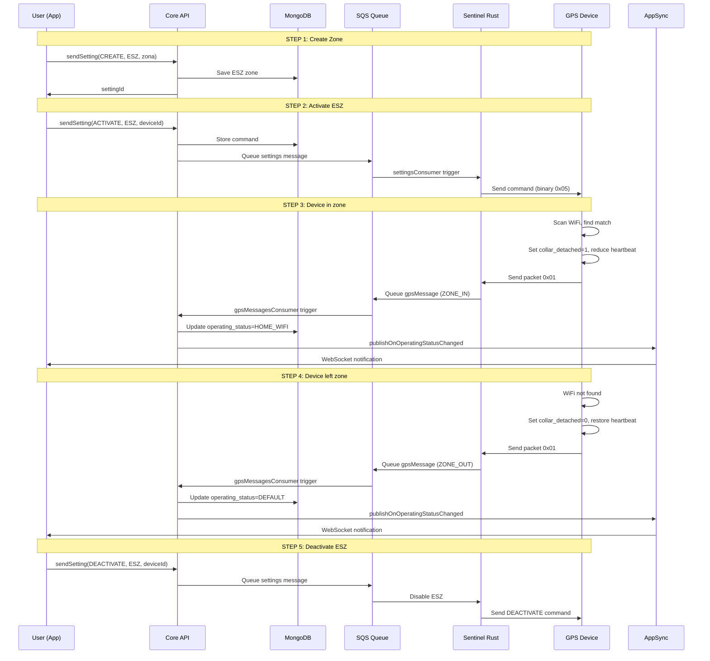

# Energy Saving Zone (ESZ)

## Overview


Normalmente il devoce invia la sua posizione ogni 5-10 secondi. Quando il tuo pet è a casa, questa frequenza è inutile e consuma molta batteria. L'**Energy Saving Zone** è una modalità intelligente che capisce quando il pet è in una zona "sicura" (come casa) usando il WiFi come marcatore, e automaticamente:

- Spegne il GPS (che consuma il 60% della batteria)
- Riduce la frequenza di aggiornamento da 5-10 secondi a 30-60 secondi
- Mantiene comunque il device connesso e pronto a reagire

Il tutto accade automaticamente, senza che l'utente debba fare nulla. Non appena il pet esce da casa e il WiFi scompare, il device riattiva il GPS e torna al tracciamento normale.

**Come funziona il sistema?** L'utente crea una zona sicura una sola volta, specificando il nome (es. "Casa"), le coordinate GPS, il raggio, e i dettagli del WiFi (SSID e BSSID del router di casa). Quando il device entra in quella zona e rileva il WiFi, il backend riceve un segnale dal device (un campo chiamato `collar_detached` che cambia da 0 a 1), e immediatamente notifica l'app. Quando il device esce dalla zona, riceve la notifica di uscita. È tutto real-time via WebSocket subscription.

---

## Feature Description

L'Energy Saving Zone funziona in cinque fasi:

1. **Setup (una volta)**: L'user crea una zona sicura (es. "Casa") con coordinate GPS, raggio, e WiFi details (SSID + BSSID).

2. **Activation**: L'user abilita l'ESZ sul device. Il backend invia i dati della zona al device via comando binario.

3. **Detection**: Il device ogni heartbeat scansiona il WiFi. Se trova il WiFi della zona: imposta `collar_detached=1`, spegne GPS, riduce heartbeat. Se non lo trova: torna a normale.

4. **Notifications**: L'app riceve notifiche real-time quando il pet entra/esce dalla zona via GraphQL subscription.

5. **Deactivation**: L'user disattiva l'ESZ e il device torna a tracciamento normale.

---

## Full User Journey

### STEP 1: USER CREATES ZONE (Una volta)

```
User: "Voglio creare una zona sicura a casa"
  ↓
App chiama GraphQL mutation:

  sendSetting({
    operationType: "CREATE",
    settingType: "ENERGY_SAVING_ZONE",
    createObject: {
      name: "Casa",
      position: { lat: 44.5024, lng: 11.3463 },
      radius: 100,
      ssid: "MioWiFi",
      bssid: "AA:BB:CC:DD:EE:FF"
    }
  })

  ↓
Backend (Core API):
  ├─ Valida i dati
  ├─ Salva zona in MongoDB (ESZ collection)
  └─ Restituisce settingId
  
  ↓
✅ Zona creata (ma NON ancora attiva!)
```

**Response**:
```json
{
  "code": "200",
  "message": "Zone created",
  "settingId": "setting_xyz123"
}
```

---

### STEP 2: USER ACTIVATES ESZ (Quando vuole)

```
User: "Attiva risparmio energetico per il mio device"
  ↓
App chiama GraphQL mutation:

  sendSetting({
    operationType: "ACTIVATE",
    settingType: "ENERGY_SAVING_ZONE",
    deviceId: "device123"
  })

  ↓
Backend (Core API):
  ├─ Legge la zona ESZ dal DB
  ├─ Crea comando: "ACTIVATE_ESZ,SSID=MioWiFi,BSSID=AA:BB:CC:DD:EE:FF"
  ├─ Salva comando in MongoDB (commands collection)
  └─ Pubblica SQS message a queue "settings"
  
  ↓
Sentinel Lambda Consumer (settingsConsumer):
  ├─ Consuma il messaggio SQS
  ├─ Chiama HTTP POST a Sentinel Rust server: /send_packet
  └─ Passa comando e deviceId
  
  ↓
Sentinel Rust TCP Server:
  ├─ Trova la connessione TCP del device
  ├─ Converte comando in pacchetto binario (SiRF 0x05)
  └─ Invia al device via TCP
  
  ↓
✅ Device riceve il comando e memorizza il WiFi
```

**Response**:
```json
{
  "code": "200",
  "message": "ESZ activated"
}
```

---

### STEP 3: DEVICE DETECTS WIFI (Automatico)

```
Device scansiona WiFi ogni heartbeat:
  
  ├─ Trova: "MioWiFi" con BSSID "AA:BB:CC:DD:EE:FF"
  ├─ Confronta: "Corrisponde alla mia zona ESZ!"
  ├─ Imposta: collar_detached = 1
  ├─ Spegne GPS (lat=0, lon=0)
  ├─ Riduce heartbeat: ogni 30-60 sec (invece di 5-10)
  └─ Invia Packet 0x01 (SiRF Welcome) con collar_detached=1
  
  ↓
Sentinel Rust Server riceve il pacchetto:
  ├─ Parsa il binary packet 0x01
  ├─ Legge: collar_detached = 1 (CHANGED from 0!)
  └─ Pubblica SQS message a queue "gpsMessages"
     └─ Event type: ENERGY_SAVING_ZONE_IN
     └─ Aggiorna operating_status = HOME_WIFI
  
  ↓
Backend Lambda Consumer (gpsMessagesConsumer):
  ├─ Consuma il messaggio SQS
  ├─ Verifica il cambio di stato (0→1)
  ├─ Invia GraphQL mutation: publishOnOperatingStatusChanged
  │  └─ payload: {
  │       deviceId: "device123",
  │       operatingStatus: "HOME_WIFI",
  │       timestamp: now(),
  │       message: "Il tuo pet è entrato nella zona sicura! Modalità risparmio attiva."
  │     }
  └─ Aggiorna MongoDB: device.operating_status = HOME_WIFI
  
  ↓
AppSync (GraphQL Subscriptions):
  ├─ Riceve il mutation publishOnOperatingStatusChanged
  └─ Pubblica a tutti i client sottoscritti
  
  ↓
App riceve notifica via WebSocket subscription:

  subscription onOperatingStatusChanged {
    operatingStatusChanged {
      deviceId
      operatingStatus      // "HOME_WIFI"
      timestamp
      message              // "Il tuo pet è entrato nella zona sicura!..."
    }
  }
  
  ↓
✅ User vede notifica sulla app
```

---

### STEP 4: DEVICE LEAVES ZONE (Automatico)

```
Device scansiona WiFi:
  
  ├─ NON trova "MioWiFi"
  ├─ Imposta: collar_detached = 0
  ├─ Riaccende GPS
  ├─ Aumenta heartbeat: ogni 5-10 sec (NORMALE)
  └─ Invia Packet 0x01 con collar_detached=0
  
  ↓
Sentinel Rust Server riceve il pacchetto:
  ├─ Parsa il binary packet 0x01
  ├─ Legge: collar_detached = 0 (CHANGED from 1!)
  └─ Pubblica SQS message a queue "gpsMessages"
     └─ Event type: ENERGY_SAVING_ZONE_OUT
     └─ Aggiorna operating_status = DEFAULT
  
  ↓
Backend Lambda Consumer:
  ├─ Consuma il messaggio SQS
  ├─ Verifica il cambio di stato (1→0)
  ├─ Invia GraphQL mutation: publishOnOperatingStatusChanged
  │  └─ payload: {
  │       deviceId: "device123",
  │       operatingStatus: "DEFAULT",
  │       timestamp: now(),
  │       message: "Il tuo pet è uscito dalla zona sicura! Tracciamento attivato."
  │     }
  └─ Aggiorna MongoDB: device.operating_status = DEFAULT
  
  ↓
AppSync pubblica agli client sottoscritti
  
  ↓
✅ User riceve notifica di uscita dalla zona
```

---

### STEP 5: USER DEACTIVATES ESZ (Quando vuole)

```
User: "Disattiva risparmio energetico"
  ↓
App chiama GraphQL mutation:

  sendSetting({
    operationType: "DEACTIVATE",
    settingType: "ENERGY_SAVING_ZONE",
    deviceId: "device123"
  })

  ↓
Backend (Core API):
  ├─ Crea comando: "DEACTIVATE_ESZ"
  ├─ Salva in MongoDB
  └─ Pubblica SQS message a queue "settings"
  
  ↓
Sentinel Lambda Consumer:
  ├─ Consuma e chiama Sentinel Rust server
  ├─ Invia comando binario al device
  └─ Device riceve DEACTIVATE_ESZ
  
  ↓
Device:
  ├─ Dimentica il WiFi della zona
  ├─ Riaccende GPS (sempre)
  ├─ Torna a heartbeat normale: ogni 5-10 sec
  └─ Invia Packet 0x01 con collar_detached=0
  
  ↓
Sentinel Rust Server:
  ├─ Riceve il pacchetto
  ├─ Pubblica SQS message: operatingStatus = DEFAULT
  └─ Backend aggiorna stato nel DB
  
  ↓
✅ ESZ disattivato, tracciamento normale ripreso
```

---

## Key Data Structures

### Device Packet (SiRF Protocol 0x01)

Campi rilevanti per ESZ:

```
collar_detached: 1 byte
├─ 0 = Device is NOT in home zone
│      └─ GPS on, normal heartbeat (5-10 sec)
│      └─ operatingStatus: DEFAULT
│
└─ 1 = Device IS in home zone
       └─ GPS off (lat=0, lon=0), reduced heartbeat (30-60 sec)
       └─ operatingStatus: HOME_WIFI

Usato per rilevare: Entered zone? (0→1) o Left zone? (1→0)
```

### ESZ Setting Schema (MongoDB)

```
{
  _id: ObjectId,
  userId: string,
  petId: string,
  name: string,                    // "Casa"
  position: {
    lat: number,                   // 44.5024
    lng: number                    // 11.3463
  },
  radius: number,                  // 100 (meters)
  ssid: string,                    // "MioWiFi"
  bssid: string,                   // "AA:BB:CC:DD:EE:FF"
  isActive: boolean,               // true if user enabled
  createdAt: Date,
  updatedAt: Date
}
```

### Device Operating Status Enum

```
DEFAULT = Normal tracking mode (GPS on, ~5-10 sec heartbeat)
HOME_WIFI = Energy saving mode (GPS off, ~30-60 sec heartbeat, reduced power)
```

---


## Sequence Diagram




## Edge Cases

1. **Device moves between zones**: If user has multiple ESZ zones, device prioritizes by closest/strongest WiFi signal
2. **WiFi interference**: If WiFi network name changes but BSSID same → still detected (BSSID is primary identifier)
3. **Subscription inactive**: ESZ commands ignored if device subscription is not active
4. **Network latency**: Command may take 30 sec - 2 min to reach device (TCP connection dependent)
5. **Battery too low**: Device may skip WiFi scanning if battery < 5%

---


