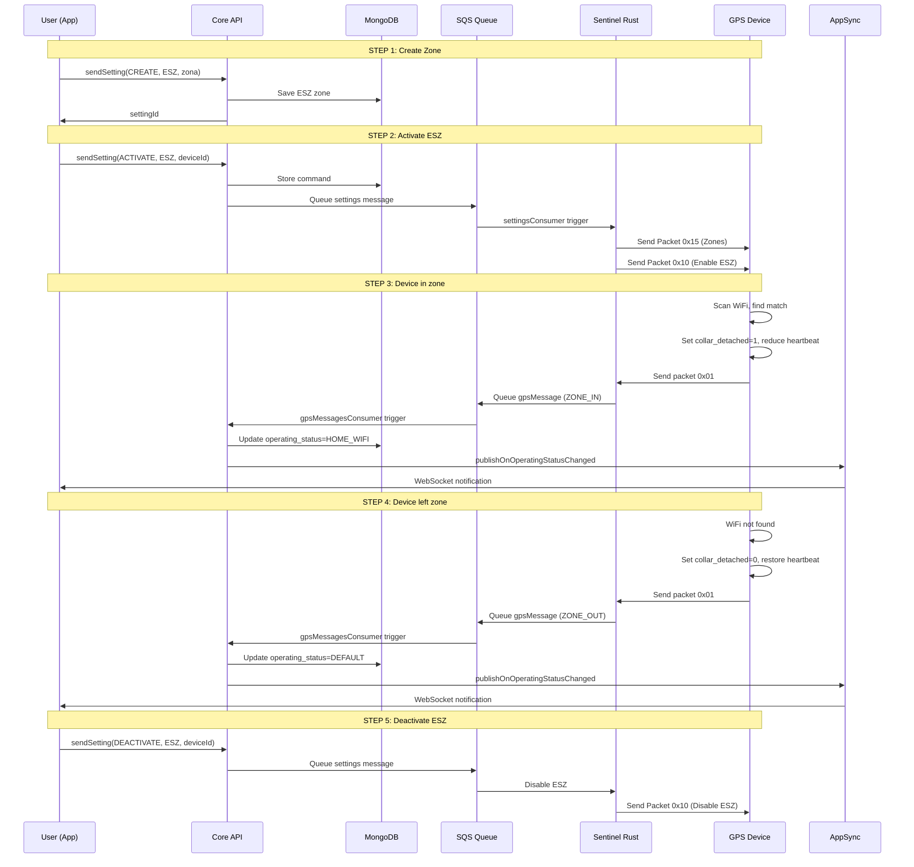

# Energy Saving Zone (ESZ)

## Overview

Energy Saving Zone is a mode that protects the device battery when the pet is in a safe zone (like home). The user creates a zone once by specifying the name, GPS coordinates, radius, and WiFi details. When the device enters that zone and detects the WiFi, GPS turns off and update frequency reduces from 5-10 seconds to 30-60 seconds, saving battery. When the pet leaves the zone, the device automatically reactivates GPS and returns to normal tracking.

**Chronological user flow:**
1. **Create zone** - User specifies "Home" with WiFi info
2. **Activate ESZ** - User enables mode on device
3. **Device in zone** - Automatically GPS OFF, battery saved
4. **Device leaves zone** - Automatically GPS ON, normal tracking
5. **Disable ESZ** - User disables when not needed

---

## Visual Flow Summary

```
┌────────────────────────────────────────────────────────┐
│           ENERGY SAVING ZONE (ESZ) FLOW                │
├────────────────────────────────────────────────────────┤
│                                                        │
│  1. User Creates Zone (GPS + WiFi info)                │
│     ↓                                                  │
│  2. User Activates ESZ on Device                       │
│     ↓                                                  │
│  3. Device Detects WiFi → GPS OFF, Battery Saved       │
│     ↓                                                  │
│  4. Device Leaves Zone → GPS ON, Normal Mode           │
│     ↓                                                  │
│  5. User Disables ESZ                                  │
│                                                        │
└────────────────────────────────────────────────────────┘
```

---

## Full User Journey

### STEP 1: USER CREATES ZONE (Once)

```
User: "I want to create a safe zone at home"
  ↓
App calls GraphQL mutation:

  sendSetting({
    operationType: "CREATE",
    settingType: "ENERGY_SAVING_ZONE",
    createObject: {
      name: "Home",
      position: { lat: 44.5024, lng: 11.3463 },
      radius: 100,
      ssid: "MyWiFi",
      bssid: "AA:BB:CC:DD:EE:FF"
    }
  })

  ↓
Backend (Core API):
  ├─ Validates data
  ├─ Saves zone in MongoDB (ESZ collection)
  └─ Returns settingId
  
  ↓
✅ Zone created (but NOT yet active!)
```

**Response**:
```json
{
  "code": "200",
  "message": "Zone created",
  "settingId": "setting_xyz123"
}
```

---

### STEP 2: USER ACTIVATES ESZ (When they want)

```
User: "Activate energy saving for my device"
  ↓
App calls GraphQL mutation:

  sendSetting({
    operationType: "ACTIVATE",
    settingType: "ENERGY_SAVING_ZONE",
    deviceId: "device123"
  })

  ↓
Backend (Core API):
  ├─ Reads ESZ zone from DB
  ├─ Creates command: "ACTIVATE_ESZ,SSID=MyWiFi,BSSID=AA:BB:CC:DD:EE:FF"
  ├─ Saves command in MongoDB (commands collection)
  └─ Publishes SQS message to "settings" queue
  
  ↓
Sentinel Lambda Consumer (settingsConsumer):
  ├─ Consumes SQS message
  ├─ Calls HTTP POST to Sentinel Rust server: /send_packet
  └─ Passes command and deviceId
  
  ↓
Sentinel Rust TCP Server:
  ├─ Finds device's TCP connection
  ├─ Sends Packet 0x15 (Safe Places): Contains zone list (Lat, Lng, Radius, BSSID)
  └─ Sends Packet 0x10 (Evo Extra Data): Enables flag 'energy_saving_area_enabled = 1'
  
  ↓
✅ Device receives zones and enables energy saving mode
```

**Response**:
```json
{
  "code": "200",
  "message": "ESZ activated"
}
```

---

### STEP 3: DEVICE DETECTS WIFI (Automatic)

```
Device scans WiFi every heartbeat:
  
  ├─ Finds: "MyWiFi" with BSSID "AA:BB:CC:DD:EE:FF"
  ├─ Compares: "Matches my ESZ zone!"
  ├─ Sets: Byte 81 (spare_c5) bit 0x01 = 1 (collar_detached = 1)
  ├─ Turns off GPS (lat=0, lon=0)
  ├─ Reduces heartbeat: every 30-60 sec (instead of 5-10)
  └─ Sends Packet 0x01 (SiRF Welcome) with collar_detached=1
  
  ↓
Sentinel Rust Server receives packet:
  ├─ Parses binary packet 0x01
  ├─ Extracts extended_notifications:
  │  └─ extended_notifications = byte_76 (notifications) + (byte_81 (spare_c5) * 256)
  │  └─ If bit 0x0100 is set → collar_detached = 1 (CHANGED from 0!)
  ├─ Verifies: energy_saving_mode == 1 && subscription_active == true
  ├─ Updates DB: operating_status = HOME_WIFI
  └─ Publishes SQS message to "gpsMessages" queue
     └─ Message type: STATUS
     └─ in_energy_saving_zone: true
  
  ↓
Backend Lambda Consumer (gpsMessagesConsumer):
  ├─ Consumes SQS message (message type: STATUS)
  ├─ Extracts: in_energy_saving_zone = true
  ├─ Sends GraphQL mutation: publishOnGpsMessageStatus
  │  └─ payload: {
  │       id: "device123",
  │       messageType: "STATUS",
  │       status: {
  │         inEnergySavingZone: true,
  │         timestamp: now(),
  │         ...
  │       }
  │     }
  └─ Updates MongoDB: device.lastKnownStatus.inEnergySavingZone = true
  
  ↓
AppSync (GraphQL Subscriptions):
  ├─ Receives publishOnGpsMessageStatus mutation
  └─ Publishes to all subscribed clients
  
  ↓
App receives notification via WebSocket subscription:

  subscription onGpsMessageStatus {
    onGpsMessageStatus(id: "device123") {
      id
      messageType              // "STATUS"
      status {
        inEnergySavingZone     // true
        timestamp
        ...
      }
    }
  }
  
  ↓
✅ User sees notification on app (device is in safe zone)
```

---

### STEP 4: DEVICE LEAVES ZONE (Automatic)

```
Device scans WiFi:
  
  ├─ Does NOT find "MyWiFi"
  ├─ Sets: Byte 81 (spare_c5) bit 0x01 = 0 (collar_detached = 0)
  ├─ Turns GPS back on
  ├─ Increases heartbeat: every 5-10 sec (NORMAL)
  └─ Sends Packet 0x01 with collar_detached=0
  
  ↓
Sentinel Rust Server receives packet:
  ├─ Parses binary packet 0x01
  ├─ Extracts extended_notifications:
  │  └─ extended_notifications = byte_76 (notifications) + (byte_81 (spare_c5) * 256)
  │  └─ If bit 0x0100 is NOT set → collar_detached = 0 (CHANGED from 1!)
  ├─ Updates DB: operating_status = DEFAULT
  └─ Publishes SQS message to "gpsMessages" queue
     └─ Message type: STATUS
     └─ in_energy_saving_zone: false
  
  ↓
Backend Lambda Consumer (gpsMessagesConsumer):
  ├─ Consumes SQS message (message type: STATUS)
  ├─ Extracts: in_energy_saving_zone = false
  ├─ Sends GraphQL mutation: publishOnGpsMessageStatus
  │  └─ payload: {
  │       id: "device123",
  │       messageType: "STATUS",
  │       status: {
  │         inEnergySavingZone: false,
  │         timestamp: now(),
  │         ...
  │       }
  │     }
  └─ Updates MongoDB: device.lastKnownStatus.inEnergySavingZone = false
  
  ↓
AppSync publishes to subscribed clients
  
  ↓
App receives notification via WebSocket subscription:

  subscription onGpsMessageStatus {
    onGpsMessageStatus(id: "device123") {
      id
      messageType              // "STATUS"
      status {
        inEnergySavingZone     // false
        timestamp
        ...
      }
    }
  }
  
  ↓
✅ User receives exit notification (device is outside safe zone)
```

---

### STEP 5: USER DEACTIVATES ESZ (When they want)

```
User: "Disable energy saving"
  ↓
App calls GraphQL mutation:

  sendSetting({
    operationType: "DEACTIVATE",
    settingType: "ENERGY_SAVING_ZONE",
    deviceId: "device123"
  })

  ↓
Backend (Core API):
  ├─ Updates DB: energy_saving_mode = 0
  ├─ Creates command: EnergySavingModeCommand { active: false }
  └─ Publishes SQS message to "settings" queue
  
  ↓
Sentinel Lambda Consumer (settingsConsumer):
  ├─ Consumes SQS message
  ├─ Updates DB: energy_saving_mode = 0
  ├─ Sends binary command to device via TCP
  └─ Device receives DEACTIVATE_ESZ
  
  ↓
Sentinel Rust TCP Server:
  ├─ Sends Packet 0x10 (Evo Extra Data): Disables flag 'energy_saving_area_enabled = 0'
  
  ↓
Device:
  ├─ Forgets zone WiFi (or ignores mode)
  ├─ Turns GPS back on (always)
  ├─ Returns to normal heartbeat: every 5-10 sec
  └─ Sends Packet 0x01 with collar_detached=0
  
  ↓
Sentinel Rust Server:
  ├─ Receives packet
  ├─ Extracts: collar_detached = 0
  ├─ Verifies: energy_saving_mode == 0 (disabled)
  ├─ Updates DB: operating_status = DEFAULT
  └─ Publishes SQS message to "gpsMessages" queue (message type: STATUS)
  
  ↓
Backend Lambda Consumer (gpsMessagesConsumer):
  ├─ Consumes SQS message
  ├─ Sends GraphQL mutation: publishOnGpsMessageStatus
  └─ Updates MongoDB: device.lastKnownStatus.inEnergySavingZone = false
  
  ↓
✅ ESZ disabled, normal tracking resumed
```

---

## Key Data Structures

### Device Packet (SiRF Protocol 0x01)

Fields relevant for ESZ:

```
collar_detached: Byte 81 (spare_c5), bit 0x01
├─ 0 = Device is NOT in home zone
│      └─ GPS on, normal heartbeat (5-10 sec)
│      └─ operatingStatus: DEFAULT
│
└─ 1 = Device IS in home zone
       └─ GPS off (lat=0, lon=0), reduced heartbeat (30-60 sec)
       └─ operatingStatus: HOME_WIFI

How it is extracted from packet:
  ├─ Byte 76 (notifications): contains geofence flags
  ├─ Byte 81 (spare_c5): contains collar_detached flag
  ├─ extended_notifications = byte_76 + (byte_81 * 256)
  └─ If (extended_notifications & 0x0100) != 0 → collar_detached = 1

Used to detect: Entered zone? (0→1) or Left zone? (1→0)
```

### ESZ Setting Schema (MongoDB)

```
{
  _id: ObjectId,
  userId: string,
  petId: string,
  name: string,                    // "Home"
  position: {
    lat: number,                   // 44.5024
    lng: number                    // 11.3463
  },
  radius: number,                  // 100 (meters)
  ssid: string,                    // "MyWiFi"
  bssid: string,                   // "AA:BB:CC:DD:EE:FF"
  isActive: boolean,               // true if user enabled
  createdAt: Date,
  updatedAt: Date
}
```

### Device Operating Status Enum

```
DEFAULT = Normal tracking mode (GPS on, ~5-10 sec heartbeat)
HOME_WIFI = Energy saving mode (GPS off, ~30-60 sec heartbeat, reduced power)
```

---

## Sequence Diagram


