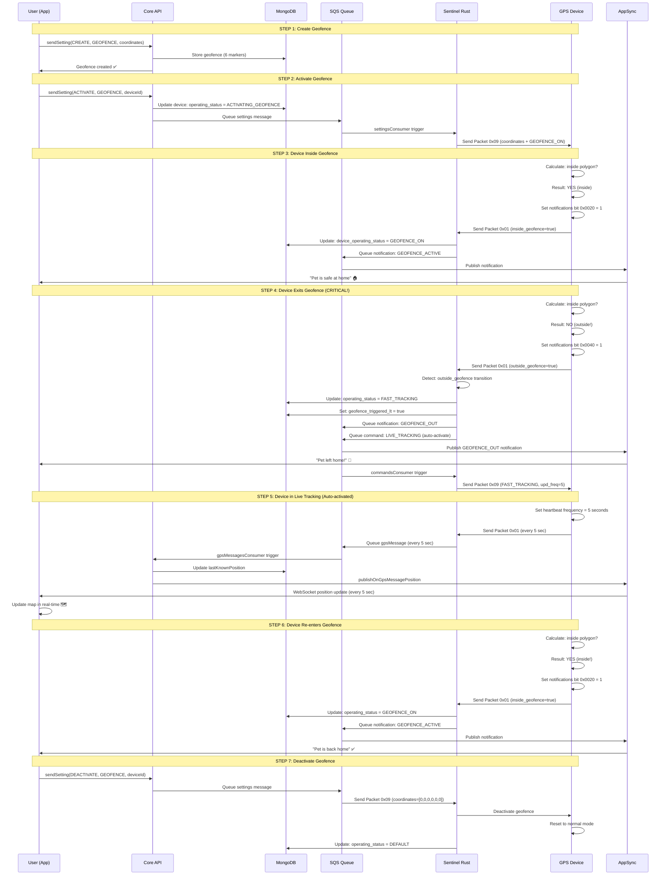

# GEOFENCE - Documentazione Completa

## Cosa Fa

Geofence è una **modalità permanente** che crea una zona geografica (poligono con 6 coordinate) e rileva quando il device entra/esce da questa zona. 

**Comportamento critico**: Quando il device **ESCE dal geofence**, Sentinel **AUTO-ATTIVA Live Tracking** per tracciare il pet in tempo reale.

## Differenze Chiave vs ESZ e Live Tracking

| Aspetto | ESZ | Geofence | Live Tracking |
|---------|-----|----------|---------------|
| **Tipo** | Permanente | Permanente | Temporaneo |
| **Attivazione** | User crea zona WiFi | User crea poligono GPS | User preme "Traccia" |
| **Durata** | Finché attivo | Finché attivo | 15 minuti (default) |
| **Frequenza** | 30-60 sec (ridotta) | 30 sec (normale) | 5 sec (alta) |
| **GPS** | Spento | Acceso | Acceso |
| **Batteria** | Risparmiata | Normale | Consumata velocemente |
| **Trigger** | WiFi rilevato | Esce da poligono | User manual |
| **Auto-Tracking** | No | **SÌ (auto-LT)** | No |

## Flusso Completo

### STEP 1: USER SETUP (Una sola volta)

```
User: "Voglio proteggere il mio pet con una zona sicura"
  ↓
App chiama: sendSetting({
  operationType: "CREATE",
  settingType: "GEOFENCE",
  createObject: {
    name: "Casa",
    coordinates: [
      {lat: 44.5, lng: 11.3},      // Marker 1
      {lat: 44.5, lng: 11.35},     // Marker 2
      {lat: 44.55, lng: 11.35},    // Marker 3
      {lat: 44.55, lng: 11.3},     // Marker 4
      {lat: 44.505, lng: 11.32},   // Marker 5
      {lat: 44.495, lng: 11.32}    // Marker 6
    ]
  }
})
  ↓
Backend salva il geofence in DB (6 coordinate)
  ↓
✅ Geofence creato (ma NON ancora attivo!)
```

### STEP 2: USER ACTIVATION

```
User: "Attiva protezione geofence per il mio device"
  ↓
App chiama: sendSetting({
  operationType: "ACTIVATE",
  settingType: "GEOFENCE",
  deviceId: "device123"
})
  ↓
Backend invia comando a SQS (commandsConsumer)
  ↓
commandsConsumer riceve il comando
  ├─ Legge: serial_number, iccid, geofence_coordinates
  ├─ Crea payload: { command: GEOFENCE, coordinates: [6 markers] }
  └─ Invia REST call a Sentinel: POST /send_packet
    ↓
Sentinel riceve il comando via REST
  ├─ Controlla: device è connesso?
  ├─ Controlla: device è pronto per nuovo comando?
  ├─ Prepara Packet 0x09 (PacketGeofenceResponse)
  │  ├─ operating_status = OPERATING_STATUS_GEOFENCE_ON
  │  ├─ coordinates = [6 markers]
  │  └─ upd_freq = 30 (secondi, normale)
  └─ Invia il pacchetto al device via socket TCP
    ↓
Device riceve il pacchetto
  ├─ Legge: coordinates = [6 markers]
  ├─ Memorizza le 6 coordinate del poligono
  ├─ Attiva geofence detection
  ├─ Ogni heartbeat: calcola se è dentro/fuori il poligono
  │  └─ Usa algoritmo point-in-polygon (ray casting)
  └─ Invia Packet 0x01 con flag:
     ├─ Se dentro: notifications bit 0x0020 = 1 (inside_geofence)
     └─ Se fuori: notifications bit 0x0040 = 1 (outside_geofence)
```

### STEP 3: DEVICE INSIDE GEOFENCE (Normale)

```
Device è dentro il poligono
  ↓
Ogni heartbeat (30 sec):
  ├─ Device calcola: sono dentro il poligono?
  ├─ Usa algoritmo point-in-polygon
  ├─ Risultato: SÌ, sono dentro
  ├─ Imposta: notifications bit 0x0020 = 1
  └─ Invia Packet 0x01
    ↓
Sentinel riceve il pacchetto
  ├─ Legge: inside_geofence = true
  ├─ Invia notifica: GEOFENCE_ACTIVE a SQS
  └─ Aggiorna DB: device_operating_status = GEOFENCE_ON
    ↓
App riceve notifica
  └─ "Pet is safe at home"
```

### STEP 4: DEVICE EXITS GEOFENCE (Critico!)

```
Device è dentro il poligono
  ↓
Device si muove FUORI dal poligono
  ↓
Ogni heartbeat (30 sec):
  ├─ Device calcola: sono dentro il poligono?
  ├─ Usa algoritmo point-in-polygon
  ├─ Risultato: NO, sono fuori!
  ├─ Imposta: notifications bit 0x0040 = 1
  └─ Invia Packet 0x01
    ↓
Sentinel riceve il pacchetto
  ├─ Legge: outside_geofence = true
  ├─ Invia notifica: GEOFENCE_OUT a SQS
  ├─ Imposta: geofence_triggered_lt = true
  ├─ AUTO-ATTIVA Live Tracking
  │  ├─ Prepara Packet 0x09 (FAST_TRACKING)
  │  ├─ upd_freq = 5 (secondi)
  │  └─ Invia comando al device
  └─ Aggiorna DB: operating_status = FAST_TRACKING
    ↓
Device riceve comando Live Tracking
  ├─ Legge: operating_status = FAST_TRACKING
  ├─ Imposta: heartbeat frequency = 5 secondi
  └─ Inizia tracciamento ad alta frequenza
    ↓
App riceve notifiche
  ├─ GEOFENCE_OUT notification
  ├─ Live Tracking attivato automaticamente
  └─ Posizioni ogni 5 secondi
```

### STEP 5: DEVICE RE-ENTERS GEOFENCE (Ritorno)

```
Device è fuori dal poligono (in Live Tracking)
  ↓
Device si muove DENTRO il poligono
  ↓
Ogni heartbeat (5 sec):
  ├─ Device calcola: sono dentro il poligono?
  ├─ Risultato: SÌ, sono dentro!
  ├─ Imposta: notifications bit 0x0020 = 1
  └─ Invia Packet 0x01
    ↓
Sentinel riceve il pacchetto
  ├─ Legge: inside_geofence = true
  ├─ Invia notifica: GEOFENCE_ACTIVE a SQS
  ├─ Disattiva Live Tracking (timeout scaduto o manuale)
  └─ Aggiorna DB: operating_status = GEOFENCE_ON
    ↓
App riceve notifiche
  ├─ GEOFENCE_ACTIVE notification
  ├─ Live Tracking disattivato
  └─ "Pet is back home"
```

### STEP 6: USER DEACTIVATION

```
User: "Disattiva protezione geofence"
  ↓
App chiama: sendSetting({
  operationType: "DEACTIVATE",
  settingType: "GEOFENCE",
  deviceId: "device123"
})
  ↓
Backend invia comando a SQS
  ↓
Sentinel riceve il comando
  ├─ Legge: geofence_coordinates = [0,0,0,0,0,0] (tutti uguali = deactivate)
  ├─ Prepara Packet 0x09 (PacketGeofenceResponse)
  │  └─ operating_status = OPERATING_STATUS_DEFAULT
  └─ Invia il pacchetto al device
    ↓
Device riceve il pacchetto
  ├─ Legge: operating_status = DEFAULT
  ├─ Disattiva geofence detection
  └─ Torna a normale
    ↓
Sentinel aggiorna DB
  └─ operating_status = DEFAULT
    ↓
App riceve notifica
  └─ Geofence disattivato
```

## Sequence Diagram



## Logica Sentinel (geofence_manager.rs)

```rust
// Riceve Packet 0x01 con geofence flags
if outside_geofence == true && valid_gps_position == true {
  // Device è FUORI dal geofence
  go_to_fasttracking = true
  geofence_triggered_lt = true
  
  // Invia notifica GEOFENCE_OUT
  send_notification_message(GEOFENCE_OUT)
  
  // Aggiorna DB
  db_update_petlink_operating_status(FAST_TRACKING)
  
} else if inside_geofence == true {
  // Device è DENTRO il geofence
  update_db = true
  
  // Invia notifica GEOFENCE_ACTIVE
  send_notification_message(GEOFENCE_ACTIVE)
  
  // Aggiorna DB
  db_update_petlink_operating_status(GEOFENCE_ON)
}
```

## Dati Chiave

### operating_status (Stato del device)
- **DEFAULT** (0): Normale (30 sec heartbeat)
- **FAST_TRACKING** (1): Live Tracking (5 sec heartbeat) - AUTO-ATTIVATO
- **HOME_WIFI** (2): ESZ (30-60 sec heartbeat)
- **GEOFENCE_ON** (3): Geofence attivo (30 sec heartbeat)
- **ACTIVATING_GEOFENCE**: Geofence in fase di attivazione

### notifications (Byte con flags)
- **Bit 0x0020**: `inside_geofence` = 1 (device dentro poligono)
- **Bit 0x0040**: `outside_geofence` = 1 (device fuori poligono)

### coordinates (6 Marker del poligono)
```typescript
[
  {lat: 44.5, lng: 11.3},      // Marker 1
  {lat: 44.5, lng: 11.35},     // Marker 2
  {lat: 44.55, lng: 11.35},    // Marker 3
  {lat: 44.55, lng: 11.3},     // Marker 4
  {lat: 44.505, lng: 11.32},   // Marker 5
  {lat: 44.495, lng: 11.32}    // Marker 6
]
```

### upd_freq (Frequenza heartbeat in secondi)
- **30**: Normale (geofence attivo)
- **5**: Live Tracking (auto-attivato quando esce)

### geofence_triggered_lt (Flag per auto-attivazione)
- **true**: Live Tracking è stato auto-attivato da geofence violation
- **false**: Live Tracking NON è stato auto-attivato

## Notifiche

### GEOFENCE_ACTIVE
- **Quando**: Device entra/rimane dentro il geofence
- **Payload**: `{ action: "GEOFENCE_ACTIVE" }`
- **Effetto**: App mostra "Pet is safe at home"

### GEOFENCE_OUT
- **Quando**: Device esce dal geofence
- **Payload**: `{ action: "GEOFENCE_OUT" }`
- **Effetto**: 
  - App mostra "Pet left home!"
  - Auto-attiva Live Tracking
  - Invia posizioni ogni 5 secondi

### GEOFENCE_NO_PET
- **Quando**: Geofence attivato ma device NON è dentro (errore di attivazione)
- **Payload**: `{ action: "GEOFENCE_NO_PET" }`
- **Effetto**: Geofence disattivato automaticamente

## Comportamento Device

| Stato | Heartbeat | GPS | Posizione | Batteria | Geofence |
|-------|-----------|-----|-----------|----------|----------|
| Normale | 30 sec | ✅ | GPS diretto | Normale | Disattivo |
| Geofence (dentro) | 30 sec | ✅ | GPS diretto | Normale | Attivo (inside) |
| Geofence (fuori) | 5 sec | ✅ | GPS diretto | Consumata | Attivo (outside) |
| ESZ | 30-60 sec | ❌ | WiFi geoloc | Risparmiata | Disattivo |

## Casi d'Uso

### Uso 1: Protezione Casa
- User crea geofence attorno a casa
- Device attivato con geofence
- Se pet esce: notifica + auto-tracking
- Se pet rientra: notifica + tracking disattivato

### Uso 2: Protezione Giardino
- User crea geofence attorno al giardino
- Device attivato con geofence
- Se pet esce dal giardino: notifica + auto-tracking
- Utile per pet che scappano

### Uso 3: Protezione Zona Urbana
- User crea geofence attorno a zona urbana
- Device attivato con geofence
- Se pet esce dalla zona: notifica + auto-tracking
- Utile durante escursioni

### Uso 4: Monitoraggio Spiaggia
- User crea geofence attorno a spiaggia
- Device attivato con geofence
- Se pet esce dalla spiaggia: notifica + auto-tracking
- Utile per vacanze al mare

## Limitazioni e Edge Cases

### ⚠️ GPS Non Disponibile
Se il device NON ha GPS valido quando esce dal geofence:
- Geofence NON attiva Live Tracking
- Notifica GEOFENCE_OUT NON inviata
- Device rimane in stato GEOFENCE_ON

**Soluzione**: Assicurati che il device abbia GPS acceso quando attivi geofence

### ⚠️ Poligono Troppo Piccolo
Se il poligono è troppo piccolo (<10 metri):
- Errori di GPS possono causare false positives
- Device potrebbe oscillare dentro/fuori

**Soluzione**: Crea poligoni con raggio minimo di 50 metri

### ⚠️ Poligono Troppo Grande
Se il poligono è troppo grande (>10 km):
- Notifiche ritardate
- Batteria consumata più velocemente

**Soluzione**: Crea poligoni con raggio massimo di 5 km

### ⚠️ Geofence + ESZ Conflitto
Se ESZ è attivo e device esce dal geofence:
- ESZ disattiva GPS
- Geofence NON può rilevare uscita
- **Comportamento**: ESZ ha priorità su Geofence

**Soluzione**: Disattiva ESZ se vuoi usare Geofence

## Stato Transizioni

```
DEFAULT
  ↓ (User attiva geofence)
ACTIVATING_GEOFENCE
  ↓ (Device riceve comando)
GEOFENCE_ON (device dentro)
  ↓ (Device esce)
FAST_TRACKING (auto-attivato)
  ↓ (Timeout o device rientra)
GEOFENCE_ON (device dentro)
  ↓ (User disattiva geofence)
DEFAULT
```

## Debugging

### Verificare se Geofence è Attivo
```
Device operating_status == GEOFENCE_ON
Device notifications bit 0x0020 o 0x0040 settato
```

### Verificare se Auto-LT è Attivato
```
Device operating_status == FAST_TRACKING
geofence_triggered_lt == true
```

### Verificare Coordinate Geofence
```
DB query: SELECT marker1_lat, marker1_lng, ... FROM geofence WHERE device_id = "device123"
```

### Verificare Notifiche Inviate
```
SQS queue: gps_messages
Cercare: GEOFENCE_OUT, GEOFENCE_ACTIVE
```
