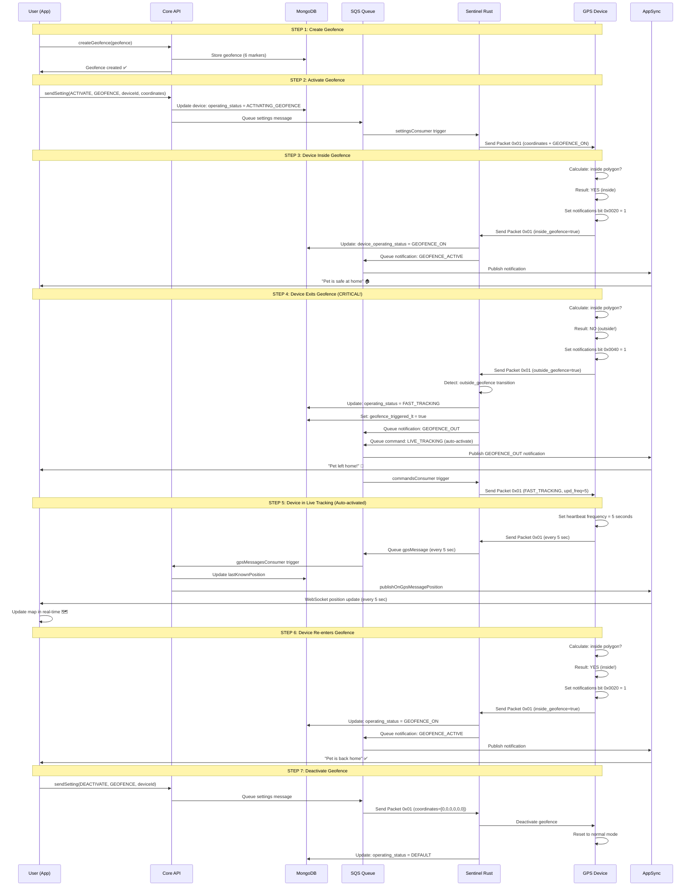

# GEOFENCE - Complete Documentation

## What It Does

Geofence is a **permanent mode** that creates a geographic zone (polygon with 6 coordinates) and detects when the device enters/exits this zone. 

**Critical behavior**: When the device **EXITS the geofence**, Sentinel **AUTO-ACTIVATES Live Tracking** to track the pet in real-time.

## Key Differences vs ESZ and Live Tracking

| Aspect | ESZ | Geofence | Live Tracking |
|---------|-----|----------|---------------|
| **Type** | Permanent | Permanent | Temporary |
| **Activation** | User creates WiFi zone | User creates GPS polygon | User presses "Track" |
| **Duration** | While active | While active | 15 minutes (default) |
| **Frequency** | 30-60 sec (reduced) | 30 sec (normal) | 5 sec (high) |
| **GPS** | Off | On | On |
| **Battery** | Saved | Normal | Consumed quickly |
| **Trigger** | WiFi detected | Exits polygon | User manual |
| **Auto-Tracking** | No | **YES (auto-LT)** | No |

## Complete Flow

### STEP 1: USER SETUP (Once only)

```
User: "I want to protect my pet with a safe zone"
  ↓
App calls: createGeofence({
  geofence: {
    name: "Home",
    position: [
      {lat: 44.5, lng: 11.3},      // Marker 1
      {lat: 44.5, lng: 11.35},     // Marker 2
      {lat: 44.55, lng: 11.35},    // Marker 3
      {lat: 44.55, lng: 11.3},     // Marker 4
      {lat: 44.505, lng: 11.32},   // Marker 5
      {lat: 44.495, lng: 11.32}    // Marker 6
    ]
  }
})
  ↓
Backend saves geofence in DB (6 coordinates)
  ↓
✅ Geofence created (but NOT yet active!)
```

### STEP 2: USER ACTIVATION

```
User: "Activate geofence protection for my device"
  ↓
App calls: sendSetting({
  operationType: "ACTIVATE",
  settingType: "GEOFENCE",
  deviceId: "device123",
  geofence: [ ...coordinates... ] // NOTE: Backend requires explicit coordinates
})
  ↓
Backend sends command to SQS (commandsConsumer)
  ↓
commandsConsumer receives command
  ├─ Reads: serial_number, iccid, geofence_coordinates
  ├─ Creates payload: { command: GEOFENCE, coordinates: [6 markers] }
  └─ Sends REST call to Sentinel: POST /send_packet
    ↓
Sentinel receives command via REST
  ├─ Checks: is device connected?
  ├─ Checks: is device ready for new command?
  ├─ Prepares Packet 0x01 (PacketGeofenceResponse)
  │  ├─ operating_status = OPERATING_STATUS_GEOFENCE_ON
  │  ├─ coordinates = [6 markers]
  │  └─ upd_freq = 30 (seconds, normal)
  └─ Sends packet to device via TCP socket
    ↓
Device receives packet
  ├─ Reads: coordinates = [6 markers]
  ├─ Stores 6 polygon coordinates
  ├─ Activates geofence detection
  ├─ Every heartbeat: calculates if inside/outside polygon
  │  └─ Uses point-in-polygon algorithm (ray casting)
  └─ Sends Packet 0x01 with flag:
     ├─ If inside: notifications bit 0x0020 = 1 (inside_geofence)
     └─ If outside: notifications bit 0x0040 = 1 (outside_geofence)
```

### STEP 3: DEVICE INSIDE GEOFENCE (Normal)

```
Device is inside polygon
  ↓
Every heartbeat (30 sec):
  ├─ Device calculates: am I inside polygon?
  ├─ Uses point-in-polygon algorithm
  ├─ Result: YES, I'm inside
  ├─ Sets: notifications bit 0x0020 = 1
  └─ Sends Packet 0x01
    ↓
Sentinel receives packet
  ├─ Reads: inside_geofence = true
  ├─ Sends notification: GEOFENCE_ACTIVE to SQS
  └─ Updates DB: device_operating_status = GEOFENCE_ON
    ↓
App receives notification
  └─ "Pet is safe at home"
```

### STEP 4: DEVICE EXITS GEOFENCE (Critical!)

```
Device is inside polygon
  ↓
Device moves OUTSIDE polygon
  ↓
Every heartbeat (30 sec):
  ├─ Device calculates: am I inside polygon?
  ├─ Uses point-in-polygon algorithm
  ├─ Result: NO, I'm outside!
  ├─ Sets: notifications bit 0x0040 = 1
  └─ Sends Packet 0x01
    ↓
Sentinel receives packet
  ├─ Reads: outside_geofence = true
  ├─ Sends notification: GEOFENCE_OUT to SQS
  ├─ Sets: geofence_triggered_lt = true
  ├─ AUTO-ACTIVATES Live Tracking
  │  ├─ Prepares Packet 0x01 (FAST_TRACKING)
  │  ├─ upd_freq = 5 (seconds)
  │  └─ Sends command to device
  └─ Updates DB: operating_status = FAST_TRACKING
    ↓
Device receives Live Tracking command
  ├─ Reads: operating_status = FAST_TRACKING
  ├─ Sets: heartbeat frequency = 5 seconds
  └─ Starts high-frequency tracking
    ↓
App receives notifications
  ├─ GEOFENCE_OUT notification
  ├─ Live Tracking activated automatically
  └─ Positions every 5 seconds
```

### STEP 5: DEVICE RE-ENTERS GEOFENCE (Return)

```
Device is outside polygon (in Live Tracking)
  ↓
Device moves INSIDE polygon
  ↓
Every heartbeat (5 sec):
  ├─ Device calculates: am I inside polygon?
  ├─ Result: YES, I'm inside!
  ├─ Sets: notifications bit 0x0020 = 1
  └─ Sends Packet 0x01
    ↓
Sentinel receives packet
  ├─ Reads: inside_geofence = true
  ├─ Sends notification: GEOFENCE_ACTIVE to SQS
  ├─ Disables Live Tracking (timeout expired or manual)
  └─ Updates DB: operating_status = GEOFENCE_ON
    ↓
App receives notifications
  ├─ GEOFENCE_ACTIVE notification
  ├─ Live Tracking disabled
  └─ "Pet is back home"
```

### STEP 6: USER DEACTIVATION

```
User: "Disable geofence protection"
  ↓
App calls: sendSetting({
  operationType: "DEACTIVATE",
  settingType: "GEOFENCE",
  deviceId: "device123"
})
  ↓
Backend sends command to SQS
  ↓
Sentinel receives command
  ├─ Reads: geofence_coordinates = [0,0,0,0,0,0] (all equal = deactivate)
  ├─ Prepares Packet 0x01 (PacketGeofenceResponse)
  │  └─ operating_status = OPERATING_STATUS_DEFAULT
  └─ Sends packet to device
    ↓
Device receives packet
  ├─ Reads: operating_status = DEFAULT
  ├─ Disables geofence detection
  └─ Returns to normal
    ↓
Sentinel updates DB
  └─ operating_status = DEFAULT
    ↓
App receives notification
  └─ Geofence disabled
```

## Sequence Diagram


