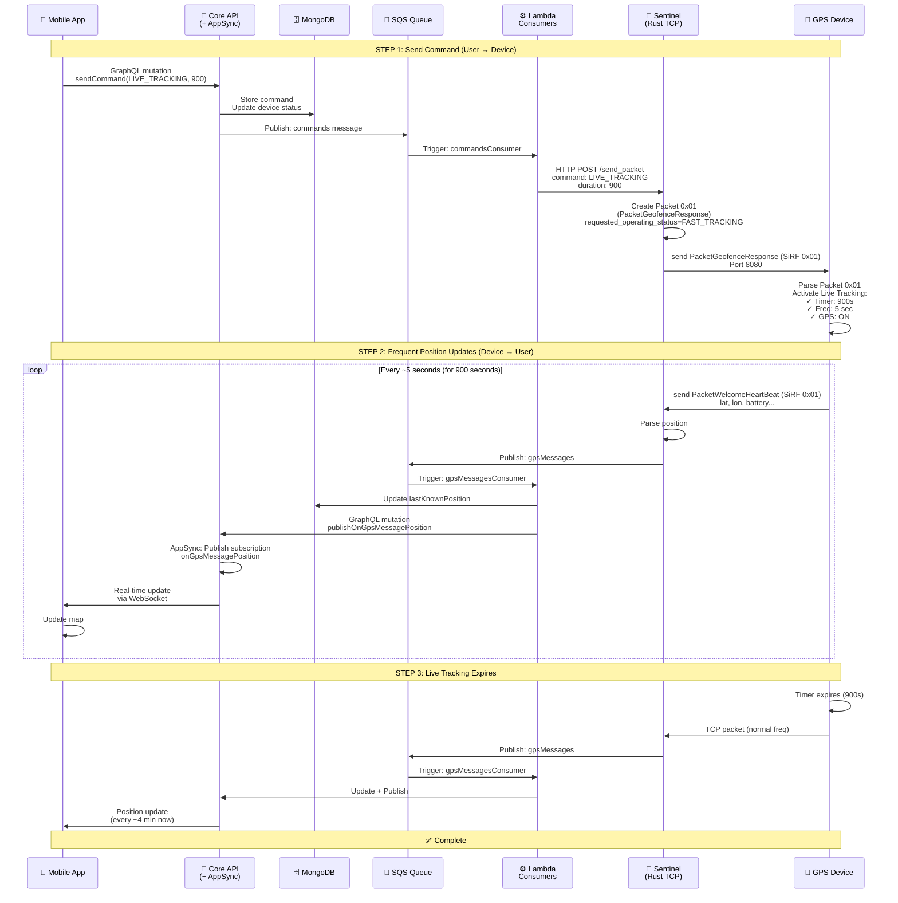

# Live Tracking

## Overview

Normalmente il device invia la sua posizione ogni 4 minuti circa. Quando l'utente ha bisogno di tracciare il pet in tempo reale (ad esempio se il pet è scappato o perso), questa frequenza è troppo lenta. Il **Live Tracking** è una modalità che aumenta drasticamente la frequenza di aggiornamento della posizione da ~4 minuti a ~5 secondi, permettendo all'utente di vedere il movimento del pet in tempo reale sulla mappa.

**Come funziona il sistema?** L'utente attiva il Live Tracking dall'app specificando una durata (tipicamente 15 minuti, ma configurabile). Il backend invia un comando al device che aumenta immediatamente la frequenza del GPS heartbeat da ~4 minuti a ~5 secondi. L'app si sottoscrive a una subscription GraphQL real-time (`onGpsMessagePosition`) e riceve le posizioni ogni ~5 secondi direttamente via WebSocket. Quando la durata scade o l'utente disattiva manualmente, il device torna automaticamente alla frequenza normale.

Il Live Tracking è l'opposto dell'Energy Saving Zone: invece di risparmiare batteria, consuma di più per dare visibilità immediata. È pensato per situazioni di emergenza o quando serve precisione massima nel tracciamento.

---

## Feature Description

Il Live Tracking funziona in sei fasi:

1. **Activation**: L'utente attiva il Live Tracking dall'app specificando una durata (es. 15 minuti = 900 secondi). Il backend invia il comando al device via Sentinel.

2. **Device Response**: Il device riceve il comando e aumenta immediatamente la frequenza heartbeat da ~4 minuti a ~5 secondi. Il GPS rimane sempre attivo.

3. **Subscription**: L'app si sottoscrive alla subscription GraphQL `onGpsMessagePosition` per ricevere aggiornamenti real-time via WebSocket.

4. **Position Updates**: Il device invia posizioni ogni ~5 secondi. Ogni posizione viene processata dal backend e pubblicata agli utenti sottoscritti.

5. **Real-time Display**: L'app riceve le posizioni via WebSocket e aggiorna la mappa in tempo reale, mostrando il movimento del pet.

6. **Deactivation**: Quando la durata scade o l'utente disattiva manualmente, il device torna a frequenza normale (~4 minuti) e l'app può disiscriversi dalla subscription.

---

## Full User Journey

### STEP 1: USER ACTIVATES LIVE TRACKING

```
User: "Attiva tracciamento real-time per 15 minuti"
  ↓
App chiama GraphQL mutation:

  sendCommand({
    commandType: "LIVE_TRACKING",
    id: "device123",
    duration: 900,              // 15 minuti in secondi
    modeType: "SENTINEL"
  })

  ↓
Backend (Core API):
  ├─ Valida il comando
  ├─ Salva comando in MongoDB (commands collection)
  ├─ Aggiorna device status: postLinkStatus = "Live tracking"
  └─ Pubblica SQS message a queue "commands"
  
  ↓
Sentinel Lambda Consumer (commandsConsumer):
  ├─ Consuma il messaggio SQS
  ├─ Legge device info (serial_number, iccid)
  ├─ Chiama HTTP POST a Sentinel Rust server: /send_packet
  └─ Payload: {
       serial_number: "PETL123456",
       iccid: "iccid123",
       command: "LIVE_TRACKING",
       duration: 900,
       mode_type: "SENTINEL"
     }
  
  ↓
Sentinel Rust TCP Server:
  ├─ Trova la connessione TCP del device
  ├─ Converte comando in pacchetto binario (Packet 0x01 - PacketGeofenceResponse)
  │  └─ operating_status = FAST_TRACKING
  └─ Invia al device via TCP
  
  ↓
✅ Device riceve il comando e aumenta frequenza heartbeat a ~5 secondi
```

**Response**:
```json
{
  "code": "200",
  "message": "Command queued"
}
```

---

### STEP 2: DEVICE INCREASES HEARTBEAT FREQUENCY

```
Device riceve comando LIVE_TRACKING:
  
  ├─ Legge: duration = 900 secondi (15 minuti)
  ├─ Imposta timer interno: scadenza tra 15 minuti
  ├─ Cambia frequenza heartbeat: da ~4 minuti a ~5 secondi
  ├─ Mantiene GPS sempre attivo
  └─ Inizia a inviare posizioni ogni ~5 secondi
  
  ↓
Device invia posizione 1 (Packet 0x01 - SiRF Welcome):
  
  ├─ latitude: 44.5024
  ├─ longitude: 11.3463
  ├─ battery: 4200
  ├─ timestamp: now()
  └─ positionType: "GPS"
  
  ↓
Sentinel Rust Server riceve il pacchetto:
  ├─ Parsa il binary packet 0x01
  ├─ Estrae posizione GPS
  └─ Pubblica SQS message a queue "gpsMessages"
     └─ messageType: "LAST_POSITION"
     └─ position: { lat, lng, alt, radius, speed, positionType, date }
```

---

### STEP 3: APP SUBSCRIBES TO POSITION UPDATES

```
App (dopo aver inviato sendCommand):
  
  ├─ Si connette a AppSync via WebSocket
  └─ Invia subscription GraphQL:

  subscription onGpsMessagePosition($id: String!) {
    onGpsMessagePosition(id: $id) {
      id
      messageType
      position {
        lat
        lng
        alt
        radius
        speed
        positionType
        date
      }
    }
  }
  
  Variables: { id: "device123" }
  
  ↓
AppSync:
  ├─ Registra la subscription
  ├─ Mantiene connessione WebSocket aperta
  └─ Pronto a pubblicare aggiornamenti
```

---

### STEP 4: DEVICE SENDS FREQUENT POSITIONS

```
Device continua a inviare posizioni ogni ~5 secondi:

  Posizione 1 (t=0s):
    ├─ latitude: 44.5024
    ├─ longitude: 11.3463
    └─ battery: 4200
  
  ↓ (5 secondi dopo)
  
  Posizione 2 (t=5s):
    ├─ latitude: 44.5025      // device si è mosso
    ├─ longitude: 11.3464
    └─ battery: 4190
  
  ↓ (5 secondi dopo)
  
  Posizione 3 (t=10s):
    ├─ latitude: 44.5026
    ├─ longitude: 11.3465
    └─ battery: 4180
  
  ↓
Ogni posizione segue questo flusso:
  
  Device → Sentinel Rust (TCP packet 0x01)
    ↓
  Sentinel Rust → SQS queue "gpsMessages"
    ↓
  Backend Lambda Consumer (gpsMessagesConsumer):
    ├─ Consuma il messaggio SQS
    ├─ Aggiorna MongoDB: device.lastKnownPosition
    ├─ Crea record in positionsHistory
    └─ Chiama GraphQL mutation: publishOnGpsMessagePosition
       └─ payload: {
            id: "device123",
            messageType: "LAST_POSITION",
            position: { lat, lng, alt, radius, speed, positionType, date }
          }
  
  ↓
AppSync (GraphQL Subscriptions):
  ├─ Riceve il mutation publishOnGpsMessagePosition
  └─ Pubblica a tutti i client sottoscritti a onGpsMessagePosition
  
  ↓
App riceve posizione via WebSocket:
  
  {
    "id": "device123",
    "messageType": "LAST_POSITION",
    "position": {
      "lat": 44.5025,
      "lng": 11.3464,
      "alt": 50,
      "radius": 10,
      "speed": 2.5,
      "positionType": "GPS",
      "date": "2024-01-15T10:30:35Z"
    }
  }
  
  ↓
App aggiorna mappa in tempo reale:
  ├─ Mostra nuova posizione
  ├─ Disegna percorso (polyline)
  └─ Aggiorna UI con timestamp e batteria
  
  ↓
✅ User vede il pet muoversi in tempo reale sulla mappa
```

---

### STEP 5: USER DEACTIVATES LIVE TRACKING (Manuale)

```
User: "Disattiva tracciamento real-time"
  ↓
App chiama GraphQL mutation:

  sendCommand({
    commandType: "LIVE_TRACKING",
    id: "device123",
    duration: 0,                // 0 = disattiva
    modeType: "SENTINEL"
  })

  ↓
Backend (Core API):
  ├─ Valida il comando
  ├─ Salva comando in MongoDB
  ├─ Aggiorna device status: postLinkStatus = "Default"
  └─ Pubblica SQS message a queue "commands"
  
  ↓
Sentinel Lambda Consumer:
  ├─ Consuma e chiama Sentinel Rust server
  ├─ Invia comando binario al device: LIVE_TRACKING, duration=0
  └─ Device riceve comando di disattivazione
  
  ↓
Device:
  ├─ Legge: duration = 0 (disattiva)
  ├─ Resetta timer interno
  ├─ Torna a frequenza normale: ~4 minuti
  └─ Continua a inviare posizioni ogni ~4 minuti
  
  ↓
✅ Live Tracking disattivato, frequenza normale ripresa
```

---

### STEP 6: LIVE TRACKING EXPIRES (Automatico)

```
Device timer interno:
  
  ├─ Timer scade dopo 15 minuti (duration: 900)
  ├─ Device rileva: "Tempo scaduto!"
  ├─ Resetta frequenza heartbeat: da ~5 sec a ~4 minuti
  └─ Continua a inviare posizioni ogni ~4 minuti
  
  ↓
Device invia posizione normale (Packet 0x01):
  
  ├─ Frequenza: ogni ~4 minuti (non più ogni 5 sec)
  └─ positionType: "GPS"
  
  ↓
Backend riceve posizione:
  ├─ Processa normalmente (non più frequente)
  └─ Pubblica a subscription (ma app riceve meno frequentemente)
  
  ↓
App:
  ├─ Riceve posizioni ogni ~4 minuti (non più ogni 5 sec)
  ├─ Può disiscriversi da onGpsMessagePosition
  └─ Mostra messaggio: "Live Tracking scaduto"
  
  ↓
✅ Live Tracking terminato automaticamente
```

---

## Key Data Structures

### Live Tracking Command Schema

```typescript
{
  commandType: "LIVE_TRACKING",
  id: string,                    // deviceId
  duration: number,               // seconds (default: 900 = 15 min)
  modeType: "SENTINEL" | "BLE"   // default: "SENTINEL"
}

// duration = 0 → disattiva Live Tracking
// duration > 0 → attiva per N secondi
```

### Device Status (postLinkStatus)

```
"DEFAULT" = Normal tracking mode (~4 min heartbeat)
"Live tracking" = Live Tracking active (~5 sec heartbeat)
```

### Position Update (onGpsMessagePosition Subscription)

```typescript
{
  id: string,                     // deviceId
  messageType: "LAST_POSITION",
  position: {
    lat: number,
    lng: number,
    alt: number,                  // altitude
    radius: number,               // GPS accuracy radius (meters)
    speed: number,               // speed (m/s)
    positionType: "GPS" | "WIFI" | "LBS" | "SKIP",
    date: string                  // ISO 8601 timestamp
  }
}
```

### Device Heartbeat Frequencies

```
Normal mode:     ~4 minutes (240 seconds)
Live Tracking:   ~5 seconds
Energy Saving:   ~30-60 seconds (when in ESZ zone)
```

---

## Sequence Diagram



---

