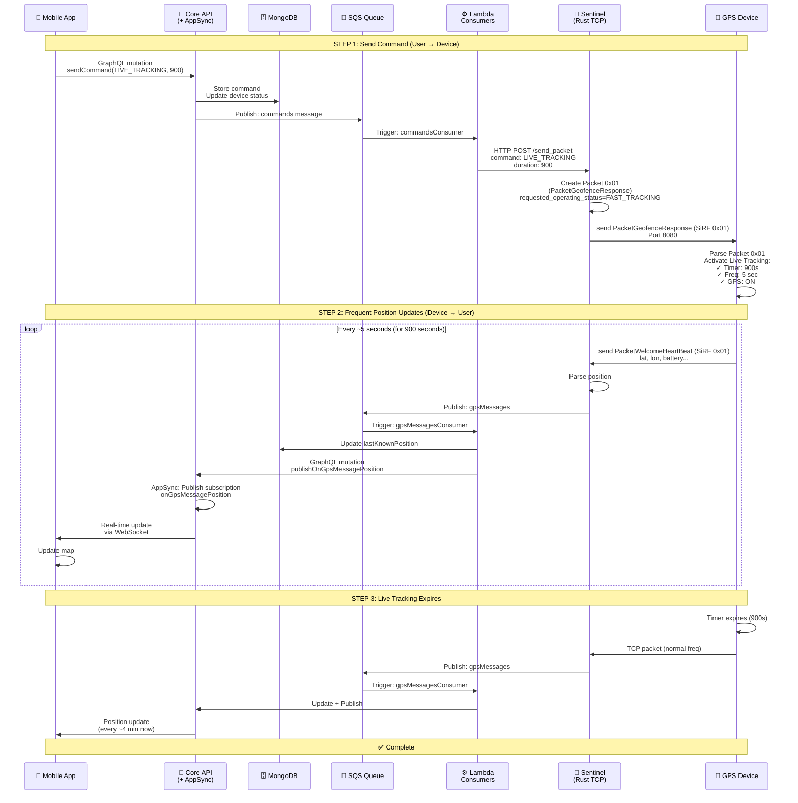

# Live Tracking

## Overview

Live Tracking is an on-demand mode that allows the user to track the pet in real-time when maximum precision is needed (e.g. the pet has escaped or is lost). Normally the device sends position every ~4 minutes, but by activating Live Tracking, the device increases frequency to ~5 seconds, allowing the app to show pet movement in real-time on the map. The user specifies a duration (default 15 minutes), after which the device automatically returns to normal frequency to save battery.

**Chronological user flow:**
1. **Activate Live Tracking** - User specifies duration (e.g. 15 minutes)
2. **Device increases frequency** - From ~4 min to ~5 seconds
3. **App subscribes to updates** - Receives positions via WebSocket
4. **Sees pet in real-time** - Map updates every 5 seconds
5. **Timer expires or disables** - Device returns to normal frequency (~4 min)

---

## Visual Flow Summary

```
┌────────────────────────────────────────────────────────┐
│       LIVE TRACKING REAL-TIME FLOW                     │
├────────────────────────────────────────────────────────┤
│                                                        │
│  1. User Activates Live Tracking (specify duration)    │
│     ↓                                                  │
│  2. Device Increases Frequency (~4 min → ~5 sec)       │
│     ↓                                                  │
│  3. App Subscribes to Position Updates (WebSocket)     │
│     ↓                                                  │
│  4. Device Sends Frequent Positions Every 5 sec        │
│     ↓                                                  │
│  5. App Updates Map in Real-Time                       │
│     ↓                                                  │
│  6. Duration Expires OR User Deactivates               │
│     → Back to Normal Frequency (~4 min)                │
│                                                        │
└────────────────────────────────────────────────────────┘
```

---

## Full User Journey

### STEP 1: USER ACTIVATES LIVE TRACKING

```
User: "Activate real-time tracking for 15 minutes"
  ↓
App calls GraphQL mutation:

  sendCommand({
    commandType: "LIVE_TRACKING",
    id: "device123",
    duration: 900,              // 15 minutes in seconds
    modeType: "SENTINEL"
  })

  ↓
Backend (Core API):
  ├─ Validates command
  ├─ Saves command in MongoDB (commands collection)
  ├─ Updates device status: postLinkStatus = "Live tracking"
  └─ Publishes SQS message to "commands" queue
  
  ↓
Sentinel Lambda Consumer (commandsConsumer):
  ├─ Consumes SQS message
  ├─ Reads device info (serial_number, iccid)
  ├─ Calls HTTP POST to Sentinel Rust server: /send_packet
  └─ Payload: {
       serial_number: "PETL123456",
       iccid: "iccid123",
       command: "LIVE_TRACKING",
       duration: 900,
       mode_type: "SENTINEL"
     }
  
  ↓
Sentinel Rust TCP Server:
  ├─ Finds device's TCP connection
  ├─ Converts command to binary packet (Packet 0x01 - PacketGeofenceResponse)
  │  └─ operating_status = FAST_TRACKING
  └─ Sends to device via TCP
  
  ↓
✅ Device receives command and increases heartbeat frequency to ~5 seconds
```

**Response**:
```json
{
  "code": "200",
  "message": "Command queued"
}
```

---

### STEP 2: DEVICE INCREASES HEARTBEAT FREQUENCY

```
Device receives LIVE_TRACKING command:
  
  ├─ Reads: duration = 900 seconds (15 minutes)
  ├─ Sets internal timer: expires in 15 minutes
  ├─ Changes heartbeat frequency: from ~4 minutes to ~5 seconds
  ├─ Keeps GPS always on
  └─ Starts sending positions every ~5 seconds
  
  ↓
Device sends position 1 (Packet 0x01 - SiRF Welcome):
  
  ├─ latitude: 44.5024
  ├─ longitude: 11.3463
  ├─ battery: 4200
  ├─ timestamp: now()
  └─ positionType: "GPS"
  
  ↓
Sentinel Rust Server receives packet:
  ├─ Parses binary packet 0x01
  ├─ Extracts GPS position
  └─ Publishes SQS message to "gpsMessages" queue
     └─ messageType: "LAST_POSITION"
     └─ position: { lat, lng, alt, radius, speed, positionType, date }
```

---

### STEP 3: APP SUBSCRIBES TO POSITION UPDATES

```
App (after sending sendCommand):
  
  ├─ Connects to AppSync via WebSocket
  └─ Sends GraphQL subscription:

  subscription onGpsMessagePosition($id: String!) {
    onGpsMessagePosition(id: $id) {
      id
      messageType
      position {
        lat
        lng
        alt
        radius
        speed
        positionType
        date
      }
    }
  }
  
  Variables: { id: "device123" }
  
  ↓
AppSync:
  ├─ Registers subscription
  ├─ Keeps WebSocket connection open
  └─ Ready to publish updates
```

---

### STEP 4: DEVICE SENDS FREQUENT POSITIONS

```
Device continues sending positions every ~5 seconds:

  Position 1 (t=0s):
    ├─ latitude: 44.5024
    ├─ longitude: 11.3463
    └─ battery: 4200
  
  ↓ (5 seconds later)
  
  Position 2 (t=5s):
    ├─ latitude: 44.5025      // device has moved
    ├─ longitude: 11.3464
    └─ battery: 4190
  
  ↓ (5 seconds later)
  
  Position 3 (t=10s):
    ├─ latitude: 44.5026
    ├─ longitude: 11.3465
    └─ battery: 4180
  
  ↓
Each position follows this flow:
  
  Device → Sentinel Rust (TCP packet 0x01)
    ↓
  Sentinel Rust → SQS queue "gpsMessages"
    ↓
  Backend Lambda Consumer (gpsMessagesConsumer):
    ├─ Consumes SQS message
    ├─ Updates MongoDB: device.lastKnownPosition
    ├─ Creates record in positionsHistory
    └─ Calls GraphQL mutation: publishOnGpsMessagePosition
       └─ payload: {
            id: "device123",
            messageType: "LAST_POSITION",
            position: { lat, lng, alt, radius, speed, positionType, date }
          }
  
  ↓
AppSync (GraphQL Subscriptions):
  ├─ Receives publishOnGpsMessagePosition mutation
  └─ Publishes to all clients subscribed to onGpsMessagePosition
  
  ↓
App receives position via WebSocket:
  
  {
    "id": "device123",
    "messageType": "LAST_POSITION",
    "position": {
      "lat": 44.5025,
      "lng": 11.3464,
      "alt": 50,
      "radius": 10,
      "speed": 2.5,
      "positionType": "GPS",
      "date": "2024-01-15T10:30:35Z"
    }
  }
  
  ↓
App updates map in real-time:
  ├─ Shows new position
  ├─ Draws path (polyline)
  └─ Updates UI with timestamp and battery
  
  ↓
✅ User sees pet moving in real-time on the map
```

---

### STEP 5: USER DEACTIVATES LIVE TRACKING (Manual)

```
User: "Disable real-time tracking"
  ↓
App calls GraphQL mutation:

  sendCommand({
    commandType: "LIVE_TRACKING",
    id: "device123",
    duration: 0,                // 0 = disable
    modeType: "SENTINEL"
  })

  ↓
Backend (Core API):
  ├─ Validates command
  ├─ Saves command in MongoDB
  ├─ Updates device status: postLinkStatus = "Default"
  └─ Publishes SQS message to "commands" queue
  
  ↓
Sentinel Lambda Consumer:
  ├─ Consumes and calls Sentinel Rust server
  ├─ Sends binary command to device: LIVE_TRACKING, duration=0
  └─ Device receives deactivation command
  
  ↓
Device:
  ├─ Reads: duration = 0 (disable)
  ├─ Resets internal timer
  ├─ Returns to normal frequency: ~4 minutes
  └─ Continues sending positions every ~4 minutes
  
  ↓
✅ Live Tracking disabled, normal frequency resumed
```

---

### STEP 6: LIVE TRACKING EXPIRES (Automatic)

```
Device internal timer:
  
  ├─ Timer expires after 15 minutes (duration: 900)
  ├─ Device detects: "Time expired!"
  ├─ Resets heartbeat frequency: from ~5 sec to ~4 minutes
  └─ Continues sending positions every ~4 minutes
  
  ↓
Device sends normal position (Packet 0x01):
  
  ├─ Frequency: every ~4 minutes (no longer every 5 sec)
  └─ positionType: "GPS"
  
  ↓
Backend receives position:
  ├─ Processes normally (no longer frequent)
  └─ Publishes to subscription (but app receives less frequently)
  
  ↓
App:
  ├─ Receives positions every ~4 minutes (no longer every 5 sec)
  ├─ Can unsubscribe from onGpsMessagePosition
  └─ Shows message: "Live Tracking expired"
  
  ↓
✅ Live Tracking terminated automatically
```

---

## Key Data Structures

### Live Tracking Command Schema

```typescript
{
  commandType: "LIVE_TRACKING",
  id: string,                    // deviceId
  duration: number,               // seconds (default: 900 = 15 min)
  modeType: "SENTINEL" | "BLE"   // default: "SENTINEL"
}

// duration = 0 → disable Live Tracking
// duration > 0 → activate for N seconds
```

### Device Status (postLinkStatus)

```
"DEFAULT" = Normal tracking mode (~4 min heartbeat)
"Live tracking" = Live Tracking active (~5 sec heartbeat)
```

### Position Update (onGpsMessagePosition Subscription)

```typescript
{
  id: string,                     // deviceId
  messageType: "LAST_POSITION",
  position: {
    lat: number,
    lng: number,
    alt: number,                  // altitude
    radius: number,               // GPS accuracy radius (meters)
    speed: number,               // speed (m/s)
    positionType: "GPS" | "WIFI" | "LBS" | "SKIP",
    date: string                  // ISO 8601 timestamp
  }
}
```

### Device Heartbeat Frequencies

```
Normal mode:     ~4 minutes (240 seconds)
Live Tracking:   ~5 seconds
Energy Saving:   ~30-60 seconds (when in ESZ zone)
```

---

## Sequence Diagram



---
