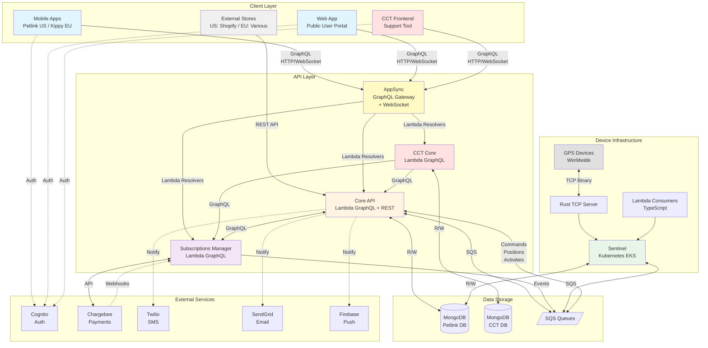
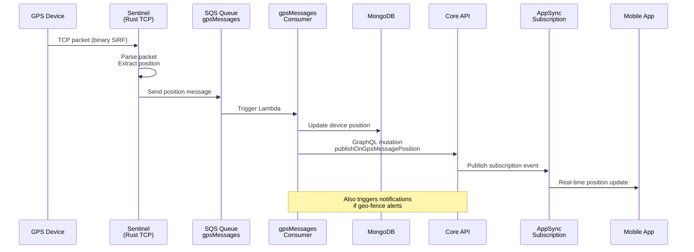
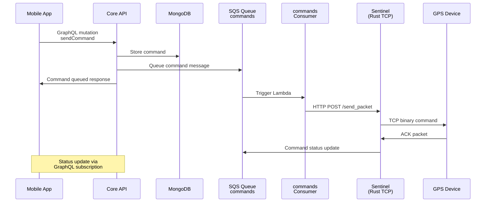
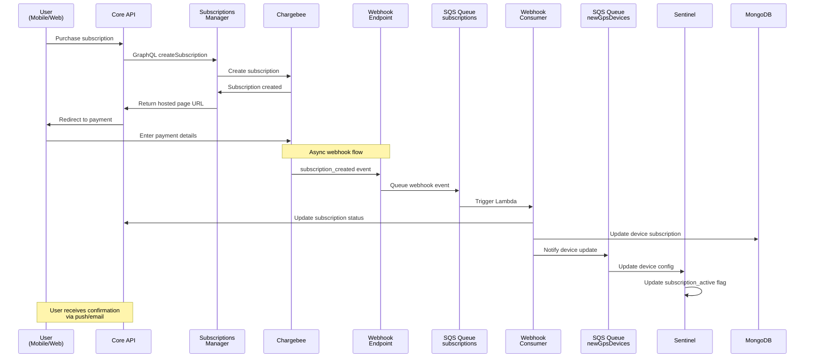
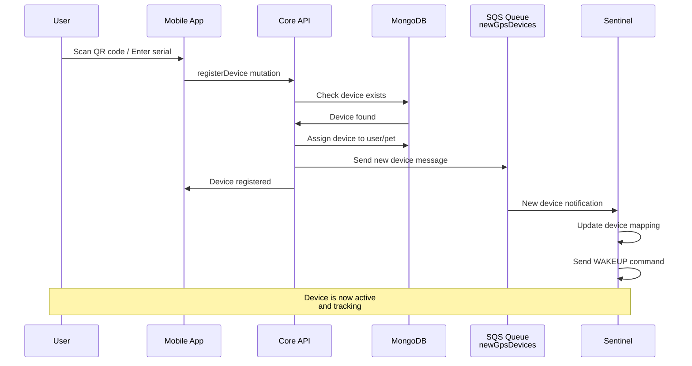
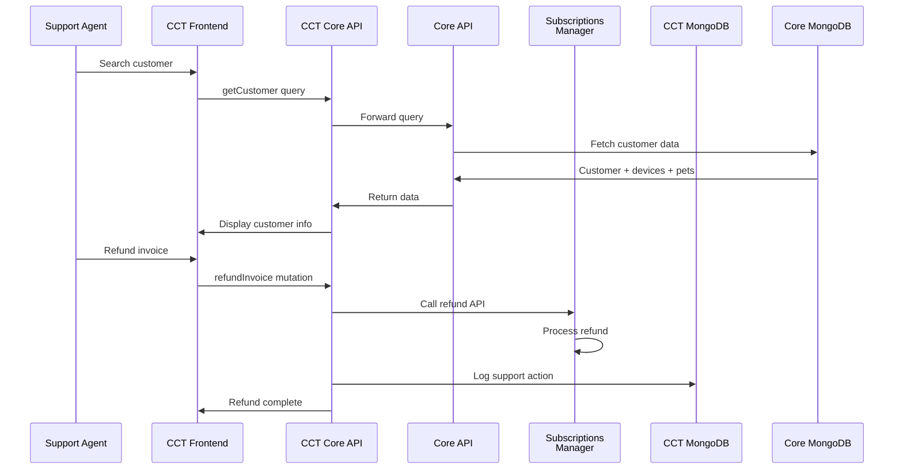
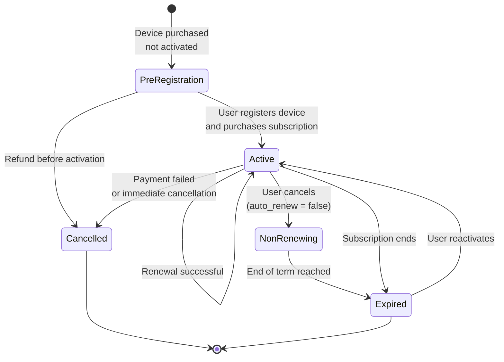

# Petlink/Kippy Infrastructure Documentation

## Overview

Petlink/Kippy is a comprehensive pet monitoring system that tracks domestic animals through GPS-enabled collars. The system consists of two branded applications (Petlink for US market, Kippy for EU market) that communicate with a distributed backend infrastructure to provide real-time location tracking, activity monitoring, and subscription management.

This document provides a complete overview of the system architecture, data flows, and component interactions to facilitate development, testing, and maintenance.

---

## Table of Contents

1. [System Architecture](#system-architecture)
2. [Component Details](#component-details)
3. [Data Flows](#data-flows)
4. [Subscription Management](#subscription-management)
5. [External Integrations](#external-integrations)
6. [Repository Guide](#repository-guide)

---

## System Architecture

### High-Level Architecture Diagram

---

## Component Details

### Mobile Applications

#### petlink-everywhere-mobile
- **Technology**: Flutter (Dart)
- **Variants**: Two branded apps (Petlink US, Kippy EU) with identical functionality
- **Responsibilities**:
    - User authentication via AWS Cognito
    - Pet and device registration/management
    - Real-time GPS tracking visualization
    - Activity monitoring and statistics
    - Subscription purchase and management
    - Push notification handling (Firebase)
    - In-app messaging and alerts
- **Communication**: GraphQL API via AppSync to `petlink-everywhere-core`

### Frontend Applications

#### petlink-everywhere-web
- **Technology**: React (TypeScript)
- **Purpose**: Public-facing web application for end users
- **Responsibilities**:
    - User account management
    - Pet registration and management
    - Device activation and setup
    - Subscription purchases (including pet protection for Kippy IT)
    - Order activation flows
    - QR tag functionality for lost pets
- **Communication**: GraphQL API via AppSync to `petlink-everywhere-core`
- **Authentication**: AWS Cognito

#### petlink-everywhere-cct (Customer Care Tool)
- **Technology**: React (TypeScript) with DaisyUI
- **Purpose**: Internal tool for customer support teams
- **Responsibilities**:
    - Customer account lookup and management
    - Device management and troubleshooting
    - Subscription modification and refunds
    - Support ticket creation and tracking
    - Device replacement history
    - Activity and position logs review
- **Communication**: GraphQL API via AppSync to `petlink-everywhere-cct-core`
- **Authentication**: AWS Cognito (separate user pool)

### Backend Services

#### AWS AppSync
- **Technology**: AWS Managed Service
- **Purpose**: GraphQL API Gateway and Real-time Subscriptions
- **Responsibilities**:
    - **GraphQL API Gateway**: Exposes GraphQL API to all clients (mobile, web, CCT)
    - **WebSocket Management**: Manages persistent WebSocket connections for real-time subscriptions
    - **Lambda Resolver Routing**: Routes GraphQL queries/mutations to appropriate Lambda functions
    - **Subscription Broadcasting**: Distributes real-time events to subscribed clients
    - **Authentication Integration**: Integrates with AWS Cognito for user authentication
- **Key Features**:
    - HTTP endpoint for queries and mutations
    - WebSocket endpoint for subscriptions (`graphql-ws` protocol)
    - Automatic event distribution when Lambda resolvers call `publishOn*` mutations
    - Connection management, reconnection handling, and scaling

#### petlink-everywhere-core
- **Technology**: AWS Lambda (TypeScript), AWS AppSync (GraphQL)
- **Database**: MongoDB
- **Responsibilities**:
    - **GraphQL Resolvers**: Lambda functions that handle GraphQL queries/mutations via AppSync
    - **REST API**: External integrations (order systems, third-party services) - bypasses AppSync
    - User management and authentication
    - Pet and device registration
    - GPS position and activity data storage
    - Subscription orchestration
    - Notification dispatching (push, SMS, email)
    - Real-time updates via GraphQL subscriptions (publishes to AppSync)
    - Device command queuing
- **Key Stacks**:
    - `api-stack`: Main GraphQL resolvers (invoked by AppSync)
    - `sentinel-integration-stack`: SQS consumers for device data
    - `subscriptions-integration-stack`: Webhook consumers and subscription logic
    - `sim-operations-stack`: SIM card management for devices

#### petlink-everywhere-cct-core
- **Technology**: AWS Lambda (TypeScript), AWS AppSync (GraphQL)
- **Database**: MongoDB (separate from core)
- **Responsibilities**:
    - GraphQL API for CCT frontend
    - CCT user management and permissions
    - Activity logging for support actions
    - Issue ticket management
    - Proxying requests to `petlink-everywhere-core` and `subscriptions-manager`
- **Communication**:
    - Calls `petlink-everywhere-core` GraphQL API
    - Calls `subscriptions-manager` GraphQL API

#### subscriptions-manager
- **Technology**: AWS Lambda (TypeScript), AWS AppSync (GraphQL)
- **Responsibilities**:
    - Chargebee integration for payment processing
    - Subscription creation, updates, and cancellations
    - Webhook handling from Chargebee
    - Payment method management
    - Invoice and refund processing
    - Coupon and promotion management
    - Business entity and gateway account routing
- **Communication**:
    - GraphQL API for `petlink-everywhere-core` and `petlink-everywhere-cct-core`
    - REST webhooks from Chargebee
    - SQS messages to `petlink-everywhere-core`

#### petlink-everywhere-sentinel
- **Technology**: Rust (TCP server) + TypeScript (Lambda consumers)
- **Deployment**: Kubernetes cluster on AWS EKS with Global Accelerator
- **Responsibilities**:
    - **Rust TCP Server**:
        - Accept TCP connections from GPS devices worldwide
        - Parse binary SiRF protocol packets
        - Maintain active device connections
        - Send commands to connected devices
        - Process position, activity, and status data
    - **TypeScript Lambda Consumers**:
        - `gpsMessagesConsumer`: Process position updates from devices
        - `notificationsConsumer`: Send notifications (SMS, email, push)
        - `activitiesConsumer`: Process activity data from devices
        - `commandsConsumer`: Forward commands from core to Rust server
        - `newGpsDevicesConsumer`: Handle device registration and reset
        - `settingsConsumer`: Update device configurations
        - `expiredSubscriptionsConsumer`: Handle subscription expiration
- **Communication**:
    - TCP connections with GPS devices (binary protocol)
    - SQS queues for communication with `petlink-everywhere-core`
    - MongoDB for device state and position data

### Supporting Libraries

#### petlink-everywhere-types
- **Technology**: TypeScript
- **Purpose**: Shared type definitions across backend services
- **Contents**: Common types, enums, and interfaces

#### petlink-everywhere-bluetooth
- **Technology**: Flutter plugin (Dart)
- **Purpose**: Bluetooth Low Energy communication with devices for initial setup

#### petlink-everywhere-test
- **Technology**: Vitest (TypeScript)
- **Purpose**: End-to-end and integration test suite
- **Coverage**: API testing, subscription flows, device operations

---

## Data Flows

### 1. Device to User Flow (Position Updates)

**Flow Description**:
1. GPS device sends binary packet via TCP to Sentinel Rust server
2. Sentinel parses SiRF protocol packet and extracts GPS coordinates
3. Sentinel sends position message to `gpsMessages` SQS queue
4. `gpsMessagesConsumer` Lambda is triggered
5. Lambda updates device position in MongoDB
6. Lambda publishes position update via GraphQL mutation to AppSync
7. AppSync broadcasts update to subscribed clients (mobile/web apps)
8. If position triggers geo-fence alert, notification is queued

### 2. User to Device Flow (Send Command)

**Flow Description**:
1. User initiates command from mobile app (e.g., "Find my pet", "LED on")
2. Core API validates and stores command in MongoDB
3. Core sends command message to Sentinel `commands` SQS queue
4. `commandsConsumer` Lambda receives message
5. Lambda calls Sentinel HTTP endpoint with command details
6. Sentinel Rust server sends binary command to device via TCP
7. Device acknowledges command
8. Status updates flow back via SQS and GraphQL subscriptions

### 3. Subscription Purchase Flow

**Flow Description**:
1. User selects subscription plan in mobile app or web
2. Core API calls Subscriptions Manager to create subscription
3. Subscriptions Manager creates subscription in Chargebee
4. User is redirected to Chargebee hosted page for payment
5. After payment, Chargebee sends webhook to Subscriptions Manager
6. Webhook event is queued in SQS
7. Webhook consumer Lambda processes event
8. Consumer updates MongoDB with subscription details
9. Consumer notifies Sentinel about subscription activation
10. Sentinel updates device's `subscription_active` flag
11. User receives confirmation notification

### 4. Device Registration Flow

**Flow Description**:
1. User scans device QR code or enters serial number
2. Mobile app calls `registerDevice` GraphQL mutation
3. Core validates device exists in inventory
4. Core assigns device to user's pet in MongoDB
5. Core sends notification to Sentinel via SQS
6. Sentinel updates device-to-user mapping
7. Sentinel sends WAKEUP command to activate device
8. Device begins transmitting position data

### 5. Customer Support Flow (CCT)

**Flow Description**:
1. Support agent searches for customer in CCT
2. CCT Core proxies request to Core API
3. Core fetches customer, device, and subscription data
4. Support agent performs action (e.g., refund)
5. CCT Core calls appropriate service (Core or Subscriptions Manager)
6. Action is logged in CCT MongoDB for audit trail
7. Result is returned to support agent

---

## Subscription Management

### Subscription Types

The system handles different subscription models based on brand and region:

#### Petlink (US Market)
- **Standard Subscriptions**: Monthly, Yearly, Multi-year plans
- No device protection addon
- All plans have same features, differ only in duration and pricing

#### Kippy (EU Market)
- **Standard Subscriptions**: Monthly, Yearly, Multi-year plans
- **Device Protection Addon** (optional):
    - Same duration as main subscription
    - Covers device replacement in case of damage
    - Managed as Chargebee addon
- **Pet Protection** (Italy only):
    - Also called "Care Protection" in code
    - 1-year duration (independent of subscription duration)
    - Can be purchased only if active subscription exists
    - Covers veterinary expenses and pet insurance
    - Managed as separate subscription in Chargebee

### Subscription States

### Key Subscription Flows

#### Pre-registration Flow
- User purchases device from external store (e.g., Magento, Amazon)
- Store calls Core REST API with device serial and subscription plan
- Core creates "pre-registered" subscription in Chargebee
- User later activates device via mobile app
- Subscription becomes active upon device activation

#### Renewal Flow
- Chargebee automatically attempts renewal based on billing cycle
- `subscription_renewed` webhook is sent to Subscriptions Manager
- Subscriptions Manager updates Core via SQS
- Core updates subscription end date in MongoDB
- Sentinel is notified to keep device active

#### Cancellation Flow
- User cancels via mobile app or support cancels via CCT
- Subscription `auto_renew` flag set to false in Chargebee
- Device remains active until current term ends
- At term end, `subscription_cancelled` webhook triggers
- Sentinel is notified to deactivate device

---

## External Integrations

### AWS Cognito
- **Purpose**: User authentication and authorization
- **Usage**:
    - Mobile apps: User sign-up, sign-in, password reset
    - Web app: User authentication
    - CCT: Support staff authentication (separate user pool)
- **Integration**: AWS Amplify libraries

### Chargebee
- **Purpose**: Payment processing and subscription billing
- **Features Used**:
    - Customer management
    - Subscription lifecycle management
    - Addons (device/pet protection)
    - Invoicing and payments
    - Webhooks for event notifications
    - Hosted payment pages
- **Integration**: Chargebee Node.js SDK
- **Webhook Events**: payment_succeeded, payment_failed, subscription_created, subscription_renewed, subscription_cancelled, etc.

### Firebase Cloud Messaging (FCM)
- **Purpose**: Push notifications to mobile apps
- **Configuration**: Separate FCM projects for Petlink and Kippy
- **Notification Types**:
    - Device alerts (low battery, geo-fence)
    - Subscription reminders
    - Activity summaries
    - System messages

### Twilio
- **Purpose**: SMS notifications
- **Use Cases**:
    - OTP for phone verification during sign-up
    - Critical device alerts
    - Subscription expiration warnings
- **Configuration**: Environment-based whitelists for testing

### SendGrid
- **Purpose**: Transactional email
- **Use Cases**:
    - Welcome emails
    - Password reset
    - Subscription receipts
    - Device alerts
    - Marketing campaigns (via templates)
- **Configuration**: Template-based emails stored in MongoDB

### LocationIQ
- **Purpose**: Reverse geocoding
- **Usage**: Convert GPS coordinates to human-readable addresses
- **Called By**: Sentinel when processing position updates

---

## Deployment Architecture

### AWS Infrastructure
- **AppSync**: Managed GraphQL API service that exposes GraphQL endpoints and manages WebSocket connections for real-time subscriptions
- **Lambda Functions**: All backend services (Core, CCT Core, Subscriptions Manager) - invoked as resolvers by AppSync
- **EKS**: Kubernetes cluster for Sentinel
- **MongoDB Atlas**: Database hosting
- **SQS**: Message queues for async communication
- **S3**: Asset storage (pet photos, device firmware)
- **CloudFront**: CDN for web applications
- **Global Accelerator**: Low-latency device connections to Sentinel

### CI/CD
- **CDK**: Infrastructure as code for all AWS resources
- **GitHub Actions**: Build and deployment pipelines
- **Environment Stages**: Development, Staging, Production
- **Branch-based Deployments**: Feature branches deploy to isolated environments

---