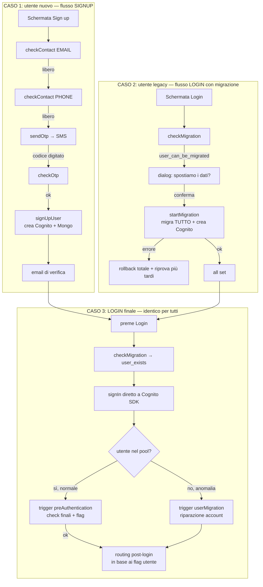
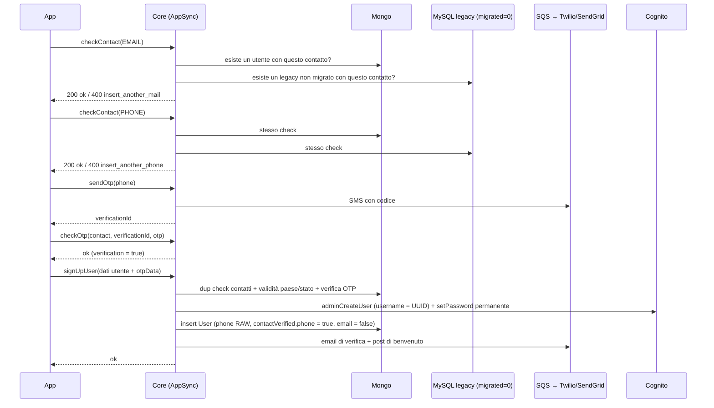
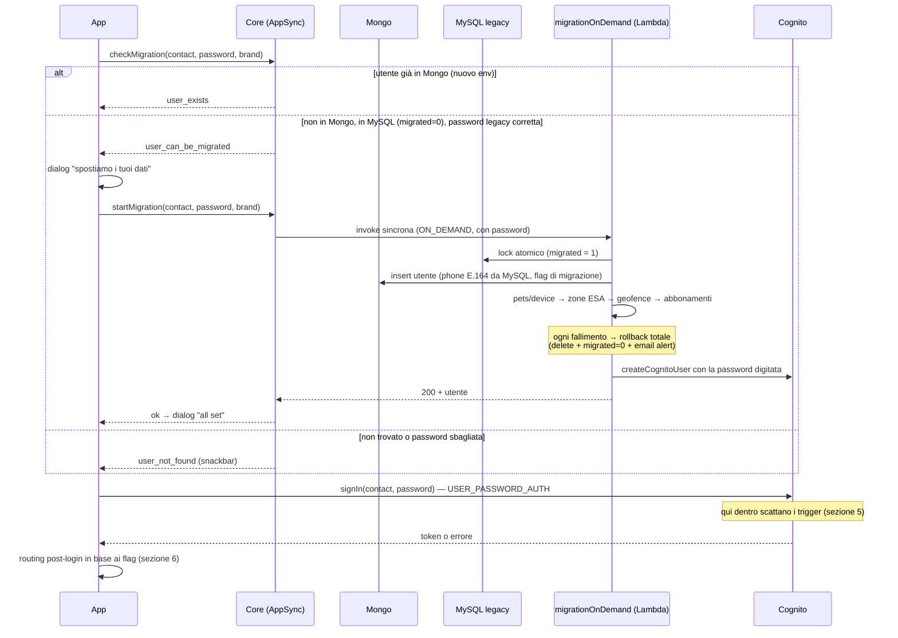
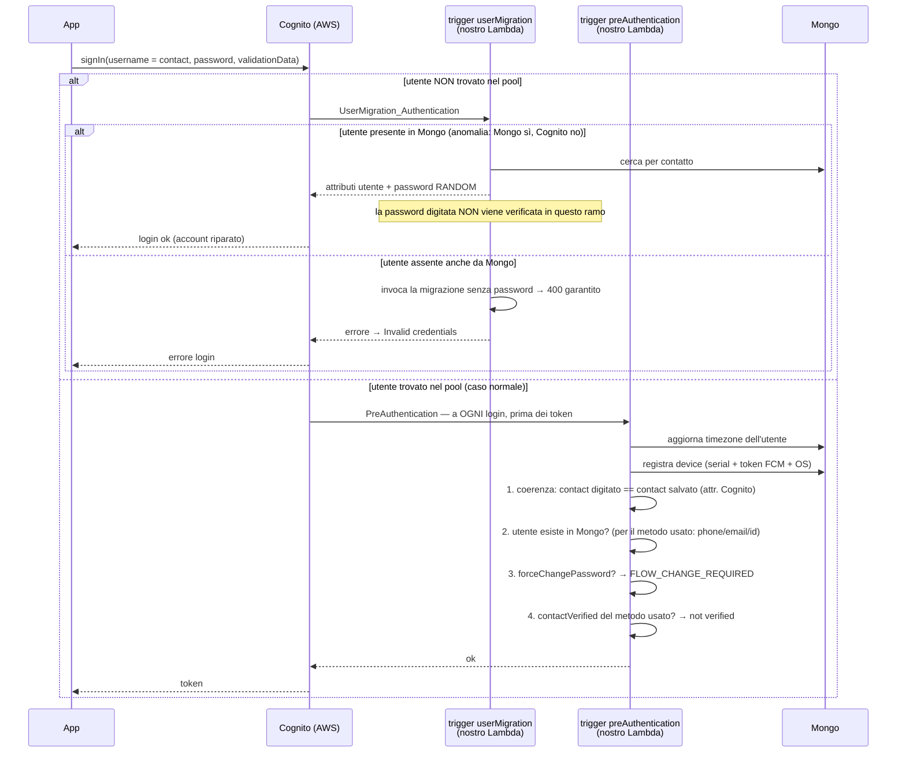
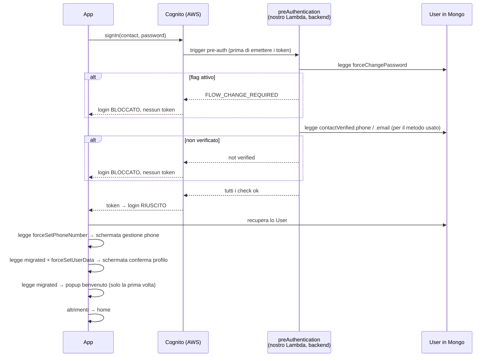
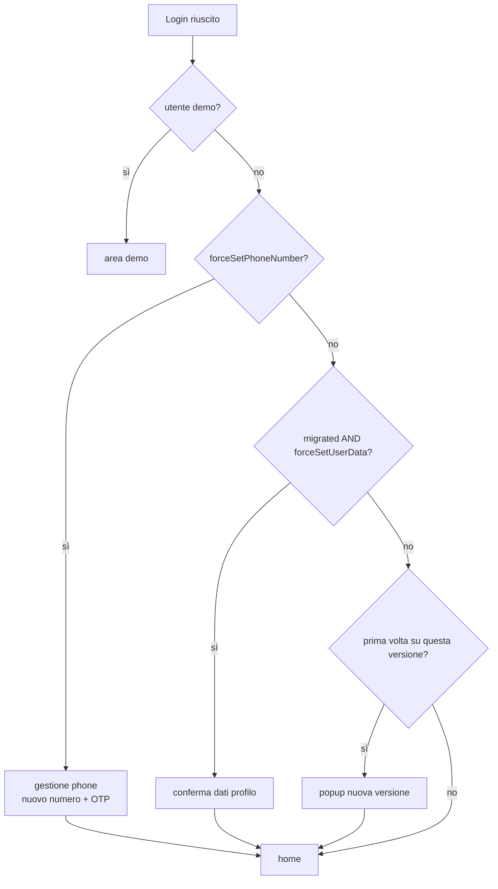

# Flussi utente: signup, migrazione e login — cronologia completa e diramazioni

> Contesto: analisi dei flussi di signup/login per il bug PEM-4124 (vedi `bugs/bug-migration-phone-number-PEM-4124.md`).

## 1. Chi fa cosa

| Attore | Ruolo |
|---|---|
| **App mobile** | Validazione **sintattica** dei campi, costruzione del contact, **orchestrazione** (ordine delle chiamate), **routing UI** in base ai `translationCode`/flag ricevuti. Nessuna decisione di business: non può sapere da sola se un utente è da migrare. |
| **Backend Core (AppSync)** | Tutte le decisioni: utente esiste? migrabile? password giusta? contatto duplicato? OTP valido? |
| **Backend data-migration** | L'intera migrazione: utente → pets/device → zone risparmio energetico → geofence → abbonamenti, con rollback totale in caso di errore. |
| **Cognito (AWS)** | Autenticazione vera e propria. È l'unica chiamata che **non passa dal nostro backend GraphQL**: l'app parla direttamente con AWS. Dentro quella chiamata Cognito esegue automaticamente i nostri due Lambda trigger. |

**Concetto chiave**: il **contact** (email o phone) è costruito dall'app in formato "raw": prefisso selezionato + cifre digitate (eventuale zero incluso). La stessa stringa viaggia in tutte le chiamate ed è quella su cui il backend interroga Mongo/MySQL/Cognito con match **esatto**.

**Concetto chiave 2**: signup e login sono due flussi **separati**. Lo signup **non** chiama mai checkMigration/startMigration: la migrazione vive solo dentro il flusso login, come diramazione di `checkMigration`.

---

## 2. Ciclo di vita: tre casi d'ingresso

I tre casi convergono: dopo signup o migrazione, l'utente entra sempre nel login standard, dove `checkMigration` risponde `user_exists` e il controllo passa a Cognito.

---

## 3. Signup — sequenza cronologica

### Diramazioni backend

- **checkContact (email e phone)**, in ordine:
  1. formato valido (email / phone con regex) → altrimenti `insert_valid_mail` / `insert_valid_phone`;
  2. contatto già usato da un utente in Mongo → `insert_another_mail` / `insert_another_phone`;
  3. contatto di un **utente legacy non migrato** → **lo stesso identico codice** di "già usato" (`insert_another_mail` / `insert_another_phone`): **solo blocco, nessuna azione** — dalla signup non parte nessuna migrazione né altro. Il blocco serve a proteggere il percorso di migrazione: se il contatto venisse registrato ora, al primo login `checkMigration` troverebbe "user_exists" e la dialog di migrazione non apparirebbe più (i dati legacy — device, abbonamenti, pets — resterebbero orfani nel vecchio sistema). Nota UX: il messaggio è identico a "email/phone già in uso" — all'utente legacy **non viene detto esplicitamente** di fare login, deve arrivarci da solo.
- **sendOtp**: validità formato, throttle sul resend (`wait_for_new_otp`), OTP salvato e precedente invalidato, SMS via coda.
- **checkOtp**: match otp + verificationId + non scaduto + contact identico (case-insensitive) → marca la verifica.
- **signUpUser**, in ordine:
  1. dup check Mongo su email/phone → `insert_valid_contact`;
  2. paese/provincia validi → altrimenti rifiuto;
  3. OTP verificato e coerente → altrimenti `invalid_otp`;
  4. creazione Cognito (username interno = UUID; **se fallisce → cleanup totale**);
  5. insert su Mongo: **phone salvata raw** (con eventuale zero), telefono verificato, email **non** verificata;
  6. email di verifica con link + post di benvenuto + evento CEMI.

---

## 4. Login — sequenza cronologica (migrazione incorporata)

### Dettagli della migrazione (dentro `startMigration`)

- La **verifica della password legacy** (hash salted SHA256) avviene **solo in `checkMigration`**: la migrazione si fida della password ricevuta e la usa come **password Cognito del nuovo utente** (per questo la migrazione invocata senza password viene rifiutata).
- Idempotenza: se l'utente è già in Mongo (match su email o phone anche normalizzata) → risponde "già fatto" senza rifare nulla.
- Utenti demo: skippati.
- Lock su MySQL: se un'altra migrazione è in corso → conflitto, non si migra due volte in parallelo.
- La phone del nuovo utente è **ricomposta dai campi MySQL** (prefisso paese + numero nazionale **senza** zero) → formato E.164.
- Rollback: cancella tutto ciò che ha inserito e riporta `migrated = 0` → l'utente può riprovare.
- Le migrazioni "pesanti" (storico posizioni, attività, notifiche) partono **asincrone** in coda dopo il resto: per questo la dialog dice "completeremo in background".

---

## 5. I trigger Cognito: quando scattano e cosa fanno

I trigger sono **Lambda nostri** (codice nel repo core) **agganciati al user pool** nella configurazione AWS: non vengono mai chiamati da noi, è Cognito a invocarli in automatico durante l'autenticazione. Per l'app sono invisibili: l'app fa una sola chiamata `signIn`.

### 5.1 `userMigration` — quando: SOLO se il nome utente non esiste nel pool

**Come funziona il contratto con Cognito** (trigger "Migrate user"): quando l'app fa signIn e l'username non è nel pool, invece di fallire subito Cognito dà al nostro Lambda un'ultima possibilità. Gli passa **username digitato, password digitata e validationData**, e aspetta una di due risposte:

- **successo con attributi utente** → Cognito **crea l'account al volo** con quegli attributi e **completa il login nella stessa chiamata** (token emessi);
- **errore** → login fallito.

Il nostro Lambda cerca l'utente in Mongo per contatto (email o phone, match esatto):

- **Trovato** (Mongo sì, Cognito no — anomalia, es. account Cognito cancellato ma utente Mongo sopravvissuto) → ramo **riparazione**: restituisce gli attributi (id utente, phone, email, nome...) e Cognito ricrea l'account. Due particolarità: (a) la password digitata **non viene verificata contro nulla** in questo ramo; (b) il trigger **sovrascrive la password con una casuale** → il login in corso riesce lo stesso, ma l'account ricreato ha una password sconosciuta → al login successivo l'utente dovrà passare da "password dimenticata".
- **Non trovato** → ramo **migrazione on-the-fly**, il design originale: l'app un tempo non chiamava `checkMigration`; l'utente digitava le credenziali legacy e la migrazione partiva da qui (con la password digitata, destinata a diventare la password Cognito). Oggi il Lambda invoca la migrazione on-demand **senza password** → rifiuto garantito ("password obbligatoria per on-demand") → login fallisce. **Ramo morto**: l'app ora fa sempre `checkMigration → startMigration` prima, quindi quando arriva la signIn l'utente è già in Cognito e il trigger non scatta quasi mai — sopravvive come paracadute per le anomalie.

### 5.2 `preAuthentication` — quando: a OGNI login, dopo la risoluzione dell'utente, prima dell'emissione dei token

Sequenza esatta dei check (il primo che fallisce blocca il login):

1. Se il `method` è `change_password` → pass-through (usato dal flusso cambio password, che si autentica apposta).
2. Aggiorna la timezone dell'utente su Mongo (se l'app l'ha inviata).
3. Registra/aggiorna il device mobile dell'utente (serial number, token FCM, OS).
4. **Coerenza**: il contact digitato (nel `validationData.username`) deve essere **identico** all'attributo salvato in Cognito (`phone_number` se il method è phone, `email` se è email) → altrimenti 422 "method e username non coerenti".
5. **Esistenza in Mongo**: cerca l'utente per phone/email (in base al method) → se non trovato → 422.
6. **`forceChangePassword == true`** → errore `FLOW_CHANGE_REQUIRED` con redirect a cambio password.
7. **`contactVerified`**: verifica il contatto **in base al metodo di login** (login by phone → `contactVerified.phone`; by email → `contactVerified.email`; method assente → entrambi) → se false → 422 "not verified".

Nota: il punto 4 è **match esatto stringa** → è uno dei punti dove il bug del phone (raw vs E.164) fa fallire il login.

---

## 6. Flag utente: quando intervengono e cosa fanno esattamente

I flag vivono sul documento **User in Mongo**. La differenza tra bloccanti e di routing è **il momento della lettura** e **chi legge**:

- **Flag bloccanti** — letti dal **backend durante l'autenticazione**, dentro il trigger `preAuthentication` (che Cognito esegue prima di emettere i token). Mentre sono attivi **il login non riesce mai**: ogni tentativo riceve lo stesso errore. L'utente non riceve token, non entra.
- **Flag di routing** — letti dall'**app dopo il login riuscito** (l'app recupera lo User e guarda i flag). L'utente **è già autenticato**, ha i token: il flag non blocca nulla, decide solo **quale schermata vedere prima** della home.

**Precisazione sui tempi della signIn**: la chiamata non è un istante, è un processo. L'app fa **una** chiamata e resta in attesa; Cognito, *mentre la sta servendo*, esegue i trigger (userMigration se l'utente non è nel pool, poi preAuthentication). I token sono generati **per ultimi**, solo se tutti i check passano. Quindi i trigger non sono "dopo" la signIn: sono passi **dentro** la signIn — quando la chiamata torna all'app (con token o con errore), i trigger sono già stati eseguiti.

### Timeline di un login: dove viene letto ogni flag

### Flag bloccanti — letti dal backend DENTRO il login

**`forceChangePassword`** (booleano)
- **Attivato da**: migrazione **BULK** (sempre: la password è generata a caso e l'utente non la conosce); migrazione ON_DEMAND solo se il legacy aveva il proprio flag di cambio forzato (`force_pwd_change = 'Y'`).
- **Letto da**: `preAuthentication`, a **ogni** tentativo di login.
- **Azione**: il login viene rifiutato con `FLOW_CHANGE_REQUIRED`. L'app intercetta l'errore e avvia il cambio password: contatto → `sendOtpForgotPassword` (OTP via SMS/email) → nuova password → `changeForgotPassword`.
- **Spegnimento**: `changeForgotPassword` imposta la nuova password su Cognito e scrive `forceChangePassword = false` su Mongo. Dal login successivo la porta si apre.

**`contactVerified.phone` / `contactVerified.email`** (oggetto)
- **Attivato da**: migrazione → **entrambi true** (il legacy è considerato affidabile); signup → `phone: true` (verificato via OTP alla registrazione), `email: false` (finché l'utente non verifica col link nella mail di conferma).
- **Letto da**: `preAuthentication`, **in base al metodo di login**: by phone → `.phone`; by email → `.email`; senza method → entrambi.
- **Azione**: se falso → login rifiutato ("phone number not verified" / "email not verified") → l'app dirotta sul flusso di verifica del contatto (ri-OTP del telefono / verifica email).
- **Spegnimento**: `updatePhoneNumberUser` → `phone: true`; flusso di verifica email → `email: true`.

### Flag di routing — letti dall'app DOPO il login

**`forceSetPhoneNumber`** (booleano)
- **Attivato da**: migrazione, se la phone legacy è assente o invalida → al suo posto viene salvato un **numero fake** E.164 univoco.
- **Letto da**: app, subito dopo il login riuscito.
- **Azione/routing**: schermata **gestione phone** → l'utente inserisce il suo numero reale → OTP sul nuovo numero → `updatePhoneNumberUser`.
- **Spegnimento**: `updatePhoneNumberUser` verifica OTP e unicità del numero, scrive la phone su Mongo **e** su Cognito, azzera il flag e marca `contactVerified.phone = true`.
- **Nota**: il numero fake è marcato "verificato", quindi il login by phone passa lo stesso — per questo è indispensabile il routing forzato alla correzione.

**`forceSetUserData`** (booleano)
- **Attivato da**: migrazione, **sempre true** (i dati arrivano dal legacy e possono essere incompleti: indirizzo vuoto, data di nascita di default, ecc.).
- **Letto da**: app, dopo il login, **solo se anche `migrated` è true**.
- **Azione/routing**: schermata **conferma dati profilo** (nome, cognome, indirizzo, paese, ...).
- **Spegnimento**: `updateUser` (salvataggio del profilo) → `forceSetUserData = false`.

**`migrated`** (booleano)
- **Attivato da**: migrazione → true, **permanente** (non si spegne: identifica l'origine dell'utente).
- **Letto da**: app, dopo il login.
- **Azione/routing**: (a) insieme a `forceSetUserData` abilita la conferma profilo; (b) alla prima login mostra il **popup di benvenuto** "i tuoi dati sono stati spostati", gestito col campo compagno `readPopupMigrated` (fino a false) e la mutation `setReadPopupMigratedUser`.

**Utente demo**
- Non è un flag su Mongo: l'app lo riconosce dall'account/claim demo dopo il login.
- **Azione/routing**: area demo dedicata.

### Tabella riassuntiva

| Flag | Tipo | Letto da / quando | Attivato da | Routing / azione | Come si spegne |
|---|---|---|---|---|---|
| `forceChangePassword` | Bloccante | Backend (`preAuthentication`), durante il login | BULK sempre; ON_DEMAND se legacy `force_pwd_change='Y'` | login rifiutato → cambio password con OTP | `changeForgotPassword` |
| `contactVerified.phone/.email` | Bloccante | Backend (`preAuthentication`), durante il login | migrazione: entrambi true; signup: phone true, email false | login rifiutato → verifica contatto | `updatePhoneNumberUser` / verifica email |
| `forceSetPhoneNumber` | Routing | App, dopo il login | migrazione con phone assente/invalida (numero fake) | gestione phone: nuovo numero + OTP | `updatePhoneNumberUser` |
| `forceSetUserData` | Routing | App, dopo il login (solo se `migrated`) | migrazione, sempre | conferma dati profilo | `updateUser` |
| `migrated` | Routing | App, dopo il login | migrazione | conferma profilo + popup benvenuto | permanente (popup: `setReadPopupMigratedUser`) |
| demo | Routing | App, dopo il login | account demo | area demo | — |

### Routing post-login (ordine di precedenza)

Non è una lista di schermate che l'utente vede tutte: è una **catena if/else-if**. Un utente migrato arriva tipicamente con **più flag attivi insieme** (phone fake → `forceSetPhoneNumber`, dati da confermare → `forceSetUserData`, `migrated`): l'app valuta i flag in quest'ordine fisso e mostra **una schermata alla volta**. Quando la correzione finisce (flag spento), la catena viene rivalutata e passa al gradino successivo, fino alla home.

Nota: `forceChangePassword` e `contactVerified` **non compaiono** qui perché vengono intercettati **prima**, dentro il login (sezione 5.2): se attivi, il login nemmeno riesce.

---

## 7. Flussi di correzione (come si spengono i flag)

### 7.1 Cambio password forzato / dimenticata

`preAuthentication` rifiuta il login (`FLOW_CHANGE_REQUIRED`) → l'app chiede il contatto → `sendOtpForgotPassword`:
- **utente del nuovo env** → OTP via email o SMS (se il contatto non è verificato e non è flusso migrazione → rifiuto);
- **utente legacy non migrato** → il reset è **delegato al vecchio ambiente** via REST (le vecchie API inviano l'SMS/email); se il vecchio sistema risponde che l'utente deve prima migrare → errore dedicato `user_should_migrate`.

Poi: OTP digitato → nuova password → `changeForgotPassword` → il backend imposta la nuova password su Cognito e azzera `forceChangePassword` → l'utente rifà il login.

### 7.2 Set phone number

Routing post-login su `forceSetPhoneNumber` → schermata gestione phone → `sendOtp` sul nuovo numero → `updatePhoneNumberUser` → il backend verifica l'OTP, controlla che il numero non sia già usato da un altro utente, lo salva su Mongo **e** su Cognito, azzera il flag e marca il telefono verificato.

### 7.3 Conferma dati utente

Routing post-login su `forceSetUserData` (utenti migrati) → schermata conferma profilo → `updateUser` → il backend aggiorna i dati e azzera il flag.

### 7.4 Verifica email (utenti da signup)

Alla signup la email parte **non verificata**: se l'utente logga by email, `preAuthentication` la rifiuta finché non verifica (link via email). Gli utenti **migrati** hanno invece la email già verificata (ereditata dal legacy).

---

## 8. Riepilogo del bug phone in questi flussi (PEM-4124)

Ogni punto di match sul phone in tutti i flussi sopra è **match esatto su stringa**:

- `checkMigration` (Mongo) → migra due volte / "utente non trovato";
- `preAuthentication` (attr. Cognito + Mongo) → login by phone fallisce se i formati differiscono;
- trigger `userMigration` (Mongo) → riparazione non trova l'utente;
- `checkContact` / `signUpUser` (dup check) → doppioni non rilevati;
- `sendOtpForgotPassword` → reset non trovato;
- `updatePhoneNumberUser` → unicità non rilevata.

Il formato salvato dipende dal percorso: **migrazione → E.164 (senza trunk zero)**, **signup → raw (con eventuale zero)**. Fix: normalizzare lato backend tutte le query e le scritture (vedi fix plan nel bug file); l'app non va toccata.

---

## Appendice — file coinvolti

| Flusso / logica | Repo | File |
|---|---|---|
| Login: checkMigration | core | `src/lambda_functions/graphql/query/checkMigration/handler.ts` |
| Login: startMigration (proxy) | core | `src/lambda_functions/graphql/mutation/startMigration/handler.ts` |
| Migrazione on-demand | data-migration | `src/lambda_functions/migrationOnDemand/handler.ts` |
| Creazione utente migrato + flag | data-migration | `src/lambda_functions/migrationOnDemand/util.ts` (`createUser`, `getMysqlUser`) |
| Trigger Cognito migrazione | core | `src/lambda_functions/cognito/userMigration/handler.ts` |
| Trigger Cognito pre-auth | core | `src/lambda_functions/cognito/preAuthentication/handler.ts` |
| Signup: checkContact | core | `src/lambda_functions/graphql/query/checkContact/handler.ts` |
| Signup: sendOtp / checkOtp | core | `src/lambda_functions/graphql/mutation/sendOtp/handler.ts`, `.../checkOtp/handler.ts` |
| Signup: signUpUser + createPetlinkUser | core | `.../mutation/signUpUser/handler.ts`, `src/lib/petlink/user.ts` |
| Reset/cambio password | core | `.../mutation/sendOtpForgotPassword/handler.ts`, `.../changeForgotPassword/handler.ts` |
| Update phone / update profilo | core | `.../mutation/updatePhoneNumberUser/handler.ts`, `src/lib/petlink/user.ts` |
| App: login + routing | mobile | `lib/features/auth/presentation/view_model/auth_view_model.dart` |
| App: signup | mobile | `lib/features/auth/presentation/view_model/sign_up_view_model.dart` |
| App: signIn Cognito + errori | mobile | `lib/base/network/cognito_manager.dart` |
| App: flag utente osservabili | mobile | `lib/features/common/user_controller.dart` |
