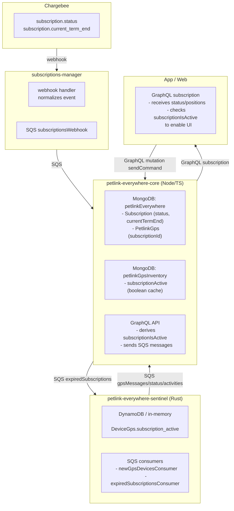
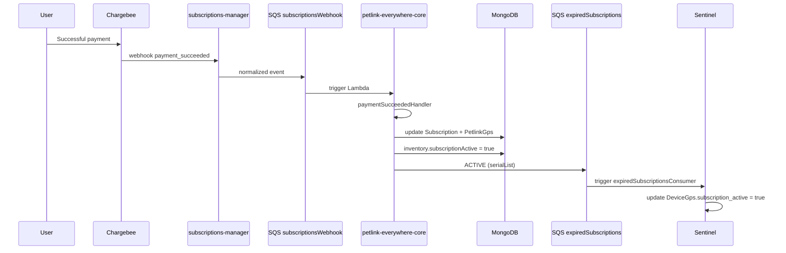
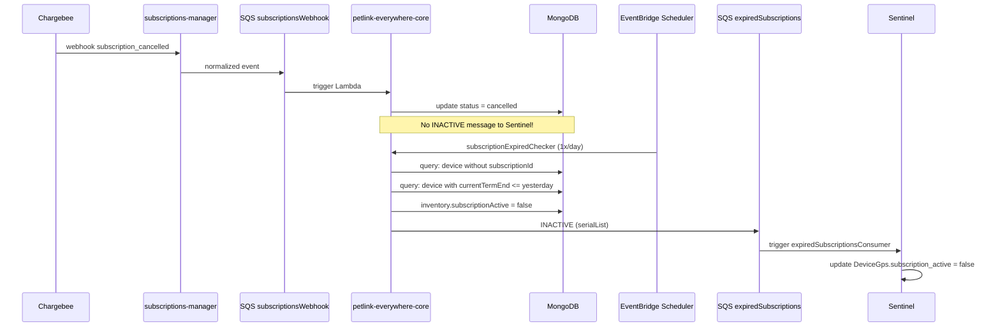
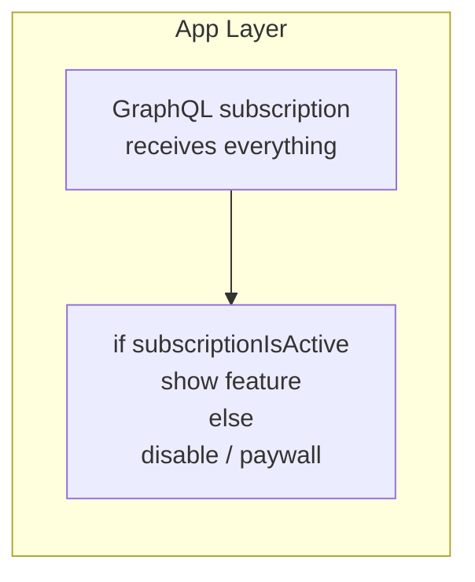
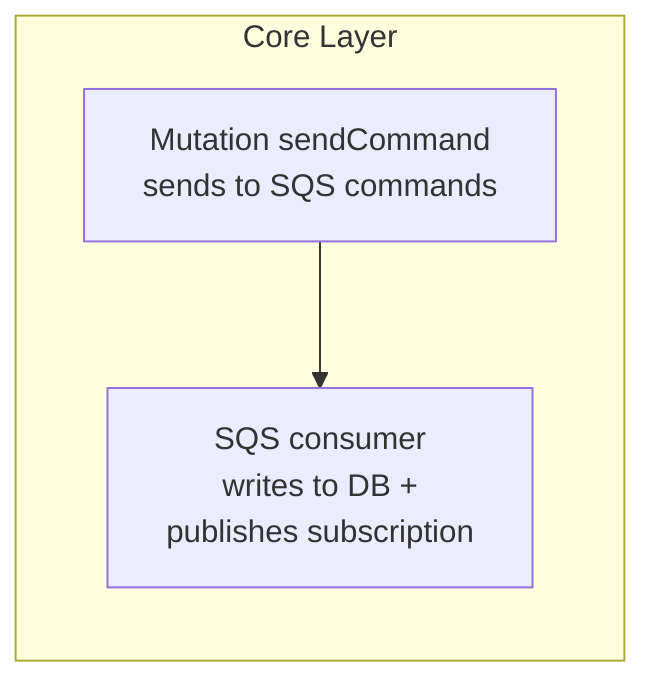
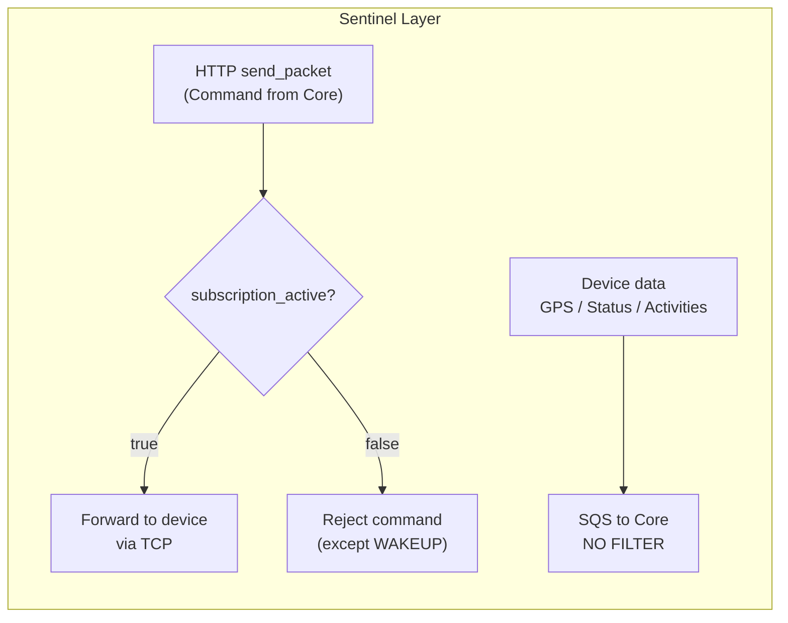

# Subscription Sync & Feature Gating

How the subscription state (`ACTIVE` / `INACTIVE`) is synchronized across repositories and where the feature enable/disable check occurs.

---

## 1. Key Fields

Before following the flows, it is useful to know which fields determine whether a subscription is active and where they live.

### 1.1 Field `subscription_active` (boolean)

| Repository | Type / Scope | Meaning |
|---|---|---|
| **Sentinel** (`petlink-everywhere-sentinel`) | `DeviceGps.subscription_active` | Local in-memory state (Rust). Updated by SQS consumers. This is the **source of truth for Sentinel** when deciding whether to forward a command to the device. |
| **Core** (`petlink-everywhere-core`) | `petlinkGpsInventory.subscriptionActive` | Field in the `petlinkGpsInventory` collection. Updated by `subscriptionExpiredChecker` and webhook handlers. Acts as a **cache** for fast lookups. |
| **Core** (`petlink-everywhere-core`) | `PetlinkGps.subscriptionIsActive` | **Derived** field (not persisted) calculated by `definePipeline` in `src/lib/petlink/subscriptions.ts`. Based on the subscription's `currentTermEnd`. |

### 1.2 Fields `subscriptionId` + `currentTermEnd`

| Repository | Field | Meaning |
|---|---|---|
| **Core** | `PetlinkGps.subscriptionId` | UUID of the subscription currently linked to the device. If missing, the device is considered without a subscription. |
| **Core** | `Subscription.currentTermEnd` | Term end date (ISO string). Used by `subscriptionExpiredChecker` to determine whether the subscription has expired. |
| **Core** | `Subscription.status` | Chargebee status: `active`, `cancelled`, `non_renewing`, `in_trial`, `future`, `to_stop_renew`, `to_stop_renew_addon`. |

---

## 2. Where Data Lives (by Repository)

---

## 3. ACTIVE / INACTIVE Synchronization

The synchronization flow is **asymmetric**: activation is near real-time, deactivation is daily batch.

### 3.1 Activation (ACTIVE)

**Reference file in Core:**
- `@/all-repo/petlink-everywhere-core/src/lambda_functions/subscriptions/subscriptionsWebhookConsumer/subscriptionWebhookHandlers/paymentSucceededHandler.ts:84-94`

### 3.2 Deactivation (INACTIVE)

**Reference file in Core:**
- `@/all-repo/petlink-everywhere-core/src/lambda_functions/subscriptions/subscriptionExpiredChecker/handler.ts:29-30`

> **Lag note:** if a subscription expires or is cancelled at 10:00, Sentinel is only deactivated at the next scheduled run (typically the following day).

---

## 4. Feature Gating Check: The 3 Blocks

The decision to enable or disable a feature (commands, positions, geofence, live tracking) is made at **3 different levels**, with different logic.

### 4.1 Level 1 — App (UI / UX)

**Where:** Flutter App (`petlink-everywhere-mobile`) and Web App (`petlink-everywhere-web`).

**Logic:** the App receives all data from the backend (positions, status, etc.) even if the subscription has expired. Widgets decide **what to show** based on `subscriptionIsActive`.

- If `subscriptionIsActive == false`: command buttons are disabled or display a paywall.
- If `subscriptionIsActive == true`: features are enabled in the UI.

**This is visual gating**, not a security gate. Data still arrives.

### 4.2 Level 2 — Core (API / Business Logic)

**Where:** GraphQL Lambda in `petlink-everywhere-core`.

**Logic:** Core **does not filter** inbound data from Sentinel (positions, status, activities). It writes to MongoDB and publishes via AppSync subscription.

However, when the App calls a state-changing mutation (e.g. `sendCommand`, `createGeofence`, `toggleLiveTracking`), Core may check `subscriptionIsActive` in the resolver or delegate to Sentinel.

In the specific case of `sendCommand`, Core **does not check** `subscriptionIsActive` in the resolver: it forwards the command to Sentinel and leaves gating to Sentinel.

**Reference file:**
- `@/all-repo/petlink-everywhere-core/src/lambda_functions/graphql/mutation/sendCommand/handler.ts:160-162`

### 4.3 Level 3 — Sentinel (Hard Gate)

**Where:** Rust TCP server in `petlink-everywhere-sentinel`.

**Logic:** Sentinel is the only point with a **hard gate** based on `subscription_active`. When it receives a command from Core (via HTTP `send_packet`), it reads `DeviceGps.subscription_active`:

- If `subscription_active == true` → forwards the command to the device via TCP.
- If `subscription_active == false` → **rejects the command**, unless it is `WAKEUP`.

In the case of `ENERGY_SAVING_MODE` (special command): it does not forward to the device, but sends a fake status message to Core to sync the toggle in the App.

**Data from the device to Core is NEVER filtered**: GPS, status, activities and notifications always pass through, regardless of `subscription_active`.

**Reference file in Sentinel:**
- `@/all-repo/petlink-everywhere-sentinel/src/sentinel/main.rs:372-430`

---

## 5. Summary: Who Filters What

| Level | Filters data IN (device → app) | Filters commands OUT (app → device) | Mechanism |
|---|---|---|---|
| **App** | No (receives everything) | Yes (UI gating) | Conditional on `subscriptionIsActive` |
| **Core** | No (writes everything to DB) | No (forwards to Sentinel) | No `subscriptionIsActive` check for `sendCommand` |
| **Sentinel** | No (always forwards to Core) | **Yes (hard gate)** | Check on `DeviceGps.subscription_active` |

---

## 6. Summary: ACTIVE / INACTIVE Synchronization

| Event | Direction | Trigger | Latency | Key file in Core |
|---|---|---|---|---|
| `ACTIVE` | Core → Sentinel | Webhook `payment_succeeded` | Near real-time | `paymentSucceededHandler.ts` |
| `ACTIVE` | Core → Sentinel | Vodafone SIM reactivation | Batch | `scheduledSimReactivation/handler.ts` |
| `INACTIVE` | Core → Sentinel | Scheduled `subscriptionExpiredChecker` | ~24 hours | `subscriptionExpiredChecker/handler.ts` |
| `INACTIVE` | Core → Sentinel | Test cleanup (`utilityIntegrationTest`) | On-demand | `cleanUpUser.ts` |

---

## 7. Conclusion

- The **source of truth** for the subscription is in **Core** (`Subscription.currentTermEnd` + `PetlinkGps.subscriptionId`).
- **Sentinel** receives a **simplified copy** (`subscription_active` boolean) via SQS `expiredSubscriptions` and uses it only to block commands to the device.
- **Feature gating** is asymmetric: **visual in App**, **transparent in Core**, **blocking in Sentinel**.
- **Synchronization** is asymmetric: activation is immediate, deactivation is daily batch.
