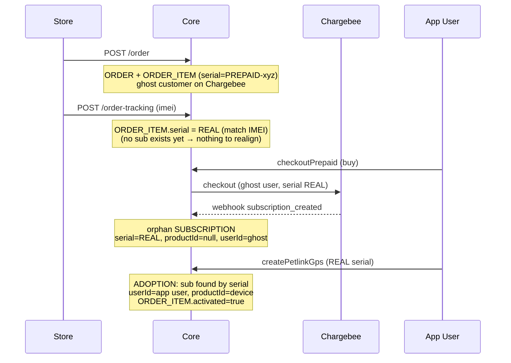
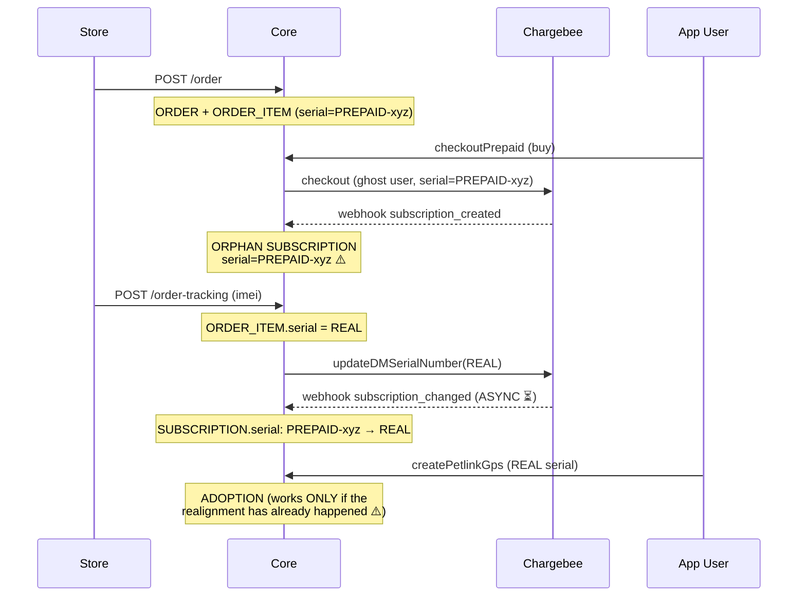
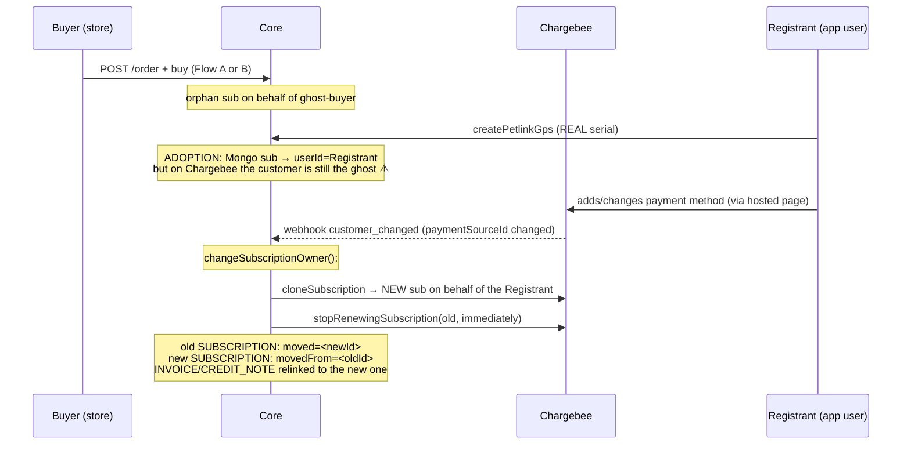

# Prepaid Subscriptions — How the end-to-end flow works

> **Prepaid** subscriptions are subscriptions purchased on an **external store** (e.g. Kippy shop)
> together with the physical device, **before** the user has registered the device in the app
> (and potentially before the app user exists at all).
> This document explains the involved entities, the 3 possible flows (A, B, C) and the weak points.

---

## 1. Actors and systems

| System | Role |
|---|---|
| **External store** (e.g. Kippy shop) | Sells device + subscription. Calls REST `POST /order` and `POST /order-tracking` |
| **Core** (petlink-everywhere-core) | Mongo persistence, GraphQL API for app, REST for the store, webhook consumer |
| **SM** (subscriptions-manager) | Chargebee wrapper: checkout, clone, stop renew, custom fields |
| **Chargebee** | Billing engine. Source of truth for sub/invoice. Notifies Core via webhook (async) |
| **User app** | The end user registers the device (`createPetlinkGps`) |
| **Web activate-order page** | Page where the user buys the sub starting from the order link (`checkoutPrepaid`) |

## 2. The three Mongo entities (same collection, discriminated by `entityType`)

```text
ORDER          "the cart paid on the store"          → IMMUTABLE after creation
ORDER_ITEM     "the single physical device in the order" → MUTABLE (serial, imei, activated)
SUBSCRIPTION   "Mongo mirror of the Chargebee sub"   → MUTABLE (written ONLY by webhooks + adoption)
```

### ORDER
```js
{
  id: "<uuid>",                 // used in the link /activate-order/<orderId>
  entityType: "ORDER",
  kippyId: <seq>,               // numeric id for the store (order-tracking uses it)
  customer: { firstName, lastName, email, phone, chargebeeId },  // chargebeeId = GHOST user (see below)
  lineItems: ["<orderItemId>"],
  status, total, currency, shippingAddress, billingAddress, ...
}
```

### ORDER_ITEM
```js
{
  id: "<uuid>",                          // = orderItemId
  entityType: "ORDER_ITEM",
  orderId: "<uuid parent ORDER>",
  serialNumber: "PREPAID-<id>",          // ⚠️ PLACEHOLDER → becomes the REAL serial after tracking
  kippyId: <seq>,                        // used by the store in order-tracking
  imei: null,                            // → populated by tracking
  activated: false,                      // → true when the user registers the device
  kippySku, model, amount, quantity, appBrand
}
```

### SUBSCRIPTION
```js
{
  id: "<uuid>",
  entityType: "SUBSCRIPTION",
  isPrepaid: true,
  userId: "<uuid>",                      // ⚠️ at the start = GHOST Chargebee user, then = app user
  productId: null,                       // ⚠️ null until a device is registered ("orphan")
  serialNumber: "PREPAID-..." | "REAL",  // ⚠️ follows (in async!) the ORDER_ITEM serial
  chargebeeSubscriptionId: "...",        // ✅ ONLY stable identifier from start to finish
  status, paymentStatus, currentTermStart/End, billingPeriod, subscriptionItems, ...
}
```

> **No SUBSCRIPTION field points to ORDER or ORDER_ITEM.**
> The only link is `serialNumber`, which **changes value mid-flow**.
> This is the weak point of the whole design (see §7).

## 3. The 4 fundamental steps (every flow is a permutation)

```text
[order]     POST /order            → creates ORDER + ORDER_ITEM (serial PREPAID-*) + ghost Chargebee user
[buy]       checkoutPrepaid        → Chargebee checkout on behalf of the ghost user
                                     → webhook subscription_created → ORPHAN SUBSCRIPTION on Mongo
[tracking]  POST /order-tracking   → ORDER_ITEM: serial PREPAID-* → REAL (match by IMEI)
                                     → update serial on Chargebee → webhook subscription_changed
                                     → realigns the SUBSCRIPTION serial on Mongo (ASYNC)
[register]  createPetlinkGps       → the app user registers the device with the REAL serial
                                     → "adoption": the orphan sub is found by serial and linked
                                     → SUBSCRIPTION.userId = app user, productId = device id
                                     → ORDER_ITEM.activated = true
```

### Detail: the ghost user

`POST /order` **always** creates a Chargebee customer with `id = random uuid`
(`utilOrder.ts`), attached to the ORDER in `customer.chargebeeId`.
The sub is purchased **on behalf of this ghost**, because the app user may not exist yet.
Only the adoption at register replaces the ghost with the real app user **on Mongo**
(on Chargebee the customer remains the ghost, except in Flow C).

### Detail: the adoption (in `createPetlinkGps` → `handlePrepaidSubscription`)

```js
// looks for an ORPHAN sub with the serial of the just-registered device
findItem({ entityType: "SUBSCRIPTION", serialNumber, status: active|in_trial, productId: undefined })
// if found:
//   PETLINK_GPS.subscriptionId = sub.id
//   SUBSCRIPTION.productId = device.id, SUBSCRIPTION.userId = app user id
//   linked INVOICEs → userId = app user
//   recalculate currentTermEnd (the prepaid period starts from registration)
// also (always): ORDER_ITEM with that serial → activated: true
```

---

## 4. Flow A — order → tracking → buy → register

The device is **shipped before** the user buys the sub.
The sub is born **directly with the real serial**: no realignment needed.



**Final state**: active sub, linked to device and app user. ORDER_ITEM activated.

## 5. Flow B — order → buy → tracking → register (the most common case)

The user buys the sub **before** the device is shipped.
The sub is born with the **placeholder serial** and must be **realigned** by the webhook.



**⚠️ Critical window**: between tracking and the webhook `subscription_changed`
the ORDER_ITEM has the real serial but the SUBSCRIPTION still has `PREPAID-*`.
If the user registers the device **in that window**, the adoption cannot find the sub
(searches by real serial) and **silently fails**: the device ends up without a sub.

## 6. Flow C — buyer ≠ registrant (transfer via `customer_changed`)

Who buys (e.g. a gift) **is not** who registers the device.
The adoption at register still links the Mongo sub to the **registrant**
(`handlePrepaidSubscription` does not check who paid), but on **Chargebee**
the customer remains the ghost of the buyer. Real reconciliation happens **later**,
when the registrant enters their own payment method:



Key points of the transfer (`customerChangedHandler.ts`):
- triggers **only** if the customer's `primaryPaymentSourceId` changes
- compares the Chargebee owner of the sub with the app user's chargebeeId: if different → move
- the sub **is not modified**: it is **cloned** on Chargebee on behalf of the new owner,
  the old one is stopped; on Mongo there remain **two documents** linked by `moved`/`movedFrom`
- all "operational" queries exclude subs with `moved` set


## 7. State summary by step

| Step | ORDER_ITEM.serial | ORDER_ITEM.activated | SUB exists | SUB.serial | SUB.userId | SUB.productId |
|---|---|---|---|---|---|---|
| after order | `PREPAID-*` | false | no | — | — | — |
| after buy (Flow B) | `PREPAID-*` | false | yes | `PREPAID-*` | ghost | null |
| after tracking | REAL | false | yes | `PREPAID-*` → REAL ⏳ | ghost | null |
| after register | REAL | **true** | yes | REAL | **app user** | **device id** |
| after transfer (Flow C) | REAL | true | 2 docs (`moved`/`movedFrom`) | REAL | registrant | device id |
