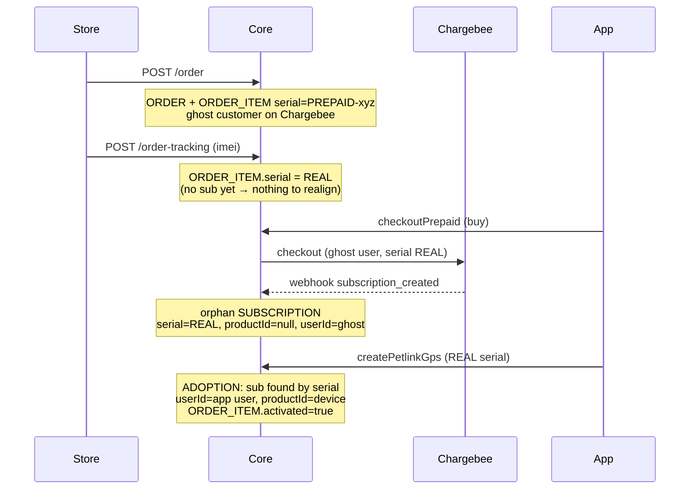
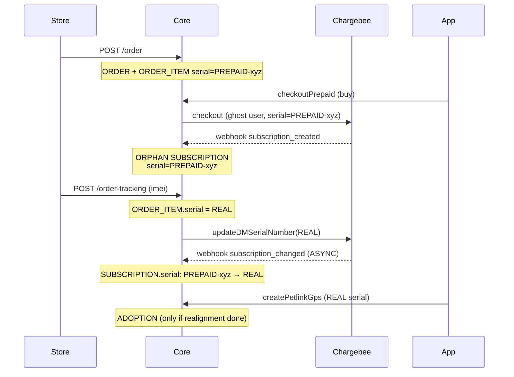
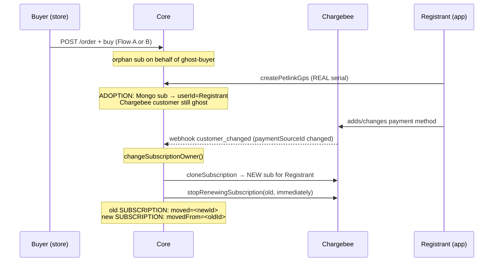

# Subscription Flow — PREPAID (external store)

> Subscription purchased on an external store (e.g. Kippy shop) **before** the device is registered in the app. The user may not exist yet at purchase time.

---

## 1. Actors

| System | Role |
|---|---|
| **External store** | Calls REST `POST /order` and `POST /order-tracking` |
| **Core** | Mongo persistence, GraphQL, REST, webhook consumer |
| **SM** | Chargebee checkout, clone, stop renew |
| **Chargebee** | Billing engine; source of truth for sub/invoice |
| **User app** | Registers device (`createPetlinkGps`) |

---

## 2. Key Mongo entities

```text
ORDER          entityType="ORDER"          IMMUTABLE after creation
ORDER_ITEM     entityType="ORDER_ITEM"     MUTABLE (serial, imei, activated)
SUBSCRIPTION   entityType="SUBSCRIPTION"   MUTABLE (written by webhooks + adoption)
```

### ORDER_ITEM fields of interest

- `serialNumber`: starts as `PREPAID-<itemId>` → becomes REAL after tracking
- `imei`: null → populated by tracking
- `activated`: false → true at device registration

### SUBSCRIPTION fields of interest

- `isPrepaid: true`
- `userId`: ghost Chargebee customer at start → app user after adoption
- `productId`: null until registration ("orphan")
- `serialNumber`: follows ORDER_ITEM serial (changes mid-flow)
- `chargebeeSubscriptionId`: only stable identifier

> **No SUBSCRIPTION field points to ORDER or ORDER_ITEM.** The only link is `serialNumber`, which changes value mid-flow.

---

## 3. The 4 fundamental steps

```text
[order]     POST /order            → ORDER + ORDER_ITEM (serial PREPAID-*) + ghost Chargebee user
[buy]       checkoutPrepaid        → Chargebee checkout (ghost user)
                                     → webhook subscription_created → ORPHAN SUBSCRIPTION
[tracking]  POST /order-tracking   → ORDER_ITEM serial PREPAID-* → REAL (match by IMEI)
                                     → update serial on Chargebee → webhook subscription_changed
                                     → realigns SUBSCRIPTION.serial on Mongo (ASYNC)
[register]  createPetlinkGps       → app user registers device with REAL serial
                                     → "adoption": orphan sub found by serial and linked
                                     → SUBSCRIPTION.userId=app user, productId=device id
                                     → ORDER_ITEM.activated = true
```

---

## 4. Flow A — order → tracking → buy → register

Device shipped **before** user buys sub. Sub born with real serial immediately.



**Final state**: active sub linked to device and app user. ORDER_ITEM activated.

---

## 5. Flow B — order → buy → tracking → register (most common)

User buys sub **before** device is shipped. Sub born with **placeholder serial**, must be realigned.



**⚠️ Critical window**: between tracking and `subscription_changed` webhook, ORDER_ITEM has real serial but SUBSCRIPTION still has `PREPAID-*`. If registration happens in that window, adoption silently fails.

---

## 6. Flow C — buyer ≠ registrant (gift/transfer)

Who buys is not who registers.



Key points of transfer (`customerChangedHandler.ts`):
- Triggers **only** if `primaryPaymentSourceId` changes.
- Compares Chargebee owner vs app user's chargebeeId; if different → move.
- Sub is **cloned** on Chargebee; old one stopped.
- On Mongo: two docs linked by `moved` / `movedFrom`.
- Operational queries exclude subs with `moved` set.

---

## 7. State summary by step

| Step | ORDER_ITEM.serial | ORDER_ITEM.activated | SUB exists | SUB.serial | SUB.userId | SUB.productId |
|---|---|---|---|---|---|---|
| after order | `PREPAID-*` | false | no | — | — | — |
| after buy (Flow B) | `PREPAID-*` | false | yes | `PREPAID-*` | ghost | null |
| after tracking | REAL | false | yes | `PREPAID-*` → REAL ⏳ | ghost | null |
| after register | REAL | **true** | yes | REAL | **app user** | **device id** |
| after transfer (Flow C) | REAL | true | 2 docs (`moved`/`movedFrom`) | REAL | registrant | device id |

---

## 8. Reference files

- `@/all-repo/petlink-everywhere-core/src/lambda_functions/subscriptions/orderManagerRestService/operation/post/order.ts`
- `@/all-repo/petlink-everywhere-core/src/lambda_functions/subscriptions/orderManagerRestService/operation/post/orderTracking.ts`
- `@/all-repo/petlink-everywhere-core/src/lambda_functions/subscriptions/subscriptionsWebhookConsumer/subscriptionWebhookHandlers/subscriptionCreatedHandler.ts`
- `@/all-repo/petlink-everywhere-core/src/lambda_functions/subscriptions/subscriptionsWebhookConsumer/subscriptionWebhookHandlers/subscriptionChangedHandler.ts`
- `@/all-repo/petlink-everywhere-core/src/lambda_functions/subscriptions/subscriptionsWebhookConsumer/subscriptionWebhookHandlers/customerChangedHandler.ts`
- `@/all-repo/petlink-everywhere-core/src/lib/petlink/subscriptions.ts:523-610` (handlePrepaidSubscription)
