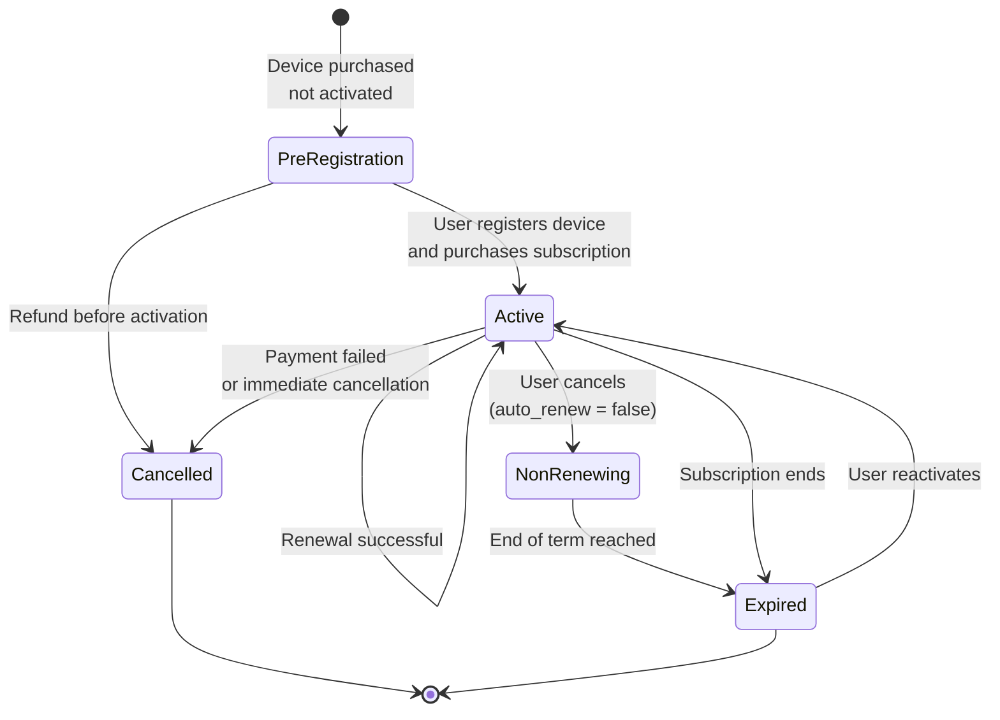

### Subscription States

### Key Subscription Flows

#### Pre-registration Flow
- User purchases device from external store (e.g., Magento, Amazon)
- Store calls Core REST API with device serial and subscription plan
- Core creates "pre-registered" subscription in Chargebee
- User later activates device via mobile app
- Subscription becomes active upon device activation

#### Renewal Flow
- Chargebee automatically attempts renewal based on billing cycle
- `subscription_renewed` webhook is sent to Subscriptions Manager
- Subscriptions Manager updates Core via SQS
- Core updates subscription end date in MongoDB
- Sentinel is notified to keep device active

#### Cancellation Flow
- User cancels via mobile app or support cancels via CCT
- Subscription `auto_renew` flag set to false in Chargebee
- Device remains active until current term ends
- At term end, `subscription_cancelled` webhook triggers
- Sentinel is notified to deactivate device
