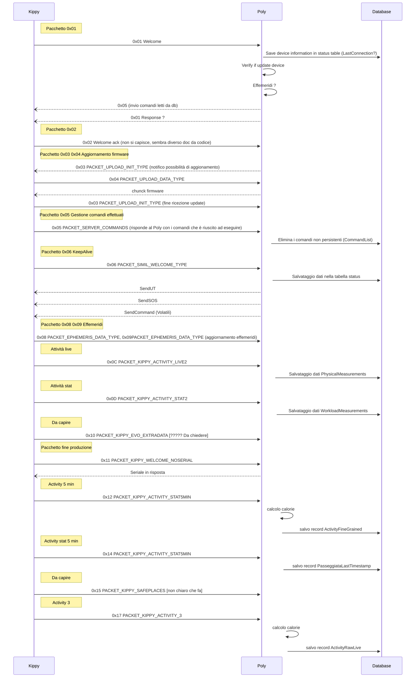

# Protocollo di Comunicazione Kippy

## Indice

- [0x01 - PACKET_WELCOME_TYPE](#0x01---packet_welcome_type)
- [0x02 - PACKET_WELCOME_ACK](#0x02---packet_welcome_ack)
- [0x03 - PACKET_UPLOAD_INIT_TYPE](#0x03---packet_upload_init_type)
- [0x04 - PACKET_UPLOAD_DATA_TYPE](#0x04---packet_upload_data_type)
- [0x05 - PACKET_SERVER_COMMANDS](#0x05---packet_server_commands)
- [0x06 - PACKET_SIMIL_WELCOME_TYPE](#0x06---packet_simil_welcome_type)
- [0x07 - PACKET_VOLATILE_COMMANDS (unused)](#0x07---packet_volatile_commands-unused)
- [0x08 - PACKET_EPHEMERIS_INIT_TYPE](#0x08---packet_ephemeris_init_type)
- [0x09 - PACKET_EPHEMERIS_DATA_TYPE](#0x09---packet_ephemeris_data_type)
- [0x0A - PACKET_KIPPY_ACTIVITY_LIVE (deprecated)](#0x0a---packet_kippy_activity_live-deprecated)
- [0x0B - PACKET_KIPPY_ACTIVITY_STAT (deprecated)](#0x0b---packet_kippy_activity_stat-deprecated)
- [0x0C - PACKET_KIPPY_ACTIVITY_LIVE2](#0x0c---packet_kippy_activity_live2)
- [0x0D - PACKET_KIPPY_ACTIVITY_STAT2](#0x0d---packet_kippy_activity_stat2)
- [0x10 - PACKET_KIPPY_EVO_EXTRADATA](#0x10---packet_kippy_evo_extradata)
- [0x11 - PACKET_KIPPY_WELCOME_NOSERIAL](#0x11---packet_kippy_welcome_noserial)
- [0x12 - PACKET_KIPPY_ACTIVITY_STAT5MIN](#0x12---packet_kippy_activity_stat5min)
- [0x14 - PACKET_KIPPY_PASSEGGIATA](#0x14---packet_kippy_passeggiata)
- [0x15 - PACKET_KIPPY_SAFEPLACES](#0x15---packet_kippy_safeplaces)
- [0x16 - PACKET_KIPPY_MEASX](#0x16---packet_kippy_measx)
- [0x17 - PACKET_KIPPY_ACTIVITY_3](#0x17---packet_kippy_activity_3)
- [Aggiunte su Petlink Everywhere](#aggiunte-su-petlink-everywhere)
- [Diagramma di Sequenza](#diagramma-di-sequenza)
- [Questions](#questions)

---

## 0x01 - PACKET_WELCOME_TYPE

Pacchetto utilizzato da Kippy per presentarsi al server. Contiene tutte le informazioni necessarie per gestire
l'anagrafica e le configurazioni del dispositivo.

**kippy → server**

| Campo                                                                 | Numero di bit | Descrizione                                     |
|-----------------------------------------------------------------------|---------------|-------------------------------------------------|
| `pckNr (0x1)`                                                         | 1 * 8         | Numero del pacchetto.                           |
| `serialNumber`                                                        | 10 * 8        | Numero seriale del dispositivo.                 |
| `imei`                                                                | 15 * 8        | IMEI del dispositivo.                           |
| `ccid`                                                                | 20 * 8        | CCID della SIM card.                            |
| `fwVersion`                                                           | 3 * 8         | Versione del firmware.                          |
| `bootVer`                                                             | 3 * 8         | Versione del bootloader.                        |
| `curLat`                                                              | 4 * 8         | Latitudine corrente.                            |
| `curLon`                                                              | 4 * 8         | Longitudine corrente.                           |
| `curAlt`                                                              | 2 * 8         | Altitudine corrente.                            |
| `lastGpsTime`                                                         | 4 * 8         | Tempo dell'ultima rilevazione GPS.              |
| `temperature`                                                         | 2 * 8         | Temperatura corrente.                           |
| `speed`                                                               | 2 * 8         | Velocità corrente.                              |
| `batteryVoltage`                                                      | 2 * 8         | Voltaggio della batteria.                       |
| `modemQuality`                                                        | 1 * 8         | Qualità del segnale del modem.                  |
| `modemBer`                                                            | 1 * 8         | Bit Error Rate (BER) del modem.                 |
| `newOperatingStatus`                                                  | 1 * 8         | Nuovo stato operativo.                          |
| `curOperatingStatus`                                                  | 1 * 8         | Stato operativo corrente.                       |
| `resetCause`                                                          | 1 * 8         | Causa del reset del dispositivo.                |
| `modemRetry`                                                          | 1 * 8         | Numero di tentativi di riconnessione del modem. |
| `modemNumSat`                                                         | 1 * 8         | Numero di satelliti visibili dal modem.         |
| `batteryRemaining (spare_c4)`                                         | 1 * 8         | Percentuale di batteria rimanente.              |
| `modemGmr (spare_c6)`                                                 | 1 * 8         | Parametro GMR del modem.                        |
| `modemRetry (spare_c7)`                                               | 1 * 8         | Numero di tentativi di riavvio del modem.       |
| `modemError (spare_c8)`                                               | 1 * 8         | Numero di errori del modem.                     |
| `modemTimeFromLastGprs`                                               | 2 * 8         | Tempo dall'ultima connessione GPRS.             |
| `modemLookingForGpsFor`                                               | 2 * 8         | Tempo di ricerca del segnale GPS.               |
| `currentRadius (spare_s3)`                                            | 2 * 8         | Raggio di precisione corrente.                  |
| `ephemerisCrc (spare_s4)`                                             | 2 * 8         | Codice di controllo CRC delle effemeridi GPS.   |
| `life (spare_s5, space_s6)`                                           | 4 * 8         | Durata di vita del dispositivo.                 |
| `activeLife (spare_s7, spare_s8)`                                     | 4 * 8         | Durata di vita attiva del dispositivo.          |
| `serverNotifications` {                                               |               |                                                 |
| &nbsp;&nbsp;&nbsp;&nbsp; `serverNotifications.fullCharge`             | 1             | Indicatore di carica completa.                  |
| &nbsp;&nbsp;&nbsp;&nbsp; `serverNotifications.outsideFence`           | 1             | Indicatore di uscita dal recinto virtuale.      |
| &nbsp;&nbsp;&nbsp;&nbsp; `serverNotifications.insideFence`            | 1             | Indicatore di ingresso nel recinto virtuale.    |
| &nbsp;&nbsp;&nbsp;&nbsp; `serverNotifications.justUpgraded`           | 1             | Indicatore di aggiornamento appena completato.  |
| &nbsp;&nbsp;&nbsp;&nbsp; `serverNotifications.noGps`                  | 1             | Indicatore di assenza di segnale GPS.           |
| &nbsp;&nbsp;&nbsp;&nbsp; `serverNotifications.smsReceived`            | 1             | Indicatore di ricezione di un SMS.              |
| &nbsp;&nbsp;&nbsp;&nbsp; `serverNotifications.poweringOff`            | 1             | Indicatore di spegnimento imminente.            |
| &nbsp;&nbsp;&nbsp;&nbsp; `serverNotifications.justPoweredOn`          | 1             | Indicatore di accensione.                       |
| }                                                                     |               |                                                 |
| serverNotificationExt (spare_c5) {                                    |               |                                                 |
| &nbsp;&nbsp;&nbsp;&nbsp; `serverNotificationExt.eutran`               | 1             | Indicatore E-UTRAN (4G).                        |
| &nbsp;&nbsp;&nbsp;&nbsp; `serverNotificationExt.geran`                | 1             | Indicatore GERAN (2G/3G).                       |
| &nbsp;&nbsp;&nbsp;&nbsp; `serverNotificationExt.continuousMode`       | 1             | Modalità continua attivata.                     |
| &nbsp;&nbsp;&nbsp;&nbsp; `serverNotificationExt.temperatureAlarm`     | 1             | Allarme temperatura.                            |
| &nbsp;&nbsp;&nbsp;&nbsp; `serverNotificationExt.productionTest`       | 1             | Test di produzione attivato.                    |
| &nbsp;&nbsp;&nbsp;&nbsp; `serverNotificationExt.justBooted`           | 1             | Indicatore di riavvio appena completato.        |
| &nbsp;&nbsp;&nbsp;&nbsp; `serverNotificationExt.temperatureWarning`   | 1             | Avviso di temperatura elevata.                  |
| &nbsp;&nbsp;&nbsp;&nbsp; `serverNotificationExt.detached`             | 1             | Indicatore di disconnessione dal servizio.      |
| }                                                                     |               |                                                 |
| &nbsp;&nbsp;&nbsp;&nbsp; `detaileddetailedInformationFlag` {          |               |                                                 |
| &nbsp;&nbsp;&nbsp;&nbsp; `detaileddetailedInformationFlag.wifiCell`   | 1             | Indicatore di celle WiFi scansionate.           |
| &nbsp;&nbsp;&nbsp;&nbsp; `detaileddetailedInformationFlag.agps_ublox` | 1             | Indicatore AGPS u-blox attivo.                  |
| &nbsp;&nbsp;&nbsp;&nbsp; `detaileddetailedInformationFlag.fmw_dis`    | 1             | Disabilitazione del firmware.                   |
| &nbsp;&nbsp;&nbsp;&nbsp; `detaileddetailedInformationFlag.vita`       | 1             | Vita del dispositivo.                           |
| &nbsp;&nbsp;&nbsp;&nbsp; `detaileddetailedInformationFlag.aGps_act`   | 1             | Attivazione AGPS.                               |
| &nbsp;&nbsp;&nbsp;&nbsp; `detaileddetailedInformationFlag.aGps_en`    | 1             | Abilitazione AGPS.                              |
| &nbsp;&nbsp;&nbsp;&nbsp; `detaileddetailedInformationFlag.aGps`       | 1             | Stato dell'AGPS.                                |
| &nbsp;&nbsp;&nbsp;&nbsp; `detaileddetailedInformationFlag.cellId`     | 1             | ID della cella.                                 |
| }                                                                     |               |                                                 |
| if (detailedInformationFlag.cellId) {                                 |               |                                                 |
| &nbsp;&nbsp;&nbsp;&nbsp; for (i = 0; i < 7; i++) {                    |               |                                                 |
| &nbsp;&nbsp;&nbsp;&nbsp;&nbsp;&nbsp;&nbsp;&nbsp;  `cellType`          | 1 * 8         | Tipo di cella.                                  |
| &nbsp;&nbsp;&nbsp;&nbsp;&nbsp;&nbsp;&nbsp;&nbsp;  `cellDescription`   | 22 * 8        | Descrizione della cella.                        |
| &nbsp;&nbsp;&nbsp;&nbsp; }                                            |               |                                                 |
| }                                                                     |               |                                                 |
| if (detailedInformationFlag.wifiCell)                                 |               |                                                 |
| &nbsp;&nbsp;&nbsp;&nbsp; `scannedAPs`                                 | 90 * 8        | Access Point WiFi scansionati.                  |

**server → kippy**

| Campo                                        | Numero di bit | Descrizione                                               |
|----------------------------------------------|---------------|-----------------------------------------------------------|
| `pckNr (0x1)`                                | 1 * 8         | Numero del pacchetto.                                     |
| `lbsCurrentLatitude`                         | 4 * 8         | Latitudine corrente tramite LBS (Location-Based Service). |
| `lbsCurrentLongitude`                        | 4 * 8         | Longitudine corrente tramite LBS.                         |
| `serverPositionSource`                       | 1 * 8         | Fonte della posizione dal server.                         |
| `requestedOperatingStatus`                   | 1 * 8         | Stato operativo richiesto.                                |
| `updateFrequency`                            | 2 * 8         | Frequenza di aggiornamento delle informazioni.            |
| `utcTimestamp`                               | 4 * 8         | Timestamp in formato UTC.                                 |
| `txEveryCheck`                               | 2 * 8         | Controllo di trasmissione a ogni intervallo.              |
| `lbsCurrentRadius (optional)`                | 4 * 8         | Raggio della posizione corrente tramite LBS.              |
| for (i = 0; i < 6; i++) {                    |               |                                                           |
| &nbsp;&nbsp;&nbsp;&nbsp; `geofenceLatitude`  | 4 * 8         | Latitudine del recinto virtuale.                          |
| &nbsp;&nbsp;&nbsp;&nbsp; `geofenceLongitude` | 4 * 8         | Longitudine del recinto virtuale.                         |
| }                                            |               |                                                           |

---

## 0x02 - PACKET_WELCOME_ACK

È il pacchetto con il quale il Kippy conferma al server di aver ricevuto e processato le informazioni contenute nel
pacchetto `0x01`.

**kippy → server**

| Campo                   | Numero di bit | Descrizione                                    |
|-------------------------|---------------|------------------------------------------------|
| `pckNr (0x2)`           | 1 * 8         | Numero del pacchetto.                          |
| `answerHardwareFailure` | 1             | Indicatore di fallimento hardware.             |
| `answerGeofenceLoaded`  | 1             | Indicatore di geofence caricato correttamente. |
| `reserved`              | 6             | Bit riservati per uso futuro.                  |

---

## 0x03 - PACKET_UPLOAD_INIT_TYPE

È il pacchetto utilizzato dal server per segnalare al Kippy che è disponibile un aggiornamento firmware. La decisione se
procedere con l’aggiornamento è demandata al Kippy, che chiuderà il trasferimento utilizzando questo pacchetto. Il
trasferimento del file è gestito con il pacchetto `0x04`.

**kippy → server**

| Campo         | Numero di bit | Descrizione                                             |
|---------------|---------------|---------------------------------------------------------|
| `pckNr (0x3)` | 1 * 8         | Numero del pacchetto.                                   |
| `crc`         | 2 * 8         | Codice di controllo CRC per la verifica dell'integrità. |
| `result`      | 1 * 8         | Risultato dell'operazione di inizializzazione.          |

**server → kippy**

| Campo                        | Numero di bit | Descrizione                                    |
|------------------------------|---------------|------------------------------------------------|
| `pckNr (0x3)`                | 1 * 8         | Numero del pacchetto.                          |
| `reserved`                   | 2 * 8         | Bit riservati per uso futuro.                  |
| `filename`                   | variabile     | Nome del file da aggiornare, in formato ASCII. |
| `blankSpace (0x20)`          | 1 * 8         | Spazio vuoto opzionale.                        |
| `fileLength (ascii encoded)` | variabile     | Lunghezza del file, codificata in ASCII.       |

---

## 0x04 - PACKET_UPLOAD_DATA_TYPE

È il pacchetto utilizzato per il trasferimento del file di aggiornamento firmware. Il Kippy chiede i singoli chunk (
dimensione, offset) e il server invia quanto richiesto.

**1.1.1 kippy → server**

| Campo         | Numero di bit | Descrizione                           |
|---------------|---------------|---------------------------------------|
| `pckNr (0x4)` | 1 * 8         | Numero del pacchetto.                 |
| `position`    | 4 * 8         | Posizione dell'offset del chunk.      |
| `chunkSize`   | 2 * 8         | Dimensione del chunk.                 |
| `compression` | 1 * 8         | Indicatore di compressione del chunk. |

**1.1.2 server → kippy**

| Campo         | Numero di bit           | Descrizione                      |
|---------------|-------------------------|----------------------------------|
| `pckNr (0x4)` | 1 * 8                   | Numero del pacchetto.            |
| `position`    | 4 * 8                   | Posizione dell'offset del chunk. |
| `data`        | (payloadLength - 5) * 8 | Dati del chunk inviati al Kippy. |

---

## 0x05 - PACKET_SERVER_COMMANDS

È il pacchetto utilizzato per trasferire i comandi (impostati nel DB) al Kippy. Il server invia una lista di comandi in
formato ASCII e il Kippy risponde con una maschera di bit che conferma quali dei comandi sono stati effettivamente
processati dal Kippy.

**server → kippy**

| Campo                                                        | Numero di bit | Descrizione                              |
|--------------------------------------------------------------|---------------|------------------------------------------|
| `pckNr (0x5)`                                                | 1 * 8         | Numero del pacchetto.                    |
| for (...) {                                                  |               |                                          |
| &nbsp;&nbsp;&nbsp;&nbsp; `command (ascii encoded)`           | variabile     | Comando in formato ASCII.                |
| &nbsp;&nbsp;&nbsp;&nbsp; `comma (0x2C, optional at the end)` | 1 * 8         | Virgola opzionale alla fine dei comandi. |
| }                                                            |               |                                          |

**kippy → server**

| Campo                                      | Numero di bit | Descrizione                                            |
|--------------------------------------------|---------------|--------------------------------------------------------|
| `pckNr (0x5)`                              | 1 * 8         | Numero del pacchetto.                                  |
| `for (...) {                               |               |                                                        |
| &nbsp;&nbsp;&nbsp;&nbsp; `commandExecuted` | 1 * 8         | Maschera di bit che conferma l'esecuzione dei comandi. |
| }                                          |               |                                                        |

---

## 0x06 - PACKET_SIMIL_WELCOME_TYPE

È un pacchetto di heartbeat equivalente al pacchetto `0x01`, che viene però gestito diversamente lato backend nelle
logiche di funzionamento di alcune funzionalità.

**kippy → server**

| Campo                                                               | Numero di bit | Descrizione                                     |
|---------------------------------------------------------------------|---------------|-------------------------------------------------|
| `pckNr (0x6)`                                                       | 1 * 8         | Numero del pacchetto.                           |
| `serialNumber`                                                      | 10 * 8        | Numero seriale del dispositivo.                 |
| `imei`                                                              | 15 * 8        | IMEI del dispositivo.                           |
| `ccid`                                                              | 20 * 8        | CCID della SIM card.                            |
| `fwVersion`                                                         | 3 * 8         | Versione del firmware.                          |
| `bootVer`                                                           | 3 * 8         | Versione del bootloader.                        |
| `curLat`                                                            | 4 * 8         | Latitudine corrente.                            |
| `curLon`                                                            | 4 * 8         | Longitudine corrente.                           |
| `curAlt`                                                            | 2 * 8         | Altitudine corrente.                            |
| `lastGpsTime`                                                       | 4 * 8         | Tempo dell'ultima rilevazione GPS.              |
| `temperature`                                                       | 2 * 8         | Temperatura corrente.                           |
| `speed`                                                             | 2 * 8         | Velocità corrente.                              |
| `batteryVoltage`                                                    | 2 * 8         | Voltaggio della batteria.                       |
| `modemQuality`                                                      | 1 * 8         | Qualità del segnale del modem.                  |
| `modemBer`                                                          | 1 * 8         | Bit Error Rate (BER) del modem.                 |
| `newOperatingStatus`                                                | 1 * 8         | Nuovo stato operativo.                          |
| `curOperatingStatus`                                                | 1 * 8         | Stato operativo corrente.                       |
| `serverNotifications` {                                             |               |                                                 |
| &nbsp;&nbsp;&nbsp;&nbsp; `serverNotifications.fullCharge`           | 1             | Indicatore di carica completa.                  |
| &nbsp;&nbsp;&nbsp;&nbsp; `serverNotifications.outsideFence`         | 1             | Indicatore di uscita dal recinto virtuale.      |
| &nbsp;&nbsp;&nbsp;&nbsp; `serverNotifications.insideFence`          | 1             | Indicatore di ingresso nel recinto virtuale.    |
| &nbsp;&nbsp;&nbsp;&nbsp; `serverNotifications.justUpgraded`         | 1             | Indicatore di aggiornamento appena completato.  |
| &nbsp;&nbsp;&nbsp;&nbsp; `serverNotifications.noGps`                | 1             | Indicatore di assenza di segnale GPS.           |
| &nbsp;&nbsp;&nbsp;&nbsp; `serverNotifications.smsReceived`          | 1             | Indicatore di ricezione di un SMS.              |
| &nbsp;&nbsp;&nbsp;&nbsp; `serverNotifications.poweringOff`          | 1             | Indicatore di spegnimento imminente.            |
| &nbsp;&nbsp;&nbsp;&nbsp; `serverNotifications.justPoweredOn`        | 1             | Indicatore di accensione.                       |
| }                                                                   |               |                                                 |
| `resetCause`                                                        | 1 * 8         | Causa del reset del dispositivo.                |
| `modemRetry`                                                        | 1 * 8         | Numero di tentativi di riconnessione del modem. |
| `modemNumSat`                                                       | 1 * 8         | Numero di satelliti visibili dal modem.         |
| `batteryRemaining`                                                  | 1 * 8         | Percentuale di batteria rimanente.              |
| `serverNotificationExt` {                                           |               |                                                 |
| &nbsp;&nbsp;&nbsp;&nbsp; `serverNotificationExt.eutran`             | 1             | Indicatore E-UTRAN (4G).                        |
| &nbsp;&nbsp;&nbsp;&nbsp; `serverNotificationExt.geran`              | 1             | Indicatore GERAN (2G/3G).                       |
| &nbsp;&nbsp;&nbsp;&nbsp; `serverNotificationExt.continuousMode`     | 1             | Modalità continua attivata.                     |
| &nbsp;&nbsp;&nbsp;&nbsp; `serverNotificationExt.temperatureAlarm`   | 1             | Allarme temperatura.                            |
| &nbsp;&nbsp;&nbsp;&nbsp; `serverNotificationExt.productionTest`     | 1             | Test di produzione attivato.                    |
| &nbsp;&nbsp;&nbsp;&nbsp; `serverNotificationExt.justBooted`         | 1             | Indicatore di riavvio appena completato.        |
| &nbsp;&nbsp;&nbsp;&nbsp; `serverNotificationExt.temperatureWarning` | 1             | Avviso di temperatura elevata.                  |
| &nbsp;&nbsp;&nbsp;&nbsp; `serverNotificationExt.detached`           | 1             | Indicatore di disconnessione dal servizio.      |
| }                                                                   |               |                                                 |
| `modemGmr`                                                          | 1 * 8         | Parametro GMR del modem.                        |
| `modemRetry`                                                        | 1 * 8         | Numero di tentativi di riavvio del modem.       |
| `modemError`                                                        | 1 * 8         | Numero di errori del modem.                     |
| `modemTimeFromLastGprs`                                             | 2 * 8         | Tempo dall'ultima connessione GPRS.             |
| `modemLookingForGpsFor`                                             | 2 * 8         | Tempo di ricerca del segnale GPS.               |
| `currentRadius`                                                     | 2 * 8         | Raggio di precisione corrente.                  |
| `ephemerisCrc`                                                      | 2 * 8         | Codice di controllo CRC delle effemeridi GPS.   |
| `life`                                                              | 4 * 8         | Durata di vita del dispositivo.                 |
| `activeLife`                                                        | 4 * 8         | Durata di vita attiva del dispositivo.          |
| `detailedInformationFlag`                                           | 1 * 8         | Flag per informazioni dettagliate.              |

---

## 0x07 - PACKET_VOLATILE_COMMANDS (unused)

È un pacchetto equivalente al `0x05`, pensato per inviare dei comandi temporanei che non risiedono su DB ma direttamente
in memoria sul server. Non è utilizzato.

**Nota:** Questo pacchetto non è attualmente in uso.

**Sintassi non specificata per questo pacchetto.**

---

## 0x08 - PACKET_EPHEMERIS_INIT_TYPE

È il pacchetto utilizzato per segnalare al kippy che è disponibile un nuovo file di effemeridi assistite. Il meccanismo
di trasferimento del file di effemeridi (pacchetti `0x08` e `0x09`) è identico a quello implementato per il
trasferimento dell’aggiornamento firmware (pacchetti `0x03` e `0x04`).

**server → kippy**

| Campo         | Numero di bit | Descrizione                               |
|---------------|---------------|-------------------------------------------|
| `pckNr (0x8)` | 1 * 8         | Numero del pacchetto.                     |
| `reserved`    | 2 * 8         | Spazio riservato.                         |
| `filename`    | variable      | Nome del file di effemeridi.              |
| `blankSpace`  | 1 * 8         | Spazio vuoto (0x20).                      |
| `fileLength`  | variable      | Lunghezza del file (codificato in ASCII). |

**kippy → server**

| Campo          | Numero di bit | Descrizione                                                            |
|----------------|---------------|------------------------------------------------------------------------|
| `pckNr (0x8)`  | 1 * 8         | Numero del pacchetto.                                                  |
| `crc`          | 2 * 8         | Codice di controllo del file.                                          |
| `fileUploaded` | 1 * 8         | Indica se il file è stato caricato (solo per aggiornamenti firmware?). |

---

## 0x09 - PACKET_EPHEMERIS_DATA_TYPE

È il pacchetto utilizzato per il trasferimento del file di effemeridi assistite.

**kippy → server**

| Campo         | Numero di bit | Descrizione                 |
|---------------|---------------|-----------------------------|
| `pckNr (0x9)` | 1 * 8         | Numero del pacchetto.       |
| `position`    | 4 * 8         | Posizione del chunk.        |
| `chunkSize`   | 2 * 8         | Dimensione del chunk.       |
| `compression` | 1 * 8         | Indicatore di compressione. |

**server → kippy**

| Campo         | Numero di bit           | Descrizione                                 |
|---------------|-------------------------|---------------------------------------------|
| `pckNr (0x9)` | 1 * 8                   | Numero del pacchetto.                       |
| `position`    | 4 * 8                   | Posizione del chunk.                        |
| `data`        | (payloadLength - 5) * 8 | Dati del chunk (lunghezza del payload - 5). |

---

## 0x0A - PACKET_KIPPY_ACTIVITY_LIVE (deprecated)

È il pacchetto con il quale il kippy trasferisce il dato di activity in tempo reale. Sostituito dal pacchetto `0x0C`.

**Nota:** Questo pacchetto non è attualmente in uso.

**Sintassi non specificata per questo pacchetto.**

---

## 0x0B - PACKET_KIPPY_ACTIVITY_STAT (deprecated)

È il pacchetto con il quale il kippy trasferisce il dato di activity cumulato. Sostituito dal pacchetto `0x0D`.

**server → kippy**

| Campo                  | Numero di bit | Descrizione                     |
|------------------------|---------------|---------------------------------|
| `pckNr (0x0B)`         | 1 * 8         | Numero del pacchetto.           |
| `timestamp`            | 4 * 8         | Timestamp della misurazione.    |
| `dogWeight`            | 1 * 8         | Peso del cane.                  |
| `fiveMinutesTimestamp` | 4 * 8         | Timestamp opzionale a 5 minuti. |

---

## 0x0C - PACKET_KIPPY_ACTIVITY_LIVE2

È il pacchetto con il quale il kippy trasferisce il dato di activity in tempo reale.

**kippy → server**

| Campo          | Numero di bit | Descrizione                  |
|----------------|---------------|------------------------------|
| `pckNr (0x0C)` | 1 * 8         | Numero del pacchetto.        |
| `timestamp`    | 4 * 8         | Timestamp della misurazione. |
| `play`         | 1 * 8         | Tempo giocato.               |
| `walk`         | 1 * 8         | Tempo camminato.             |
| `run`          | 1 * 8         | Tempo corso.                 |
| `sleep`        | 1 * 8         | Tempo dormito.               |
| `rest`         | 1 * 8         | Tempo di riposo.             |
| `steps`        | 2 * 8         | Numero di passi.             |
| `jumps`        | 2 * 8         | Numero di salti.             |

---

## 0x0D - PACKET_KIPPY_ACTIVITY_STAT2

È il pacchetto con il quale il kippy trasferisce il dato di activity cumulato su base oraria.

**kippy → server**

| Campo                                             | Numero di bit | Descrizione           |
|---------------------------------------------------|---------------|-----------------------|
| `pckNr (0x0D)`                                    | 1 * 8         | Numero del pacchetto. |
| for (i = 0; i < (payloadLength - 1) / 104; i++) { |               |                       |
| &nbsp;&nbsp;&nbsp;&nbsp; `timestamp`              | 4 * 8         | Timestamp dell'ora.   |
| &nbsp;&nbsp;&nbsp;&nbsp; `play`                   | 1 * 8         | Tempo giocato.        |
| &nbsp;&nbsp;&nbsp;&nbsp; `walk`                   | 1 * 8         | Tempo camminato.      |
| &nbsp;&nbsp;&nbsp;&nbsp; `run`                    | 1 * 8         | Tempo corso.          |
| &nbsp;&nbsp;&nbsp;&nbsp; `sleep`                  | 1 * 8         | Tempo dormito.        |
| &nbsp;&nbsp;&nbsp;&nbsp; `rest`                   | 1 * 8         | Tempo di riposo.      |
| &nbsp;&nbsp;&nbsp;&nbsp; `steps`                  | 2 * 8         | Numero di passi.      |
| &nbsp;&nbsp;&nbsp;&nbsp; `jumps`                  | 2 * 8         | Numero di salti.      |
| }                                                 |               |                       |

---

## 0x10 - PACKET_KIPPY_EVO_EXTRADATA

È il pacchetto usato per estendere le informazioni trasmesse con il pacchetto `0x01`, aggiungendo nuove funzionalità (
torcia, suono, etc.).

**kippy → server**

| Campo                                              | Numero di bit | Descrizione                                     |
|----------------------------------------------------|---------------|-------------------------------------------------|
| `pckNr (0x10)`                                     | 1 * 8         | Numero del pacchetto.                           |
| `evoTasks`                                         | 4 * 8         | Flag delle attività estese.                     |
| if (evoTasks & 0x1) {                              |               |                                                 |
| &nbsp;&nbsp;&nbsp;&nbsp; `torchDuration`           | 2 * 8         | Durata della torcia (minuti).                   |
| }                                                  |               |                                                 |
| if (evoTasks & 0x2) {                              |               | Se il bit 1 è impostato, esegue il blocco.      |
| &nbsp;&nbsp;&nbsp;&nbsp; `tourRecordingEnabled`    | 1 * 8         | Indicatore di registrazione del tour.           |
| }                                                  |               |                                                 |
| if (evoTasks & 0x4) {                              |               |                                                 |
| &nbsp;&nbsp;&nbsp;&nbsp; `soundCommand`            | 2 * 8         | Comando sonoro.                                 |
| &nbsp;&nbsp;&nbsp;&nbsp; `soundDuration`           | 2 * 8         | Durata del suono (secondi).                     |
| }                                                  |               |                                                 |
| if (evoTasks & 0x8) {                              |               |                                                 |
| &nbsp;&nbsp;&nbsp;&nbsp; `energySavingAreaEnabled` | 1 * 8         | Abilitazione dell'area di risparmio energetico. |
| }                                                  |               |                                                 |

---

## 0x11 - PACKET_KIPPY_WELCOME_NOSERIAL

È un pacchetto equivalente al pacchetto `0x01`, che permette però la serializzazione automatica in fase di
programmazione e collaudo.

**kippy → server**

| Campo                   | Numero di bit | Descrizione                                     |
|-------------------------|---------------|-------------------------------------------------|
| `pckNr (0x11)`          | 1 * 8         | Numero del pacchetto.                           |
| `serialNumber`          | 10 * 8        | Numero seriale del dispositivo.                 |
| `imei`                  | 15 * 8        | IMEI del dispositivo.                           |
| `ccid`                  | 20 * 8        | CCID della SIM card.                            |
| `fwVersion`             | 3 * 8         | Versione del firmware.                          |
| `bootVer`               | 3 * 8         | Versione del bootloader.                        |
| `curLat`                | 4 * 8         | Latitudine corrente.                            |
| `curLon`                | 4 * 8         | Longitudine corrente.                           |
| `curAlt`                | 2 * 8         | Altitudine corrente.                            |
| `lastGpsTime`           | 4 * 8         | Tempo dell'ultima rilevazione GPS.              |
| `temperature`           | 2 * 8         | Temperatura corrente.                           |
| `speed`                 | 2 * 8         | Velocità corrente.                              |
| `batteryVoltage`        | 2 * 8         | Voltaggio della batteria.                       |
| `modemQuality`          | 1 * 8         | Qualità del segnale del modem.                  |
| `modemBer`              | 1 * 8         | Bit Error Rate (BER) del modem.                 |
| `newOperatingStatus`    | 1 * 8         | Nuovo stato operativo.                          |
| `curOperatingStatus`    | 1 * 8         | Stato operativo corrente.                       |
| `serverNotification`    | 1 * 8         | Notifica del server.                            |
| `resetCause`            | 1 * 8         | Causa del reset del dispositivo.                |
| `modemRetry`            | 1 * 8         | Numero di tentativi di riconnessione del modem. |
| `modemNumSat`           | 1 * 8         | Numero di satelliti visibili dal modem.         |
| `batteryRemaining`      | 1 * 8         | Percentuale di batteria rimanente.              |
| `serverNotificationExt` | 1 * 8         | Estensione della notifica del server.           |
| `modemGmr`              | 1 * 8         | Parametro GMR del modem.                        |
| `modemRetry`            | 1 * 8         | Numero di tentativi di riavvio del modem.       |
| `modemError`            | 1 * 8         | Numero di errori del modem.                     |
| `modemTimeFromLastGprs` | 2 * 8         | Tempo dall'ultima connessione GPRS.             |
| `modemLookingForGpsFor` | 2 * 8         | Tempo di ricerca del segnale GPS.               |
| `currentRadius`         | 2 * 8         | Raggio di precisione corrente.                  |
| `ephemerisCrc`          | 2 * 8         | Codice di controllo CRC delle effemeridi        |

---

## 0x12 - PACKET_KIPPY_ACTIVITY_STAT5MIN

È il pacchetto con il quale il kippy trasferisce il dato di activity cumulato su 5 minuti.

**kippy → server**

| Campo                                             | Numero di bit | Descrizione                  |
|---------------------------------------------------|---------------|------------------------------|
| `pckNr (0x12)`                                    | 1 * 8         | Numero del pacchetto.        |
| for (i = 0; i < (payloadLength - 1) / 104; i++) { |               |                              |
| &nbsp;&nbsp;&nbsp;&nbsp; `timestamp`              | 4 * 8         | Timestamp della misurazione. |
| &nbsp;&nbsp;&nbsp;&nbsp; `play`                   | 1 * 8         | Tempo giocato.               |
| &nbsp;&nbsp;&nbsp;&nbsp; `walk`                   | 1 * 8         | Tempo camminato.             |
| &nbsp;&nbsp;&nbsp;&nbsp; `run`                    | 1 * 8         | Tempo corso.                 |
| &nbsp;&nbsp;&nbsp;&nbsp; `sleep`                  | 1 * 8         | Tempo dormito.               |
| &nbsp;&nbsp;&nbsp;&nbsp; `rest`                   | 1 * 8         | Tempo di riposo.             |
| &nbsp;&nbsp;&nbsp;&nbsp; `steps`                  | 2 * 8         | Numero di passi.             |
| &nbsp;&nbsp;&nbsp;&nbsp; `jumps`                  | 2 * 8         | Numero di salti.             |
| }                                                 |               |                              |

---

## 0x14 - PACKET_KIPPY_PASSEGGIATA

È il pacchetto con il quale il kippy trasferisce i dati della passeggiata.

**kippy → server**

| Campo                                            | Numero di bit | Descrizione                  |
|--------------------------------------------------|---------------|------------------------------|
| `pckNr (0x14)`                                   | 1 * 8         | Numero del pacchetto.        |
| for (i = 0; i < (payloadLength - 1) / 96; i++) { |               |                              |
| &nbsp;&nbsp;&nbsp;&nbsp; `timestamp`             | 4 * 8         | Timestamp della misurazione. |
| &nbsp;&nbsp;&nbsp;&nbsp; `latitude`              | 4 * 8         | Latitudine.                  |
| &nbsp;&nbsp;&nbsp;&nbsp; `longitude`             | 4 * 8         | Longitudine.                 |
| }                                                |               |                              |

**server → kippy**

| Campo          | Numero di bit | Descrizione                  |
|----------------|---------------|------------------------------|
| `pckNr (0x14)` | 1 * 8         | Numero del pacchetto.        |
| `timestamp`    | 4 * 8         | Timestamp della misurazione. |

---

## 0x15 - PACKET_KIPPY_SAFEPLACES

È il pacchetto con il quale il kippy riceve le informazioni sui safe places.

**kippy → server**

| Campo                                             | Numero di bit | Descrizione                   |
|---------------------------------------------------|---------------|-------------------------------|
| `pckNr (0x15)`                                    | 1 * 8         | Numero del pacchetto.         |
| for (i = 0; i < (payloadLength - 1) / 144; i++) { |               | Ripetuto per ogni safe place. |
| &nbsp;&nbsp;&nbsp;&nbsp; `homeLatitude`           | 4 * 8         | Latitudine del safe place.    |
| &nbsp;&nbsp;&nbsp;&nbsp; `homeLongitude`          | 4 * 8         | Longitudine del safe place.   |
| &nbsp;&nbsp;&nbsp;&nbsp; `homeRadius`             | 4 * 8         | Raggio del safe place.        |
| &nbsp;&nbsp;&nbsp;&nbsp; `homeMac`                | 6 * 8         | MAC address del safe place.   |
| }                                                 |               |                               |

---

## 0x16 - PACKET_KIPPY_MEASX

Descrizione e sintassi non specificate per questo pacchetto.

---

## 0x17 - PACKET_KIPPY_ACTIVITY_3

**kippy → server**

| Campo                                                       | Numero di bit | Descrizione                                       |
|-------------------------------------------------------------|---------------|---------------------------------------------------|
| `pckNr (0x17)`                                              | 1 * 8         | Numero del pacchetto.                             |
| `timeFrame`                                                 | 1 * 8         | Intervallo di tempo (0 = live, 1 = 5min, 2 = 1h). |
| `activityBitmap`                                            | 4 * 8         | Bitmap delle attività.                            |
| `dataSamples`                                               | 2 * 8         | Numero di campioni di dati.                       |
| for (i = 0; i < dataSamples; i++) {                         |               |                                                   |
| &nbsp;&nbsp;&nbsp;&nbsp; `timestamp`                        | 4 * 8         | Timestamp della misurazione.                      |
| &nbsp;&nbsp;&nbsp;&nbsp; if (activityBitmap & 0x1) {        |               |                                                   |
| &nbsp;&nbsp;&nbsp;&nbsp;&nbsp;&nbsp;&nbsp;&nbsp; `sleep`    | 1 * 8         | Tempo dormito.                                    |
| &nbsp;&nbsp;&nbsp;&nbsp; }                                  |               |                                                   |
| &nbsp;&nbsp;&nbsp;&nbsp; if (activityBitmap & 0x2) {        |               |                                                   |
| &nbsp;&nbsp;&nbsp;&nbsp;&nbsp;&nbsp;&nbsp;&nbsp; `relax`    | 1 * 8         | Tempo di relax.                                   |
| &nbsp;&nbsp;&nbsp;&nbsp; }                                  |               |                                                   |
| &nbsp;&nbsp;&nbsp;&nbsp; if (activityBitmap & 0x4) {        |               |                                                   |
| &nbsp;&nbsp;&nbsp;&nbsp;&nbsp;&nbsp;&nbsp;&nbsp; `walk`     | 1 * 8         | Tempo camminato.                                  |
| &nbsp;&nbsp;&nbsp;&nbsp; }                                  |               |                                                   |
| &nbsp;&nbsp;&nbsp;&nbsp; if (activityBitmap & 0x8) {        |               |                                                   |
| &nbsp;&nbsp;&nbsp;&nbsp;&nbsp;&nbsp;&nbsp;&nbsp; `run`      | 1 * 8         | Tempo corso.                                      |
| &nbsp;&nbsp;&nbsp;&nbsp; }                                  |               |                                                   |
| &nbsp;&nbsp;&nbsp;&nbsp; if (activityBitmap & 0x10) {       |               |                                                   |
| &nbsp;&nbsp;&nbsp;&nbsp;&nbsp;&nbsp;&nbsp;&nbsp; `play`     | 1 * 8         | Tempo giocato.                                    |
| &nbsp;&nbsp;&nbsp;&nbsp; }                                  |               |                                                   |
| &nbsp;&nbsp;&nbsp;&nbsp; if (activityBitmap & 0x20) {       |               |                                                   |
| &nbsp;&nbsp;&nbsp;&nbsp;&nbsp;&nbsp;&nbsp;&nbsp; `climb`    | 1 * 8         | Tempo di arrampicata.                             |
| &nbsp;&nbsp;&nbsp;&nbsp; }                                  |               |                                                   |
| &nbsp;&nbsp;&nbsp;&nbsp; if (activityBitmap & 0x40) {       |               |                                                   |
| &nbsp;&nbsp;&nbsp;&nbsp;&nbsp;&nbsp;&nbsp;&nbsp; `grooming` | 1 * 8         | Tempo di toelettatura.                            |
| &nbsp;&nbsp;&nbsp;&nbsp; }                                  |               |                                                   |
| &nbsp;&nbsp;&nbsp;&nbsp; if (activityBitmap & 0x80) {       |               |                                                   |
| &nbsp;&nbsp;&nbsp;&nbsp;&nbsp;&nbsp;&nbsp;&nbsp; `eat`      | 1 * 8         | Tempo di alimentazione.                           |
| &nbsp;&nbsp;&nbsp;&nbsp; }                                  |               |                                                   |
| &nbsp;&nbsp;&nbsp;&nbsp; if (activityBitmap & 0x100) {      |               |                                                   |
| &nbsp;&nbsp;&nbsp;&nbsp;&nbsp;&nbsp;&nbsp;&nbsp; `drink`    | 1 * 8         | Tempo di bevuta.                                  |
| &nbsp;&nbsp;&nbsp;&nbsp; }                                  |               |                                                   |
| &nbsp;&nbsp;&nbsp;&nbsp; if (activityBitmap & 0x200) {      |               |                                                   |
| &nbsp;&nbsp;&nbsp;&nbsp;&nbsp;&nbsp;&nbsp;&nbsp; `steps`    | 2 * 8         | Numero di passi.                                  |
| &nbsp;&nbsp;&nbsp;&nbsp; }                                  |               |                                                   |
| &nbsp;&nbsp;&nbsp;&nbsp; if (activityBitmap & 0x400) {      |               |                                                   |
| &nbsp;&nbsp;&nbsp;&nbsp;&nbsp;&nbsp;&nbsp;&nbsp; `jump`     | 2 * 8         | Numero di salti.                                  |
| &nbsp;&nbsp;&nbsp;&nbsp; }                                  |               |                                                   |
| }                                                           |               |                                                   |

---

## Aggiunte su Petlink Everywhere

- petWeight: per il calcolo delle calorie

---

## Diagramma di Sequenza

---

## Questions

- There are 3 classes: gpsTrackerClient, cherubiniClient and TPMSClient? Are they unused so far?
- Is it correct that Kippy always initiates the communications?
- What are the polymorphic server startup modes?
- What is the difference between persistent commands and volatile commands in Kippy?
- What is UT? (source: sendUT method in GpsTrackerClient)
- Packet 0x02 is documented as PACKET_WELCOME_ACK, but on Confluence and in the code, it seems related to GeoFence.
- How does fast transfer work in packet 0x04?
- How does packet 0x10 work?
- How does packet 0x11 work?
- What does packet 0x15 do? It seems to do nothing.
- Are commands sent by Kippy only when I do the welcome using packet 0x06?
- Is there a document describing the behavior of Kippy -> database?
- Is it possible to access the test tables?
- How do the for loops work within the packets?
- What is the file or source from which the ephemeris are retrieved?
