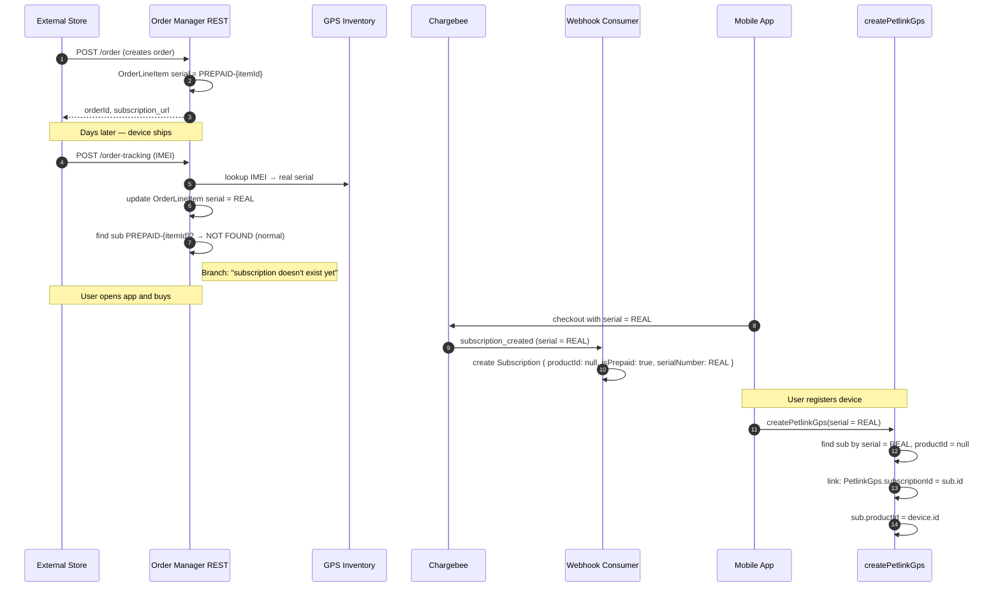
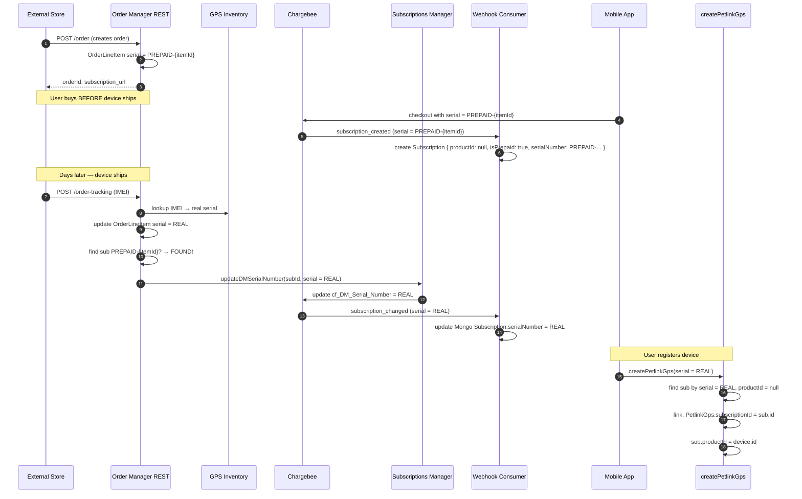

# Prepaid Subscription Flow

> **TL;DR**  
> The user buys a device in a physical store. The device serial is unknown at purchase time, so the system uses a temporary serial (`PREPAID-{itemId}`) on the order item. When Datamars ships the real device, tracking resolves the true serial from the IMEI. Depending on whether the user buys the subscription **before** or **after** tracking, the system handles serial reconciliation differently. Device registration (`createPetlinkGps`) always links by the real serial.

---

## The Core Problem

```
Order created          Tracking ships           Buy subscription           Register device
      │                    │                        │                         │
      ▼                    ▼                        ▼                         ▼
  serial = ???        serial = REAL           serial = ???              serial = REAL
  (placeholder)       (resolved by IMEI)       (whatever the order       (user types it in)
                                                 item has at that time)
```

The subscription in Chargebee is created with **the serial present on the order item at the moment of purchase**. 
- If tracking has already happened, it's the real serial. 
- If tracking hasn't happened yet, it's the placeholder.

The key mechanic that makes everything work: **`serialNumber` is the lookup key**. The system always links the device to the subscription by matching the real serial.

---

## Data Model (the 4 entities that matter)

```
┌─────────────┐     lineItems      ┌─────────────────┐
│   Order     │────────────────────│  OrderLineItem  │
│             │                    │ serialNumber    │──┐
│ customer.   │                    │ activated       │  │
│ chargebeeId │                    │ imei            │  │
└─────────────┘                    └─────────────────┘  │
         │                                            │
         │ userId                                      │
         ▼                                            │
┌─────────────────┐         productId (null → linked) │
│   Subscription  │◄──────────────────────────────────┘
│   (orphan)      │         serialNumber (key for lookup)
│ isPrepaid: true │
│ serialNumber    │────────────────────┐
│ productId: null │                    │
└─────────────────┘                    │
         ▲                             │
         │                             │
         │ subscriptionId              │
         │                             │
    ┌────┴────┐                        │
    │PetlinkGps│◄──────────────────────┘
    │ (device) │   serialNumber (real)
    └─────────┘
```

- **Order** → holds `chargebeeId` of the buyer (created during `POST /order`)
- **OrderLineItem** → holds the serial, starts as `PREPAID-{itemId}`, becomes real after tracking
- **Subscription** → created by Chargebee webhook. Starts **orphan** (`productId: null`, `isPrepaid: true`). Gets linked to the device during registration.
- **PetlinkGps** → the real device record, created only when the user registers. Links back to the subscription via `subscriptionId`.

---

## The Two Possible Orderings

There are two realistic sequences of events. They exercise **different code branches** and must both be tested.

### Flow A: `order → tracking → buy → register`
*(Device ships before the user buys the subscription. More deterministic.)*



**What makes Flow A work:** the subscription is created **directly with the real serial** because tracking already updated the order item. No serial realignment is needed.

---

### Flow B: `order → buy → tracking → register`
*(User buys before the device ships. More common in real life.)*



**What makes Flow B work:** the tracking handler finds an **existing** subscription with the `PREPAID-{itemId}` serial and calls `updateDMSerialNumber` on Chargebee. Chargebee emits a `subscription_changed` webhook, which the Core webhook consumer uses to rewrite `serialNumber` on the Mongo subscription document. Only after this async realignment can `createPetlinkGps` find the subscription by the real serial and link it.

---

## Flow A vs Flow B — Side by Side

| | Flow A | Flow B |
|---|---|---|
| **Typical scenario** | Device ships, then user buys | User buys, then device ships |
| **Serial at buy time** | Real serial (tracking already updated the order) | Placeholder `PREPAID-{itemId}` |
| **Tracking branch** | `else` — "subscription doesn't exist" | `if (subscription)` — calls `updateDMSerialNumber` |
| **Mongo sub after buy** | `serialNumber = REAL`, `productId = null` | `serialNumber = PREPAID-{itemId}`, `productId = null` |
| **Realignment needed?** | No | Yes: `subscription_changed` webhook updates Mongo serial |
| **Registration timing** | Safe to register immediately after buy | Must wait for async serial realignment before registering |
| **Code paths exercised** | `subscriptionCreateddHandler` → `handlerNewSubscription` | Same + `subscriptionChangedHandler:109` |

---

## Backend Linking Logic — Does It Change for the Test Utility?

**No. It stays exactly the same.**

The `BUY_PREPAID_SUBSCRIPTION` test utility is just a **bypass** around the Chargebee hosted page. In production, the user lands on the hosted page, pays, and Chargebee creates the subscription. In tests, the utility directly creates the subscription in Chargebee using the same Chargebee API (`subscription.createWithItems`) that the hosted page would have used.

```
Production path:
  User → ActivateOrderPage → checkoutPrepaid → Chargebee hosted page → pays →
  Chargebee creates sub → webhook subscription_created → Core saves orphan sub

Test bypass:
  Test utility BUY_PREPAID_SUBSCRIPTION →
  Core resolves chargebeeId from order → calls SM utilityIntegrationTest(BUY_NEW_SUBSCRIPTION) →
  SM creates sub in Chargebee → webhook subscription_created → Core saves orphan sub
```

After the subscription exists in Chargebee, the rest of the flow is **identical**:
- `subscription_created` webhook → `subscriptionCreateddHandler` → `handlerNewSubscription` → orphan sub in Mongo
- `payment_succeeded` webhook → updates `paymentStatus: SUCCEEDED`
- `orderTracking` REST → updates order item serial, calls `updateDMSerialNumber` if sub found
- `subscription_changed` webhook → realigns Mongo serial
- `createPetlinkGps` → `checkDeviceSubscription` → `handlePrepaidSubscription` → links sub to device by real serial

The only backend change needed is a new case in `utilityIntegrationTest` (Core) that:
1. Reads the order by `orderId`
2. Resolves `chargebeeId` from `order.customer.chargebeeId`
3. Resolves `businessEntity` from `appBrand`
4. Forwards to the SM's existing `BUY_NEW_SUBSCRIPTION` utility with `userId`, `serialNumber`, `priceIds`, `businessEntity`, `card`

No changes are needed in:
- `subscriptionsWebhookConsumer`
- `subscriptionCreateddHandler` / `subscriptionChangedHandler`
- `handlePrepaidSubscription`
- `createPetlinkGps`
- `orderTracking`

---

## What to Verify in Tests

### Flow A assertions
- Order created with `PREPAID-{itemId}` serial
- After tracking: `OrderLineItem.serialNumber = REAL`
- After buy: Mongo `Subscription` exists with `serialNumber = REAL`, `productId = null`, `isPrepaid = true`
- After registration: `PetlinkGps.subscriptionId = sub.id`, `sub.productId = device.id`, `OrderLineItem.activated = true`

### Flow B assertions
- Order created with `PREPAID-{itemId}` serial
- After buy (before tracking): Mongo `Subscription` exists with `serialNumber = PREPAID-{itemId}`, `productId = null`
- After tracking: `OrderLineItem.serialNumber = REAL`
- **Critical async step**: wait for Mongo `Subscription.serialNumber` to change from `PREPAID-...` to `REAL` (via `subscription_changed` webhook)
- After registration: same final state as Flow A

### Risk in Flow B
`orderTracking.ts:167` matches the existing subscription with `status: active` only. If the subscription is `in_trial` at the moment of tracking, the `if (subscription)` branch does **not** fire, `updateDMSerialNumber` is never called, and the serial realignment never happens. Confirm with the backend team whether prepaid subscriptions are always `active` when tracking occurs.

